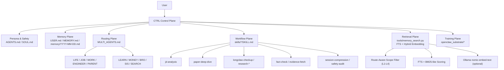
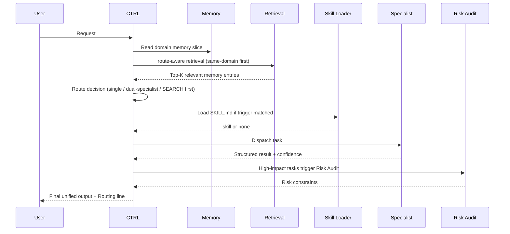

# longClaw Workspace

Language / 语言: [简体中文](README.md) | **English**

> A personal AI operating system built on [OpenClaw](https://github.com/openclaw/openclaw) —
> upgrades a single AI assistant into a **scalable multi-expert collaboration runtime**
> with industrial-grade memory retrieval, session management, and full developer observability.

**🌐 Visual Overview**: [longClaw Introduction Site](https://htmlpreview.github.io/?https://gist.githubusercontent.com/jinglong92/4e8c97b038c48f585ab95876a7efdcd2/raw/f7b6e00ae8e44139ce4a7820a6d3a7ec64f3dace/index.html) — Start here for a visual walkthrough of the architecture and capabilities.

---

## What You Can Do With It

**🧩 Build a scalable multi-agent system**
Define any number of specialist agents (JOB / WORK / LEARN / ENGINEER / ...), unified routing and arbitration through the CTRL control plane. Each agent handles only its own domain; CTRL owns final arbitration and output — no contradictory answers from multiple agents.

**🧠 Three-layer industrial memory storage and retrieval**
Built-in three-layer memory: daily logs (short-term), domain-blocked long-term memory (MEMORY.md split by [DOMAIN]), structured JSONL entry index (persistent). Retrieval first narrows scope by routing domain, then does FTS + Embedding Rerank (Ollama local inference) — precise recall without cross-domain noise pollution.

**🔄 Intelligent session management and context compression**
Two-layer compression: token-pressure-driven auto-compression (protects head/tail messages), and topic-boundary-triggered archival (conclusions written to long-term memory). Long conversations no longer lose critical information from context overflow.

**🔍 Controllable Developer Mode + evidence-driven execution**

Say **"开启 dev mode"** in conversation to activate session-scoped hard state, reading session fields from `memory/session-state.json`. Developer Mode is not just "print more logs" — it makes execution closure **verifiable-artifact-first**:

- Cannot claim "executed/completed/activated" without real execution evidence
- Cannot claim "readback verified" without verbatim readback
- Public-web read-only evidence fetch is pre-authorized per session, not mixed with local tasks
- Web evidence gate only intercepts external web fetches, must NOT block local file edits/readback/verification

```
[DEV LOG]
🔀 Route    JOB | trigger: "offer, interview" | mode: single-specialist
🧠 Memory   [SYSTEM]+[JOB] | ~380 tokens | 72% saved
📂 Session  round 5 | recent_turns=5/20 | compression not triggered
🔍 Retrieval scope=JOB | level=same-domain archive | recalled 3 | top=[0.91, 0.78, 0.62]
⚖️ Confidence 0.88 [basis: data+experience] | conflict: none
🤝 A2A      JOB → PARENT time conflict coordination | confidence=0.85 | needs_ctrl=false
🏷️ Entity   new entity: Shopee=in-progress(2026-04-10) → updated [JOB]
```

Observable: **routing decisions · session state · memory injection volume · retrieval scope · specialist confidence · A2A communication · conflict arbitration · entity update records**

**🧱 Workspace Baseline Locked**

Current workspace has hardened authorization, evidence, readback, and session state into a unified baseline:

- `AGENTS.md`: Deny > Ask > Allow three-tier authorization / Immutable Rules / execution latch / readback validation
- `.claude/settings.json`: UserPromptSubmit (/new restart) / PostCompact / FileChanged / PreToolUse / SessionStart hooks (harness-layer enforcement)
- `memory/session-state.json`: Dev Mode, active domain, pending confirmations, compression count

**⚡ Workflow Skills on Demand**
14 high-frequency tasks hardened as SKILL.md files with `requires` dependency declarations. Session startup builds index only; full SKILL.md loaded on trigger match, executed immediately — no long-term context occupation. Missing required tools return `blocked` immediately, no stalling.

**🤖 Subagent Concurrent Architecture**
Four specialized subagents (model: inherit, uses main session's Codex), each with isolated context and minimal tool permissions:
- `search-agent`: concurrent search, WebFetch/WebSearch/Read/Grep only
- `memory-agent`: background memory retrieval for BRO/SIS, read-only; replies explicitly label `[current-session]`/`[memory]`/`[inference]` sources
- `heartbeat-agent`: cron-scheduled inspection, read + write heartbeat-state.json + auto index freshness check
- `repo-explorer`: codebase exploration for code-agent, read-only, returns structured file map

**📊 Local Training Substrate (Local-first)**
Real interactions can be distilled into training assets: Trace collection → Judge scoring → Dataset building → MLX / LLaMA-Factory local training. Full pipeline runs on Mac mini M4, no data upload to cloud.

---

| | |
|---|---|
| **Based on** | [OpenClaw](https://github.com/openclaw/openclaw) (Peter Steinberger, MIT, 353k ⭐) |
| **Partially inspired by** | [Hermes Agent](https://github.com/NousResearch/hermes-agent) (Nous Research, MIT, 40k ⭐) |
| **Underlying LLM** | Codex (via OpenClaw runtime) |
| **Runtime** | Mac mini M4 (24/7 local), WhatsApp / Telegram / Discord interfaces |
| **Core extensions** | Multi-expert arbitration, domain-aware memory, vector retrieval, subagent concurrency, harness hooks, training substrate |

---

## Quick Start

**Prerequisites**: [OpenClaw](https://github.com/openclaw/openclaw) installed, workspace directory created.

```bash
# 1. Clone this repo
git clone https://github.com/jinglong92/longClaw.git
cd longClaw

# 2. Copy shared configs to your OpenClaw workspace
cp AGENTS.md SOUL.md MULTI_AGENTS.md /path/to/your-workspace/
cp -r skills/ /path/to/your-workspace/

# 3. Create your private config from templates (these files are NOT pushed to GitHub)
cp USER.md.example /path/to/your-workspace/USER.md
cp MEMORY.md.example /path/to/your-workspace/MEMORY.md
# Then edit USER.md with your name, profession, preferences, and context

# 4. Install memory retrieval tools (optional, enhances retrieval)
cp -r tools/ /path/to/your-workspace/
cd /path/to/your-workspace
python3 tools/memory_entry.py           # build index
python3 tools/memory_search.py --query "test" --verbose  # verify

# 5. Say "开启 dev mode" in OpenClaw conversation to verify Dev Mode and routing/evidence rules

# 6. Optional: sync current baseline script
bash refactor_workspace_baseline.sh
```

**Private files you need to create** (not in repo, not pushed):

| File | Source | What to fill in |
|------|--------|----------------|
| `USER.md` | Copy from `USER.md.example` | Your name, profession, preferences, current context, custom term definitions |
| `MEMORY.md` | Copy from `MEMORY.md.example` | Start blank, accumulate long-term memory through conversations |
| `memory/` | Auto-generated | Daily conversation logs, written by CTRL automatically |

**Reusable as-is (no changes needed)**:
`AGENTS.md` · `SOUL.md` · `MULTI_AGENTS.md` · `skills/` · `tools/`

---

## Table of Contents

1. [Three-System Comparison](#1-three-system-comparison)
2. [Core Design](#2-core-design)
3. [System Architecture](#3-system-architecture)
4. [Memory Retrieval System](#4-memory-retrieval-system)
5. [Workflow Skills](#5-workflow-skills)
6. [Demos](#6-demos)
7. [File Index](#7-file-index)
8. [Current Boundaries](#8-current-boundaries)
9. [Design Credits](#9-design-credits)

---

## 1. Three-System Comparison

longClaw, official OpenClaw, and Hermes Agent all belong to the "personal AI operating system" space, but differ fundamentally in positioning and architecture.

### 1.1 One-line positioning

| System | Positioning | Core paradigm |
|--------|-------------|---------------|
| **Official OpenClaw** | "The AI that actually does things" | Single Agent + local execution + self-evolution |
| **Hermes Agent** | Self-improving AI agent | Single Agent + multi-tool + auto skill learning |
| **longClaw (this repo)** | Personal AI OS, multi-expert arbitration + optimizable | Multi-Agent + CTRL arbitration + training substrate |

### 1.2 Architecture comparison

```
Official OpenClaw:
  User → OpenClaw Agent (local 24/7)
           ├── Auto-generates SKILL.md (self-evolution)
           ├── 50+ integrations (Gmail/GitHub/smart home)
           └── ClawHub skill marketplace

Hermes Agent:
  User → AIAgent.run_conversation()
           ├── 47 tools / 20 toolsets
           ├── SQLite + FTS5 memory retrieval
           └── Progressive Disclosure skill loading

longClaw (this repo):
  User → CTRL control plane (sole external output)
           ├── 10 specialist agents (JOB/WORK/LEARN/ENGINEER/...)
           ├── Confidence protocol + P0-P4 conflict arbitration + Risk Audit
           ├── Domain-aware memory injection (~80% token savings)
           ├── route-aware retrieval (FTS + Hybrid Embedding)
           └── openclaw_substrate (Trace→Judge→Dataset→Training)
```

### 1.3 Capability matrix

| Dimension | Official OpenClaw | Hermes Agent | longClaw |
|-----------|------------------|--------------|----------|
| **Execution layer** | ✅ local code exec, file r/w, browser | ✅ 47 tools | ✅ inherits full OpenClaw execution |
| **Expert arbitration** | ❌ single agent | ❌ single agent | ✅ 10 specialists + CTRL arbitration |
| **Risk audit** | ❌ | ❌ | ✅ P0-P4 priority + Risk Audit |
| **Domain memory** | ❌ full injection | ⚠️ FTS-only global | ✅ route-aware domain injection |
| **Vector retrieval** | ❌ | ⚠️ FTS-only | ✅ route-aware + Hybrid Embedding |
| **User profile layer** | ❌ | ❌ | ✅ USER.md independent profile |
| **Auto skill generation** | ✅ agent writes SKILL.md | ✅ auto-refines | ⚠️ proposal system (user confirms) |
| **Local training substrate** | ❌ | ❌ | ✅ Trace→Judge→Dataset→MLX |
| **50+ integration ecosystem** | ✅ ClawHub | ✅ Skills Hub | ✅ inherits OpenClaw |
| **Open source** | ✅ MIT | ✅ MIT | ✅ MIT |

> longClaw's execution layer (code execution / file r/w / browser control / 50+ integrations) is provided by the OpenClaw software running on Mac mini M4. This repo is the workspace configuration layer, adding arbitration, memory, retrieval, and training on top.

---

## 2. Core Design

### 2.1 CTRL Control Plane

Traditional multi-agent problems: multiple agents can all answer, but nobody owns final arbitration; parallel is noisy; routing decisions are invisible.

longClaw's design:
- `CTRL` is the sole external delivery point; specialists only do domain-level reasoning
- Default single-specialist; cross-domain problems enable dual-specialist parallel (≤2)
- Every reply carries a `Routing:` line — routing decisions fully visible
- High-impact decisions trigger Risk Audit (P0 hard block → P4 info merge)

$$\text{Final Answer} = \text{CTRL}(\text{route},\ \text{specialist outputs},\ \text{risk audit},\ \text{memory slice})$$

### 2.2 Domain-aware Memory Injection

`MEMORY.md` is split by `[SYSTEM] / [JOB] / [LEARN] / [ENGINEER] / ... / [META]`. CTRL injects only the necessary slice by route:

$$\text{Injected Memory} = \text{[SYSTEM]} \cup \text{[Relevant Domain]}$$

~**80% token savings** vs full injection, while avoiding historical noise polluting current requests.

### 2.3 Workflow Skills (inspired by Hermes, adapted)

High-frequency complex tasks hardened as workflow skills, following **Progressive Disclosure** principle:
- Session startup: build skill index only (name + description)
- On trigger match: load full `SKILL.md`, execute immediately (same turn, no deferral)
- After completion: SKILL.md exits context; DEV LOG continues every turn regardless

Current skills are on-demand workflow plugins covering five broad areas: engineering execution, retrieval/evidence, learning/generation, system operations, and governance/migration (see [§ Workflow Skills](#5-workflow-skills)).

**Skill conflict priority**: `skill-safety-audit` (highest) > `research-execution-protocol` > `research-build` (lowest)

### 2.4 Route-aware Memory Retrieval

**Layer 1: scope filter (decide where to search first)**

```
Level 1: current session / recent turns  ← covered by Codex context window, no tool call needed
Level 2: same-domain + 7 days            → stop if ≥2 results
Level 3: same-domain + all history       → stop if ≥2 results and top1 score ≥0.3
Level 4: cross-domain fallback           → last resort, results tagged [cross-domain]
```

**Layer 2: hybrid rerank (decide how to search)**

$$S(q,d) = S_{\text{fts}} + 0.4 \cdot N_{\text{entity}} + 0.05 \cdot \text{imp}(d) + 0.05 \cdot \mathbf{1}_{\text{daily}}(d)$$

Optional Hybrid mode: FTS candidates → Ollama nomic-embed-text (768-dim) → RRF fusion

### 2.5 Local Training Substrate (openclaw_substrate)

Unique to longClaw — official OpenClaw and Hermes both lack this:

$$\text{Interaction} \rightarrow \text{Trace} \rightarrow \text{Judge} \rightarrow \text{Dataset} \rightarrow \text{Replay / Optimize}$$

- `trace_plane`: records canonical trace (request/response/routing/retries)
- `judge_plane`: rule-based evaluation + reward signals
- `dataset_builder`: builds SFT/GRPO trainable datasets
- `shadow_eval`: baseline vs candidate replay comparison
- `backends/`: local MLX-LM + LLaMA-Factory export paths

---

## 3. System Architecture

### 3.1 Six-layer structure



### 3.2 Request execution sequence



---

## 4. Memory Retrieval System

> Added 2026-04-10. Independent from `openclaw_substrate`, in `tools/` directory. No external dependencies for FTS mode.

### Retrieval architecture

```
User query
    │
    ▼
Query Rewrite (3 variants)
  ① original query
  ② + domain hints (JOB route auto-adds "job career offer interview")
  ③ + entity extraction (company names / tech terms / project names)
    │
    ▼
Route-Aware Scope Filter
  Level 1: Codex context window (no tool call)
  Level 2: same-domain + 7 days  →  stop if ≥2 results
  Level 3: same-domain + all     →  stop if ≥2 results and top1 ≥0.3
  Level 4: cross-domain          →  last resort, tagged [cross-domain]
    │
    ▼
FTS Scoring (BM25-like, pure Python, no external deps)
  entity exact match +0.4 · N_entity
  daily entries (more factual) +0.05
  global re-rank by score
    │
    ├── FTS-only → Top-K
    │
    └── Hybrid (--hybrid, requires Ollama)
          nomic-embed-text (768-dim, M4 local inference, no GPU)
          → RRF fusion (FTS rank + embedding rank)
          → Top-K
```

### Quick start

```bash
# Build index (first time or after MEMORY.md update)
python3 tools/memory_entry.py
python3 tools/memory_entry.py --stats   # also shows stale entries (importance<0.4, >90 days)

# FTS retrieval (no Ollama needed)
python3 tools/memory_search.py --query "Shopee interview" --domain JOB
python3 tools/memory_search.py --query "openclaw tuning" --domain ENGINEER --verbose

# Hybrid retrieval (requires Ollama)
brew install ollama && ollama pull nomic-embed-text
python3 tools/memory_search.py --query "dispatch capacity" --domain ENGINEER --hybrid
```

---

## 5. Workflow Skills

Workflow skills are easiest to read as a short category map:

| Category | Representative skills |
|----------|-----------------------|
| Engineering execution | `code-agent`, `research-execution-protocol`, `research-build` |
| Retrieval and evidence | `deep-research`, `fact-check-latest`, `public-evidence-fetch` |
| Learning and generation | `paper-deep-dive`, `paperbanana` |
| System operations | `longclaw-checkup`, `session-compression-flow`, `proactive-heartbeat` |
| Governance and migration | `skill-safety-audit`, `multi-agent-bootstrap`, `memory-companion`, `jd-analysis` |

---

## 6. Demos

### Demo 1: Multi-expert arbitration

```
Enable dev mode.
Analyze from both ENGINEER and JOB perspectives simultaneously:
How should this technical project be positioned and communicated?
Each should give confidence scores; CTRL arbitrates at the end.
```

Shows: visible routing + restrained parallel trigger + real CTRL arbitration + confidence divergence

### Demo 2: Workflow Skill

```
Process this job posting using the jd-analysis workflow.
Output: capability model, match score, main gaps, this-week actions.
```

Shows: role owns domain judgment, skill owns specific process, stable reproducible output structure

### Demo 3: Fact check

```
Using fact-check-latest workflow, check Agent + OR job market trends in the last 30 days.
Distinguish [confirmed] / [inferred] / [missing].
```

Shows: SEARCH role + honest about uncertainty + explicit information completeness

### Demo 4: Memory retrieval comparison

```bash
# FTS-only vs Hybrid, showing route-aware scope effect
python3 tools/memory_search.py --query "Shopee interview" --domain JOB --verbose
python3 tools/memory_search.py --query "last interview progress" --domain JOB --hybrid --verbose
```

Shows: same-domain priority + entity-hit weighted ranking + hybrid semantic gap-filling

---

## 7. File Index

### Core protocols

| File | Purpose |
|------|---------|
| [AGENTS.md](AGENTS.md) | Global behavior constraints (highest priority) |
| [SOUL.md](SOUL.md) | Assistant persona contract |
| `USER.md` | User profile and preferences (private — create from USER.md.example) |
| `MEMORY.md` | Long-term memory (domain-blocked — create from MEMORY.md.example) |
| [MULTI_AGENTS.md](MULTI_AGENTS.md) | Routing protocol and specialist agent config |
| [USER.md.example](USER.md.example) | Public template for USER.md |
| [MEMORY.md.example](MEMORY.md.example) | Public template for MEMORY.md |

### Workflow Skills

| File | Trigger |
|------|---------|
| [skills/job-jd-analysis/SKILL.md](skills/job-jd-analysis/SKILL.md) | JD analysis |
| [skills/learn-paper-deep-dive/SKILL.md](skills/learn-paper-deep-dive/SKILL.md) | Paper deep dive |
| [skills/engineer-longclaw-checkup/SKILL.md](skills/engineer-longclaw-checkup/SKILL.md) | Runtime checkup |
| [skills/search-fact-check-latest/SKILL.md](skills/search-fact-check-latest/SKILL.md) | Latest fact check |
| [skills/engineer-research-execution-protocol/SKILL.md](skills/engineer-research-execution-protocol/SKILL.md) | Research execution protocol |
| [skills/engineer-research-build/SKILL.md](skills/engineer-research-build/SKILL.md) | Research build workflow |
| [skills/meta-skill-safety-audit/SKILL.md](skills/meta-skill-safety-audit/SKILL.md) | External skill safety audit |
| [skills/meta-session-compression-flow/SKILL.md](skills/meta-session-compression-flow/SKILL.md) | Session compression flow |
| [skills/multi-agent-bootstrap/SKILL.md](skills/multi-agent-bootstrap/SKILL.md) | Multi-agent bootstrap |
| [skills/search-public-evidence-fetch/SKILL.md](skills/search-public-evidence-fetch/SKILL.md) | Public evidence fetch |

### Memory retrieval tools

| File | Purpose |
|------|---------|
| [tools/memory_entry.py](tools/memory_entry.py) | MEMORY.md + daily logs → JSONL entries (with stale detection) |
| [tools/memory_search.py](tools/memory_search.py) | Route-aware FTS + hybrid embedding retrieval |

### Local training substrate

| File | Purpose |
|------|---------|
| [openclaw_substrate/gateway.py](openclaw_substrate/gateway.py) | OpenAI-compatible API gateway |
| [openclaw_substrate/trace_plane.py](openclaw_substrate/trace_plane.py) | Trace recording and state assembly |
| [openclaw_substrate/judge_plane.py](openclaw_substrate/judge_plane.py) | Rule-based evaluation + reward signals |
| [openclaw_substrate/dataset_builder.py](openclaw_substrate/dataset_builder.py) | Training dataset construction |
| [openclaw_substrate/shadow_eval.py](openclaw_substrate/shadow_eval.py) | Baseline vs candidate replay comparison |

### Historical design materials

- [multi-agent/ARCHITECTURE.md](multi-agent/ARCHITECTURE.md)
- [multi-agent/PROFILE_CONTRACT.md](multi-agent/PROFILE_CONTRACT.md)
- [multi-agent/UNIFIED_SYNC_2026-03-25.md](multi-agent/UNIFIED_SYNC_2026-03-25.md)
- [docs/openclaw-iteration-plan-v1.md](docs/openclaw-iteration-plan-v1.md)

---

## 8. Current Boundaries

| Boundary | Notes |
|----------|-------|
| Workspace extension layer | longClaw is an OpenClaw workspace extension. OpenClaw native capabilities (hooks / permissions / compaction / skill loading) are available out of the box; longClaw adds arbitration, domain-aware memory, retrieval, and training on top |
| Skill auto-generation | Proposal system (user confirms before writing), not OpenClaw-style auto-write |
| Memory retrieval quality | Depends on MEMORY.md factual entry density; config/rule text has limited semantic differentiation |
| Hybrid retrieval benefit | Minimal when corpus is mostly config/rule text; significant once factual daily logs accumulate |
| openclaw_substrate | Training pipeline defined, not yet active (primary: Codex via OpenClaw) |
| Parallel concurrency | Capped at ≤2 specialists; no increase without execution-layer support |

---

## 9. Design Credits

### Official OpenClaw

> **OpenClaw** (Peter Steinberger, MIT, 353k ⭐): https://github.com/openclaw/openclaw

longClaw is a workspace built on top of official OpenClaw software. The execution layer (code execution, file r/w, browser control, 50+ integrations, Heartbeat mechanism) is fully inherited from OpenClaw, running on Mac mini M4.

This repo is the workspace configuration layer, extending:
- `MULTI_AGENTS.md` (10 specialist agents, A2A protocol, confidence arbitration)
- `MEMORY.md` (domain-blocked injection)
- `tools/` directory (independent memory retrieval tools)
- `openclaw_substrate/` (local training substrate)

### Hermes Agent

> **Hermes Agent** (Nous Research, MIT, 40k ⭐): https://github.com/NousResearch/hermes-agent

| Borrowed concept | Hermes original | longClaw implementation |
|-----------------|-----------------|------------------------|
| **SKILL.md format** | Structured frontmatter, workflow-level granularity | Same format and granularity; role definitions stay in MULTI_AGENTS.md |
| **Progressive Disclosure** | Startup loads name+description only; full content on match; skill_manage tool | OpenClaw runtime natively supports this; longClaw extends it with `requires` dependency checks and forced-trigger rules |
| **Context Compression** | 50% token threshold, 4-phase algorithm | Two layers: Layer A = compression preference (syncs with OpenClaw native compaction), Layer B = topic archival |
| **FTS + embedding retrieval** | SQLite FTS5 + session lineage | Added route-aware scope filter + Ollama local embedding rerank + RRF fusion |
| **Proactive troubleshooting** | Auto-tries fallback paths on failure | Same principle; updated fallback (Google Cache removed → Wayback Machine) |

**Unique to longClaw (Hermes lacks)**:

| Capability | Description |
|-----------|-------------|
| Multi-Agent arbitration + Risk Audit | 10 specialists + CTRL arbitration + P0-P4 priority arbitration |
| USER.md user profile layer | Independent user context file, foundation for personalized advice |
| openclaw_substrate training substrate | Trace → Judge → Dataset → MLX training loop |
| Route-aware scope filter | Narrows retrieval scope by routing domain before searching |

---

> The most valuable part of this system is not "role-based chatting" — it's cleanly separating control, memory, workflow, and optimization so each layer can evolve, be observed, and be optimized independently.

---

## Contributing

Contributions to Workflow Skills, retrieval tools, or training substrate are welcome.

Lowest-friction contribution: create a `SKILL.md` under `skills/<domain>-<skill-name>/`, describing a specific reusable workflow (see `skills/job-jd-analysis/` as reference).

See [CONTRIBUTING.md](CONTRIBUTING.md).

## Skill Extension Principles

New skills must:
- Not replace CTRL (skills are workflows, not roles)
- Not change global persona
- Not persist in context (exit after execution)
- Prefer local enhancement, verifiable, rollback-friendly
