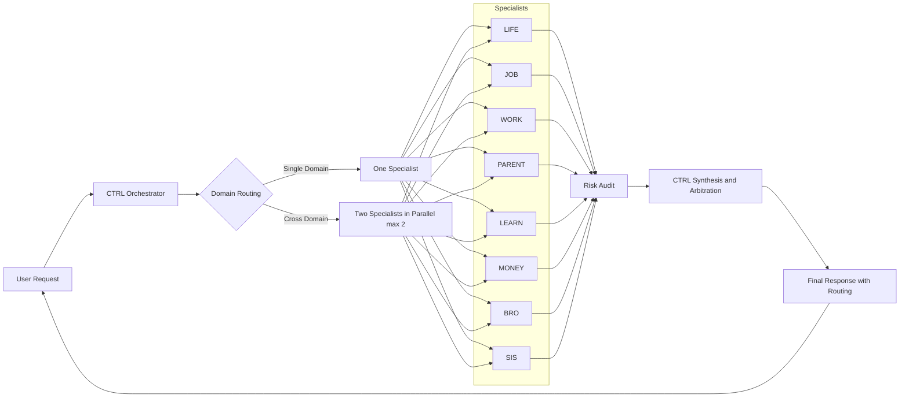
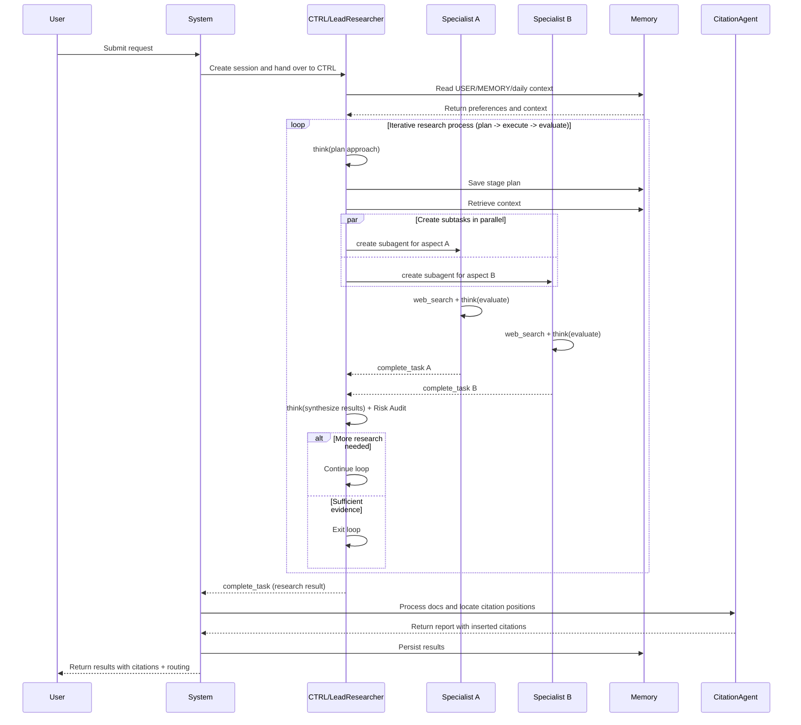

# longClaw Workspace

Language / 语言: [简体中文](README.md) | **English**

longClaw is a personal multi-agent control workspace for AI collaboration, with three core goals:

- Use `CTRL` as the single orchestrator for routing and arbitration
- Enable stable specialist collaboration across single-domain and cross-domain requests
- Improve decision quality and traceability with explicit risk audits and observable logs

---

## 1. Project Overview

This repository has three capability layers:

1. **Behavior and boundary layer**: assistant behavior, privacy boundaries, and safety constraints (`AGENTS.md`, `SOUL.md`, `USER.md`)
2. **Memory and continuity layer**: long-term preferences and daily context (`MEMORY.md`, `memory/`)
3. **Multi-agent execution layer**: routing protocol, specialist roles, and console prototype (`MULTI_AGENTS.md`, `multi-agent/`)

---

## 2. Multi-Agent Control Architecture

### 2.1 High-level control flow



### 2.2 Visual architecture dashboard


Note: The PNG gives a quick dashboard-style view; the Mermaid sequence below explains request-level execution.

### 2.3 Request execution sequence



---

## 3. Core Design Principles

- **CTRL is the only external output owner**: specialists reason, CTRL synthesizes and delivers
- **Default single-specialist, parallel only when needed**: use two-specialist parallel mode only for cross-domain or clear blind spots
- **Risk-first over style-first**: enforce Risk Audit for high-impact topics (finance, career, relationship)
- **Traceable and reviewable**: routing path, arbitration logic, and key decisions should be auditable

---

## 4. Routing Protocol (Visible to user)

Each response should include route visibility:

- Single specialist: `Routing: User -> CTRL -> [JOB] -> CTRL -> User`
- Parallel specialists: `Routing: User -> CTRL -> ([PARENT] || [LIFE]) -> CTRL -> User`

Role labels are fixed: `LIFE/JOB/WORK/ENGINEER/PARENT/LEARN/MONEY/BRO/SIS`.

---

## 5. Repository Structure

```text
.
|-- AGENTS.md
|-- SOUL.md
|-- USER.md
|-- MEMORY.md
|-- HEARTBEAT.md
|-- MULTI_AGENTS.md
|-- multi-agent/
|   |-- README.md
|   |-- ARCHITECTURE.md
|   |-- UNIFIED_SYNC_2026-03-22.md
|   `-- agent-console-mvp/
|-- memory/
|-- TOOLS.md
|-- docs/
|   `-- architecture-dashboard-zh-v5.png
|-- README.en.md
`-- README.md
```

---

## 6. Quick Start

1. Read control rules and boundaries: `AGENTS.md`
2. Read persona and user preferences: `SOUL.md`, `USER.md`
3. Read routing config and role responsibilities: `MULTI_AGENTS.md`
4. Load continuity context: `MEMORY.md`, `memory/`

---

## 7. Run Agent Console MVP

```bash
cd multi-agent/agent-console-mvp
npm install
npm run dev
```

Open: `http://localhost:3799`

Current MVP includes chat-first layout, run controls, realtime logs, basic control actions, and audit endpoint.

---

## 7.1 NoCode Online Console (Visual Preview)

A visual control console built on Meituan's NoCode platform — no local setup required. View the live architecture topology, real-time task queue, and routing logs directly in your browser.

🔗 **Live access**: [longClaw Multi-Agent Console](https://mto6jdn73suurp.sandbox.nocode.sankuai.com/#/longclaw)

The console has five panels:

- **Left — Agent topology**: SVG visualization of the full routing graph from User → CTRL → Specialists, including Policy, Protocol, Preference+Memory, and Memory nodes
- **Top right — Live task queue**: active tasks with domain labels (JOB / PARENT+LIFE / WORK) and status badges
- **Mid right — System observability**: routing latency, mislead rate, change state, and parallel concurrency limit
- **Bottom right — Routing log stream**: recent SINGLE / PARALLEL / DECISION routing records
- **Footer — Console contract**: CTRL routing rules, parallel constraints, and specialist responsibility summary


---

## 8. References

- Architecture details: `multi-agent/ARCHITECTURE.md`
- Console details: `multi-agent/agent-console-mvp/README.md`
- Unified sync notes: `multi-agent/UNIFIED_SYNC_2026-03-22.md`
- Chinese docs: `README.md`

---

## 9. Notes

- This is an evolving personal workspace; docs and state files may change frequently
- For team/production usage, add authentication, audit retention, rollback strategy, and SLA constraints
