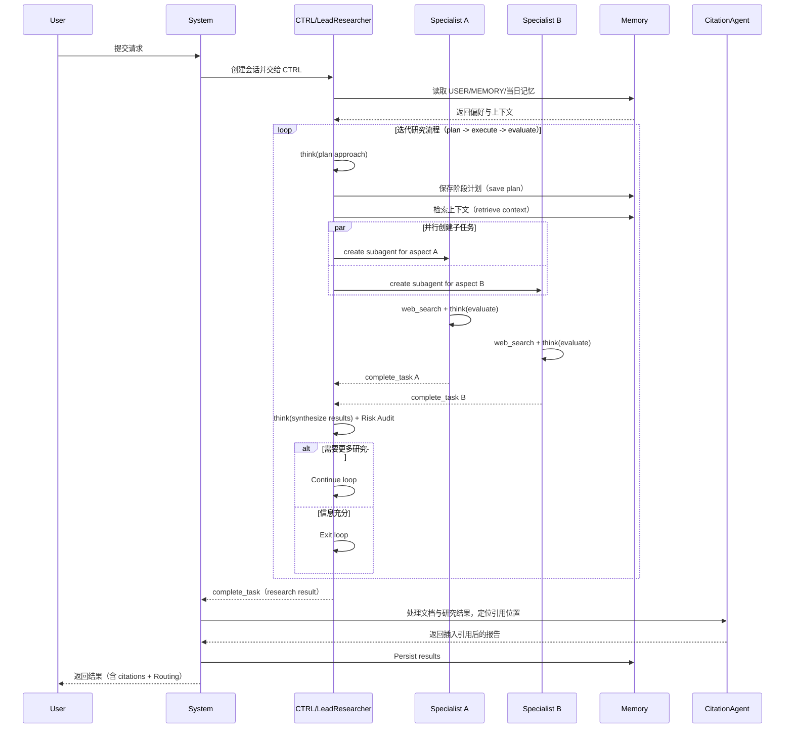

# longClaw Workspace

语言 / Language: **简体中文** | [English](README.en.md)

longClaw 是一个面向个人 AI 协作的多代理控制系统工作区。它不只是一套路由配置——它是一个有人格、有记忆、有风险意识、持续演进的个人 AI 操作系统。

---

## 1. 系统全景

```
┌─────────────────────────────────────────────────────────────────┐
│                        longClaw OS                              │
│                                                                 │
│  ┌──────────┐  ┌──────────┐  ┌──────────┐  ┌───────────────┐  │
│  │ SOUL.md  │  │ USER.md  │  │MEMORY.md │  │ memory/日志   │  │
│  │ 人格契约 │  │ 用户画像 │  │ 长期记忆 │  │ 每日短期记忆  │  │
│  └────┬─────┘  └────┬─────┘  └────┬─────┘  └───────┬───────┘  │
│       └─────────────┴──────────────┴────────────────┘          │
│                              │                                  │
│                    ┌─────────▼──────────┐                       │
│                    │   CTRL  总控代理   │  ← 唯一对外出口       │
│                    │  路由 · 仲裁 · 合并│                       │
│                    └──────────┬─────────┘                       │
│          ┌──────┬──────┬──────┼──────┬──────┬──────┐           │
│        LIFE   JOB   WORK  ENGINEER PARENT LEARN MONEY          │
│                          BRO · SIS                              │
│                    （9 个专职代理）                              │
│                                                                 │
│  ┌──────────────────────────────────────────────────────────┐  │
│  │  Risk Audit · Heartbeat · Agent Council · Routing Log    │  │
│  └──────────────────────────────────────────────────────────┘  │
└─────────────────────────────────────────────────────────────────┘
```

本仓库包含五层能力：

1. **人格与边界层**：定义助手行为、人格契约与安全约束（`SOUL.md`, `AGENTS.md`）
2. **用户与偏好层**：沉淀用户画像、长期偏好与风格约定（`USER.md`）
3. **记忆与连续性层**：双层记忆机制，跨会话保持上下文（`MEMORY.md`, `memory/`）
4. **多代理执行层**：路由协议、专职角色与控制台（`MULTI_AGENTS.md`, `multi-agent/`）
5. **训练底座层（Local-first）**：本地追踪、评测、数据集构建与后端可插拔训练导出（`openclaw_substrate/`, `docs/substrate/`）

---

## 2. 核心设计：四大支柱

### 🧠 双层记忆系统

longClaw 的记忆不依赖模型上下文窗口，而是通过文件持久化实现跨会话连续性：

```
MEMORY.md          ← 长期记忆：蒸馏后的偏好、决策、教训（主会话专用）
memory/YYYY-MM-DD.md  ← 每日记忆：当天原始事件流水账
```

每次会话启动时，CTRL 自动读取今日 + 昨日日志与长期记忆，无需用户重复交代背景。Heartbeat 心跳机制会定期将日志中的关键信息蒸馏回 `MEMORY.md`，保持长期记忆的精炼与时效性。

> 设计原则：**Text > Brain**。Mental notes 不过会话，文件才是真正的记忆。

### 🎭 SOUL 人格契约

`SOUL.md` 定义了助手的核心人格，不是功能描述，而是行为准则：

- **真相优先**：不取悦，不模糊，直接指出逻辑漏洞与自我合理化
- **有观点**：可以不同意，可以判断利弊，拒绝无立场的中立
- **行动导向**：每个建议以"现在做什么"结尾，不空谈原则
- **能力换信任**：用户给了真实的生活访问权，用胜任力回报，而非讨好

### 👤 USER 用户画像

`USER.md` 记录用户的真实上下文——不是通用用户，而是具体的人：

- 称呼偏好、语言风格、表达要求
- 当前职业叙事与求职主线
- 计算拓扑（Mac mini M4 主节点 + MacBook Air M5 调试端）
- 风险偏好与生活资产上下文

这让每个专职代理都能在正确的背景下给出有针对性的建议，而不是泛化回答。

### ⚡ Risk Audit 风险审计

对涉及策略选择、价值判断、高影响决策的请求，CTRL 强制触发 Risk Audit：

```
触发场景：资金配置 / 职业决策 / 关系决策 / 路径取舍
输出要求：至少 1 个核心逻辑漏洞 + 1 个尾部风险
豁免场景：纯事实型问答
```

---

## 3. 多代理控制架构

### 3.1 高层控制流


### 3.2 图文架构总览（Dashboard）


说明：上图用于快速理解控制台视角下的结构关系；下方 Mermaid 时序图用于表达请求级执行路径。

### 3.3 请求执行时序



---

## 4. 9 个专职代理

| 代理 | 领域 | 性格 | 核心输出 |
|------|------|------|----------|
| `LIFE` | 生活助理 | 务实、细致 | 最省力方案 + 执行顺序 |
| `JOB` | 求职助手 | 目标导向 | 匹配度判断 + 本周动作 |
| `WORK` | 职场顾问 | 冷静、策略型 | 利弊分析 + 话术建议 |
| `ENGINEER` | 工程顾问 | 严谨、务实 | 先结论后方案，强调可实现性 |
| `PARENT` | 育儿顾问 | 温和、稳定 | 小步可执行 + 就医红线 |
| `LEARN` | 学习教练 | 结构化、耐心 | 目标拆解 → 练习路径 → 复盘闭环 |
| `MONEY` | 理财顾问 | 保守理性 | 现金流与回撤控制优先 |
| `BRO` | 闲聊哥们 | 直接、幽默 | 人话直给，戳破借口 |
| `SIS` | 姐妹视角 | 敏锐、共情 | 沟通细节与关系动态分析 |

CTRL 不是专职代理，是总控——负责拆解、仲裁、合并与优先级排序，是唯一对外输出的出口。

---

## 5. 核心设计原则

- **CTRL 唯一对外交付**：专职负责推理，最终由 CTRL 汇总输出
- **默认单专职，必要时并行**：仅在跨域或明显盲区场景启用双专职并行（上限 2 个）
- **风险优先于花哨表达**：涉及资金/职业/关系等高影响问题时强制 Risk Audit
- **可追踪、可复盘**：路由路径、裁决逻辑与关键决策应可回溯
- **文件即记忆**：所有重要上下文落盘，不依赖模型上下文窗口

---

## 6. 路由协议（对外可见）

每次响应需包含路由信息：

- 单专职：`Routing: User -> CTRL -> [JOB] -> CTRL -> User`
- 双并行：`Routing: User -> CTRL -> ([PARENT] || [LIFE]) -> CTRL -> User`

角色标签固定为：`LIFE/JOB/WORK/ENGINEER/PARENT/LEARN/MONEY/BRO/SIS`。

---

## 7. 仓库结构

```text
.
|-- AGENTS.md          ← 全局行为与安全约束（最高优先级）
|-- SOUL.md            ← 助手人格契约
|-- USER.md            ← 用户画像与偏好
|-- MEMORY.md          ← 长期记忆（蒸馏版）
|-- HEARTBEAT.md       ← 心跳巡检任务清单
|-- MULTI_AGENTS.md    ← 路由协议与专职代理配置
|-- multi-agent/
|   |-- README.md
|   |-- ARCHITECTURE.md
|   |-- UNIFIED_SYNC_2026-03-22.md
|-- openclaw_substrate/ ← 本地训练底座（Gateway/Trace/Judge/Dataset/Backends）
|   |-- cli.py
|   |-- gateway.py
|   |-- trace_plane.py
|   |-- judge_plane.py
|   `-- backends/
|-- memory/            ← 每日记忆日志（memory/YYYY-MM-DD.md）
|-- TOOLS.md
|-- docs/
|   |-- architecture-dashboard-zh-v5.png
|   `-- substrate/     ← 训练底座设计与工作流文档
|-- README.en.md
`-- README.md
```

---

## 8. 快速开始

1. 阅读控制规则与边界：`AGENTS.md`
2. 阅读人格与用户偏好：`SOUL.md`, `USER.md`
3. 阅读路由配置与角色分工：`MULTI_AGENTS.md`
4. 加载连续上下文：`MEMORY.md`, `memory/`

---

## 9. 本地训练底座（Apple Silicon / Local-first）

以下流程可在 Mac mini M4 16GB 本地执行：

1. 启动本地 MLX-LM Serving（命令模板）：

```bash
python3 -m openclaw_substrate.cli mlx-serve \
  --config openclaw_substrate/configs/local.example.json \
  --dry-run
```

2. 启动 OpenAI 兼容 Gateway：

```bash
python3 -m openclaw_substrate.cli gateway-serve \
  --config openclaw_substrate/configs/local.example.json
```

3. 生成训练数据与评估：

```bash
python3 -m openclaw_substrate.cli judge-run --config openclaw_substrate/configs/local.example.json
python3 -m openclaw_substrate.cli dataset-build --config openclaw_substrate/configs/local.example.json --dataset-name openclaw_demo
python3 -m openclaw_substrate.cli shadow-eval --baseline artifacts/traces/rewarded_baseline.jsonl --candidate artifacts/traces/rewarded_candidate.jsonl --out artifacts/replay/shadow_report.json
```

4. 生成后端训练产物：

```bash
# Local backend: MLX-LM
python3 -m openclaw_substrate.cli backend-train-adapter \
  --config openclaw_substrate/configs/local.example.json \
  --backend mlx-lm \
  --dataset-name openclaw_demo_sft \
  --dataset-path artifacts/mlx/openclaw_demo_sft.jsonl \
  --out-dir artifacts/mlx \
  --run-name run_local_mlx

# Scale-up backend export: LLaMA-Factory
python3 -m openclaw_substrate.cli backend-train-adapter \
  --config openclaw_substrate/configs/local.example.json \
  --backend llamafactory \
  --dataset-name openclaw_demo_llf \
  --dataset-path artifacts/llamafactory/openclaw_demo_llf.jsonl \
  --out-dir artifacts/llamafactory \
  --run-name run_export_ready
```

详细文档见 `docs/substrate/`：

- `architecture.md`
- `local_mlx_workflow.md`
- `llamafactory_export_workflow.md`
- `trace_schema.md`
- `reward_design.md`
- `adapter_registry.md`

---

## 10. NoCode 在线控制台（可视化预览）

基于美团 NoCode 平台构建的可视化控制台，无需本地部署，直接在浏览器中查看当前运行架构、实时任务队列与路由日志。

🔗 **在线访问**：[longClaw 多代理控制台](https://control-system-panel.mynocode.host/#/longclaw)

控制台包含五个核心面板：

- **左栏 — 代理架构拓扑图**：SVG 可视化展示 User → CTRL → 专职代理的完整路由拓扑，含 Policy、Protocol、Preference+Memory、Memory 等核心节点
- **右栏上 — 实时任务队列**：当前活跃任务列表，含任务标签（JOB / PARENT+LIFE / WORK）与状态
- **右栏中 — 系统观测态**：路由延迟、误导率、变更状态、并行上限等关键指标实时展示
- **右栏下 — 运行日志流**：最近决策的 SINGLE / PARALLEL / DECISION 路由记录
- **底部 — 控制台说明**：CTRL 契约定义，包含路由规则、并行约束与代理职责说明


---

## 11. 参考文档

- 架构说明：`multi-agent/ARCHITECTURE.md`
- 全体同步记录：`multi-agent/UNIFIED_SYNC_2026-03-22.md`
- 隐藏训练层设计文档：`docs/hidden-training-agents-v0.1.md`
- 本地训练底座架构：`docs/substrate/architecture.md`
- 本地 MLX 工作流：`docs/substrate/local_mlx_workflow.md`
- LLaMA-Factory 导出工作流：`docs/substrate/llamafactory_export_workflow.md`
- 英文文档：`README.en.md`

---

## 12. 隐藏训练层（v0.1）

### 12.1 轨迹数据位置

- 运行时结构化事件（默认 JSONL）：`artifacts/traces/raw_traces.jsonl`
- 奖励输出：`artifacts/rewards/reward_log.jsonl`
- replay / 对比报告输出：`artifacts/replay/shadow_report.json`

### 12.2 一次本地训练优化回放

```bash
python3 -m openclaw_substrate.cli shadow-eval \
  --baseline artifacts/traces/rewarded_baseline.jsonl \
  --candidate artifacts/traces/rewarded_candidate.jsonl \
  --out artifacts/replay/shadow_report.json
```

说明：回放会输出 baseline/candidate 的核心指标差异（wrong-route / retry / correction / tool-success / sample-yield），用于 adapter 上线前闸门。

---

## 13. 说明

- 这是持续演进中的个人工作区，文档和状态文件会频繁更新
- 若要用于团队/生产，请补充鉴权、审计留存、故障回滚与 SLA 约束
