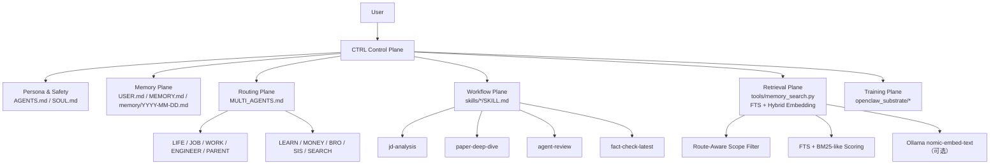
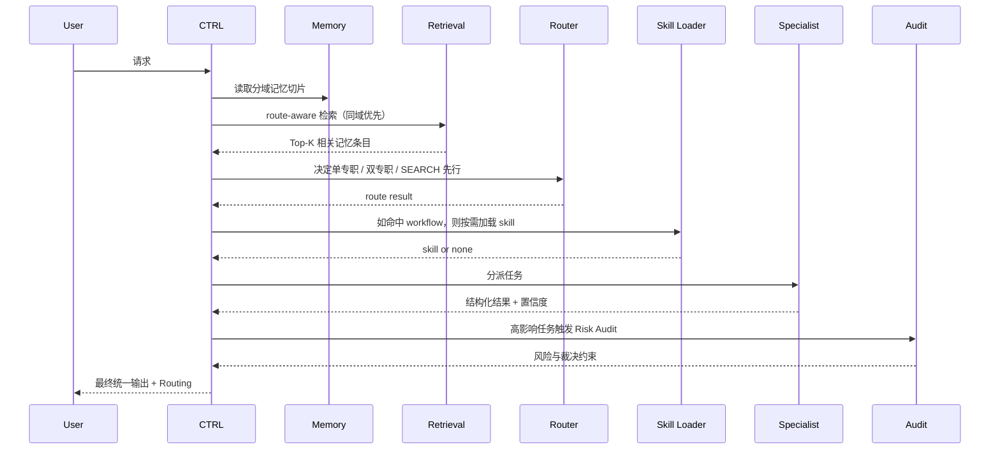

# longClaw Workspace

语言 / Language: **简体中文** | [English](README.en.md)

> 基于 [OpenClaw](https://github.com/openclaw/openclaw) 深度改造的个人 AI 操作系统——
> 把单个 AI 助手升级为**可扩展的多专家协作运行时**，
> 带工业级记忆检索、会话管理和完整的开发者可观测性。

---

## 你可以用它做什么

**🧩 搭建可扩展的多代理系统**
定义任意数量的专职代理（JOB / WORK / LEARN / ENGINEER / ...），通过 CTRL 控制平面统一路由和仲裁。每个代理只处理自己域内的任务，CTRL 负责最终裁决和输出——不会出现多个代理同时给出矛盾答案的情况。

**🧠 多层工业级记忆存储与检索**
内置三层记忆体系：每日日志（短期）、分域长期记忆（MEMORY.md 按 [DOMAIN] 分块）、结构化 JSONL 条目索引（持久化）。检索时先按路由域收敛范围，再做 FTS + Embedding Rerank（Ollama 本地推理），精准召回相关记忆，不被跨域噪声污染。

**🔄 智能会话管理与上下文压缩**
内置两层压缩策略：token 压力驱动的自动压缩（保护首尾关键消息、清理孤立工具对），以及话题边界触发的归档（结论写入长期记忆）。长对话不再因上下文溢出而丢失关键信息。

**🔍 一键开启 Developer Mode，后台过程完全可见**

在对话中说 **"开启 dev mode"** 即可，每次回复末尾自动附加运行日志：

```
[DEV LOG]
🔀 路由     JOB | 触发: "offer、面试" | 模式: 单专职
🧠 Memory   [SYSTEM]+[JOB] | ~380 tokens | 节省 72%
📂 Session  第 5 轮 | recent_turns=5/8 | 未触发压缩
🔍 检索     scope=JOB | level=同域归档 | 召回 3 条 | top=[0.91, 0.78, 0.62]
⚖️ 置信度   0.88 [依据: 数据+经验] | 冲突: 无
🤝 A2A      JOB → PARENT 时间冲突协调 | confidence=0.85 | needs_ctrl=false
🏷️ 实体     检测到新实体: Shopee=进行中（2026-04-10）→ 已更新 [JOB]
```

可观测的内容包括：**路由决策 · 记忆注入量 · 会话压缩状态 · 检索召回详情 · 专家置信度 · A2A 多代理通信 · 冲突裁决过程 · 实体更新记录**

**⚡ Workflow Skill 按需加载**
把高频复杂任务（JD 分析、论文解读、配置审查、事实核查）固化为独立 SKILL.md，会话启动时只建索引，命中时才加载全文，执行完即退出——不长期占用上下文预算。

**📊 本地训练底座（Local-first）**
真实交互可沉淀为训练资产：Trace 收集 → Judge 评分 → Dataset 构建 → MLX / LLaMA-Factory 本地训练，全流程在 Mac mini M4 上运行，无需上传数据到云端。

---

| | |
|---|---|
| **基于** | [OpenClaw](https://github.com/openclaw/openclaw)（Peter Steinberger，MIT 开源，353k ⭐） |
| **部分借鉴** | [Hermes Agent](https://github.com/NousResearch/hermes-agent)（Nous Research，MIT 开源，40k ⭐） |
| **运行环境** | Mac mini M4（24/7 本地），WhatsApp / Telegram / Discord 交互 |
| **核心扩展** | 在 OpenClaw 执行层之上，增加了多专家仲裁、分域记忆、向量化检索、训练底座四层能力 |

---

## 目录

1. [三系统定位对比](#1-三系统定位对比)
2. [核心设计](#2-核心设计)
3. [当前系统架构](#3-当前系统架构)
4. [Memory 检索系统](#4-memory-检索系统)
5. [Workflow Skills](#5-workflow-skills)
6. [演示](#6-演示)
7. [文件索引](#7-文件索引)
8. [当前边界](#8-当前边界)
9. [设计借鉴说明](#9-设计借鉴说明)

---

## 1. 三系统定位对比

longClaw 与官方 OpenClaw、Hermes Agent 同属"个人 AI 操作系统"赛道，但定位和架构有本质差异。

### 1.1 一句话定位

| 系统 | 定位 | 核心范式 |
|------|------|---------|
| **官方 OpenClaw** | "The AI that actually does things" | 单 Agent + 本地执行 + 自我进化 |
| **Hermes Agent** | Self-improving AI agent | 单 Agent + 多工具 + 技能自动学习 |
| **longClaw（本仓库）** | 个人 AI 操作系统，多专家仲裁 + 可优化 | Multi-Agent + CTRL 仲裁 + 训练底座 |

### 1.2 架构对比

```
官方 OpenClaw：
  用户 → OpenClaw Agent（本地 24/7）
           ├── 自动生成 SKILL.md（自我进化）
           ├── 50+ 集成（Gmail/GitHub/智能家居）
           └── ClawHub 技能市场

Hermes Agent：
  用户 → AIAgent.run_conversation()
           ├── 47 个工具 / 20 toolset
           ├── SQLite + FTS5 记忆检索
           └── Progressive Disclosure skill 加载

longClaw（本仓库）：
  用户 → CTRL 控制平面（唯一对外出口）
           ├── 10 个专职代理（JOB/WORK/LEARN/ENGINEER/...）
           ├── 置信度协议 + P0-P4 冲突裁决 + Risk Audit
           ├── 分域记忆注入（~80% token 节省）
           ├── route-aware 检索（FTS + Hybrid Embedding）
           └── openclaw_substrate（Trace→Judge→Dataset→训练）
```

### 1.3 核心差异矩阵

| 能力维度         | 官方 OpenClaw         | Hermes Agent     | longClaw                         |
| ------------ | ------------------- | ---------------- | -------------------------------- |
| **执行层**      | ✅ 本地代码执行、文件读写、浏览器控制 | ✅ 47 工具          | ✅ 继承 OpenClaw 完整执行层              |
| **专家仲裁**     | ❌ 单 Agent           | ❌ 单 Agent        | ✅ 10 专职代理 + CTRL 仲裁              |
| **风险审计**     | ❌                   | ❌                | ✅ P0-P4 优先级 + Risk Audit         |
| **分域记忆**     | ❌ 全量注入              | ⚠️ FTS-only 全局检索 | ✅ 按路由域精准注入                       |
| **向量检索**     | ❌                   | ⚠️ FTS-only      | ✅ route-aware + Hybrid Embedding |
| **用户画像层**    | ❌                   | ❌                | ✅ USER.md 独立画像                   |
| **技能自动生成**   | ✅ Agent 自写 SKILL.md | ✅ 自动精炼           | ⚠️ 提议系统（用户确认后写入）                 |
| **本地训练底座**   | ❌                   | ❌                | ✅ Trace→Judge→Dataset→MLX        |
| **50+ 集成生态** | ✅ ClawHub           | ✅ Skills Hub     | ✅ 继承 OpenClaw                    |
| **开源**       | ✅ MIT               | ✅ MIT            | ✅ MIT                            |

> longClaw 的执行层（代码执行/文件读写/浏览器控制/50+ 集成）由 OpenClaw 软件本体提供，
> 运行在 Mac mini M4 上。workspace 配置层（本仓库）在此基础上增加了仲裁、记忆、检索、训练四层能力。

---

## 2. 核心设计

### 2.1 CTRL 控制平面

传统多代理系统的问题：多个 Agent 都能回答，但没人负责最后裁决；并行多但冲突难以解释；路由决策不可见。

longClaw 的设计：

- `CTRL` 是唯一对外交付入口，专职代理只做域内推理
- 默认单专职，跨域问题按需启用双专职并行（≤2）
- 每次回复携带 `Routing:` 行，路由决策完全可见
- 高影响决策触发 Risk Audit（P0 强制阻断 → P4 信息合并）

$$\text{Final Answer} = \text{CTRL}(\text{route},\ \text{specialist outputs},\ \text{risk audit},\ \text{memory slice})$$

**与官方 OpenClaw / Hermes 的差异**：两者均为单 Agent 范式，没有专家仲裁层。longClaw 的多专家仲裁是三系统中独有的。

### 2.2 分域记忆注入

`MEMORY.md` 按 `[SYSTEM] / [JOB] / [LEARN] / [ENGINEER] / ... / [META]` 分块，CTRL 按路由只注入必要片段：

$$\text{Injected Memory} = \text{[SYSTEM]} \cup \text{[Relevant Domain]}$$

相比全量注入，每次节省约 **80% token**，同时避免历史噪声污染当前请求。

**与官方 OpenClaw / Hermes 的差异**：官方 OpenClaw 全量注入 MEMORY.md；Hermes 的 FTS 检索是全局范围。longClaw 在注入前先按路由域过滤，是三系统中唯一做到分域注入的。

### 2.3 Workflow Skill（借鉴 Hermes，有所调整）

把高频复杂任务沉淀为 workflow skill，遵循 **Progressive Disclosure**¹ 原则：

- 会话启动时只建 skill index（name + description）
- 命中触发条件时才加载完整 `SKILL.md`
- 执行完成后退出 context，不长期占用 token 预算

当前 4 个 skill（详见 [§ Workflow Skills](#6-workflow-skills)）：

| Skill | 触发场景 | 核心输出 |
|-------|---------|---------|
| `jd-analysis` | 收到 JD 文本/截图 | 能力模型 + 匹配度 + 投递行动 |
| `paper-deep-dive` | 发送论文标题/摘要 | 方法论 + 对比 + 可复述摘要 |
| `agent-review` | 审查 workspace 配置 | 规则冲突 + token 效率 + 漏洞清单 |
| `fact-check-latest` | 询问最新资讯/价格 | `[确定]`/`[推断]`/`[缺失]` 分级 |

> ¹ Progressive Disclosure 设计借鉴自 **[Hermes Agent](https://github.com/NousResearch/hermes-agent)**。
> Hermes 有完整的 skill_manage 工具实现自动 create/patch；longClaw 将其移植为 workspace 协议层约定。

**与官方 OpenClaw 的差异**：官方 OpenClaw 的 Agent 可以自动写 SKILL.md（真正的自我进化）；longClaw 目前是提议系统，用户确认后才写入。

### 2.4 route-aware Memory 检索

OpenClaw 原生 `memory_search` 是 FTS-only，词面不重叠就返回空结果。longClaw 在此基础上增加了两层：

**第一层：scope filter（先决定搜哪里）**

```
Level 2: 同域 + 7天内   → 结果 ≥ 2 则停止
Level 3: 同域 + 全量    → 结果 ≥ 2 则停止
Level 4: 跨域全量       → 兜底，结果标注[跨域]
```

**第二层：hybrid rerank（再决定怎么搜）**

$$S(q,d) = S_{\text{fts}} + 0.4 \cdot N_{\text{entity}} + 0.05 \cdot \text{imp}(d) + 0.05 \cdot \mathbf{1}_{\text{daily}}(d)$$

可选 Hybrid 模式：FTS candidate → Ollama nomic-embed-text（768 维）→ RRF fusion

**与 Hermes 的差异**：Hermes 的 FTS 是全库统一检索；longClaw 先按路由域收敛范围，再做 FTS + embedding rerank，解决了"更聪明地召回不该召回的东西"的问题。

### 2.5 本地训练底座（openclaw_substrate）

longClaw 独有，官方 OpenClaw 和 Hermes 均无此能力：

$$\text{Interaction} \rightarrow \text{Trace} \rightarrow \text{Judge} \rightarrow \text{Dataset} \rightarrow \text{Replay / Optimize}$$

- `trace_plane`：记录 canonical trace（请求/响应/路由/重试）
- `judge_plane`：规则评价 + 奖励信号（RuleBasedJudge + LlmJudge）
- `dataset_builder`：构建 SFT/GRPO 可训练数据集
- `shadow_eval`：baseline vs candidate 回放对比
- `backends/`：本地 MLX-LM + LLaMA-Factory 导出路径

---

## 3. 当前系统架构

### 3.1 主架构图


### 3.2 当前六层结构



### 3.3 请求流动时序



---

## 4. Memory 检索系统

> 2026-04-10 新增，独立于 `openclaw_substrate`，放在 `tools/` 目录，无外部依赖（FTS 部分）。

### 检索架构

```
用户 query
    │
    ▼
Query Rewrite（3 个变体）
  ① 原始 query
  ② + domain hints（路由到 JOB 自动加 "job career offer interview"）
  ③ + 实体提取版（公司名 / 技术词 / 项目名）
    │
    ▼
Route-Aware Scope Filter
  Level 2: 同域 + 7天内  →  结果 ≥ 2 则停止
  Level 3: 同域 + 全量   →  结果 ≥ 2 则停止
  Level 4: 跨域全量      →  兜底，标注[跨域]
    │
    ▼
FTS Scoring（BM25-like，纯 Python，无外部依赖）
  实体精确命中 +0.4 · N_entity
  daily 条目（事实性更强）+0.05
  全局按分数重排（不受 level 顺序限制）
    │
    ├── FTS-only → Top-K
    │
    └── Hybrid（--hybrid，需 Ollama）
          nomic-embed-text（768 维，M4 本地推理，无需 GPU）
          → RRF fusion（FTS rank + embedding rank）
          → Top-K
```

### 快速上手

```bash
# 构建索引（首次或 MEMORY.md 更新后）
python3 tools/memory_entry.py
python3 tools/memory_entry.py --stats

# FTS 检索（无需 Ollama，立即可用）
python3 tools/memory_search.py --query "Shopee 面试" --domain JOB
python3 tools/memory_search.py --query "openclaw 调优" --domain ENGINEER --verbose

# Hybrid 检索（需要 Ollama）
brew install ollama && ollama pull nomic-embed-text
python3 tools/memory_search.py --query "换电站运力" --domain ENGINEER --hybrid
```

---

## 5. Workflow Skills

4 个高频任务已固化为 workflow skill，按需加载，不常驻 prompt。

### jd-analysis

触发：收到 JD 文本 / 截图 / 链接

输出：岗位解码（硬技能 / 软技能 / 隐含要求）→ 匹配度评级（A/B+/B/C）→ 简历叙事建议 → 本周行动清单

### paper-deep-dive

触发：发送论文标题 / 链接 / 摘要 / 方法片段

输出（8 个模块）：Essence → Methodology（公式 + 伪代码）→ SOTA 对比 → Reviewer#2 批判 → 工业落地评估 → Insights → Decision Card → 可复述摘要

### agent-review

触发："帮我 review workspace" / "检查配置有没有问题"

输出：规则一致性（AGENTS.md vs MULTI_AGENTS.md 冲突）→ Token 效率分析 → 逻辑漏洞清单（P0/P1/P2）

### fact-check-latest

触发：询问最新价格 / 资讯 / 技术动态

输出：`[F]` 确定信息（≥2 个独立来源）/ `[I]` 推断信息（1 个来源）→ 时效说明 + 来源列表

---

## 6. 演示

### 演示一：多专家仲裁

```
开启 dev mode。
从 ENGINEER 和 JOB 两个视角同时分析：
这个技术项目应该如何定位和表达？
要求各自给出置信度，CTRL 最后仲裁。
```

展示：路由可见 + 双专职克制触发 + CTRL 真实仲裁 + 置信度差异

### 演示二：Workflow Skill

```
按 jd-analysis 工作流处理这个岗位。
输出：能力模型、匹配度、主要短板、本周行动。
```

展示：角色负责领域判断，skill 负责具体流程，输出结构稳定可复现

### 演示三：最新事实核查

```
按 fact-check-latest 工作流，核查最近 30 天 Agent + OR 岗位趋势。
要求区分 [确定] / [推断] / [缺失]。
```

展示：SEARCH 角色 + 不对不确定信息装懂 + 信息完整性显式表达

### 演示四：Memory 检索对比

```bash
# FTS-only vs Hybrid，展示 route-aware scope 的效果
python3 tools/memory_search.py --query "Shopee 面试" --domain JOB --verbose
python3 tools/memory_search.py --query "上次面试进展" --domain JOB --hybrid --verbose
```

展示：同域优先 + 实体命中加权排序 + hybrid 语义补盲

---

## 7. 文件索引

### 核心协议

| 文件 | 作用 |
|------|------|
| [AGENTS.md](AGENTS.md) | 全局行为约束（最高优先级）|
| [SOUL.md](SOUL.md) | 助手人格契约 |
| [USER.md](USER.md) | 用户画像与偏好 |
| [MEMORY.md](MEMORY.md) | 长期记忆（分域块）|
| [MULTI_AGENTS.md](MULTI_AGENTS.md) | 路由协议与专职代理配置 |

### Workflow Skills

| 文件 | 触发场景 |
|------|---------|
| [skills/job/jd-analysis/SKILL.md](skills/job/jd-analysis/SKILL.md) | JD 分析 |
| [skills/learn/paper-deep-dive/SKILL.md](skills/learn/paper-deep-dive/SKILL.md) | 论文深度解读 |
| [skills/engineer/agent-review/SKILL.md](skills/engineer/agent-review/SKILL.md) | Workspace 审查 |
| [skills/search/fact-check-latest/SKILL.md](skills/search/fact-check-latest/SKILL.md) | 最新事实核查 |

### Memory 检索工具

| 文件 | 作用 |
|------|------|
| [tools/memory_entry.py](tools/memory_entry.py) | MEMORY.md + daily memory → JSONL 条目 |
| [tools/memory_search.py](tools/memory_search.py) | route-aware FTS + hybrid embedding 检索 |

### 本地训练底座

| 文件 | 作用 |
|------|------|
| [openclaw_substrate/gateway.py](openclaw_substrate/gateway.py) | OpenAI 兼容 API 网关 |
| [openclaw_substrate/trace_plane.py](openclaw_substrate/trace_plane.py) | Trace 记录与状态组装 |
| [openclaw_substrate/judge_plane.py](openclaw_substrate/judge_plane.py) | 规则评价 + 奖励信号 |
| [openclaw_substrate/dataset_builder.py](openclaw_substrate/dataset_builder.py) | 训练数据集构建 |
| [openclaw_substrate/shadow_eval.py](openclaw_substrate/shadow_eval.py) | Baseline vs candidate 回放对比 |

### 历史设计资料

这些内容继续保留，是演化过程的一部分：

- [multi-agent/ARCHITECTURE.md](multi-agent/ARCHITECTURE.md)
- [multi-agent/PROFILE_CONTRACT.md](multi-agent/PROFILE_CONTRACT.md)
- [multi-agent/UNIFIED_SYNC_2026-03-22.md](multi-agent/UNIFIED_SYNC_2026-03-22.md)
- [multi-agent/UNIFIED_SYNC_2026-03-25.md](multi-agent/UNIFIED_SYNC_2026-03-25.md)
- [docs/openclaw-iteration-plan-v1.md](docs/openclaw-iteration-plan-v1.md)
- [docs/hidden-training-agents-v0.1.md](docs/hidden-training-agents-v0.1.md)
- NoCode 控制台（可视化预览）：[longClaw 多代理控制台](https://control-system-panel.mynocode.host/#/longclaw)

---

## 8. 当前边界

| 边界 | 说明 |
|------|------|
| workspace 层协议 | v3.2a 是 workspace-level 行为约定，不是完整 runtime 自动装载器 |
| 技能自动生成 | 目前是提议系统（用户确认后才写入），非官方 OpenClaw 式自动写入 |
| memory 检索质量 | 取决于 MEMORY.md 的事实条目密度；配置规则文本语义区分度有限 |
| hybrid 增益 | 语料以配置/规则文本为主时 FTS 与 embedding 差距不大；事实型日志积累后优势显现 |
| openclaw_substrate | 训练底座已定义优化闭环，短期不启用（主用 Claude API） |
| 并发上限 | 维持 ≤2 专职并行，无执行层配套时不放开 |

---

## 9. 设计借鉴说明

### 官方 OpenClaw

> **OpenClaw**（Peter Steinberger，MIT 开源，353k ⭐）：https://github.com/openclaw/openclaw

longClaw 是在官方 OpenClaw 软件基础上改造的 workspace。执行层（代码执行、文件读写、浏览器控制、50+ 集成、Heartbeat 机制）完全继承官方 OpenClaw，运行在 Mac mini M4 上。

本仓库是 workspace 配置层的改造，包括：

- 扩展了 MULTI_AGENTS.md（10 个专职代理、A2A 协议、置信度裁决）
- 重构了 MEMORY.md（分域块注入）
- 新增 tools/ 目录（独立 memory 检索工具）
- 新增 openclaw_substrate/（本地训练底座）

### Hermes Agent

> **Hermes Agent**（Nous Research，MIT 开源，40k ⭐）
> GitHub：https://github.com/NousResearch/hermes-agent
> 文档：https://hermes-agent.nousresearch.com/docs/

| 借鉴点 | Hermes 原始设计 | longClaw 的实现与调整 |
|--------|---------------|---------------------|
| **Skill 格式（SKILL.md）** | 结构化 frontmatter，粒度为具体 workflow（arxiv-search、github-pr-workflow 等） | 沿用格式和粒度原则，为 4 个高频任务建 SKILL.md；角色定义保留在 MULTI_AGENTS.md |
| **Progressive Disclosure** | 启动时只加载 skill name+description，命中时才读完整内容，有 skill_manage 工具支撑 | 移植为 workspace 协议层约定，由 CTRL 遵守执行（无 runtime 自动装载） |
| **Context Compression** | 50% token threshold 触发，四阶段算法（清理冗长输出→划定边界→生成摘要→清理孤立工具对） | 分两层：Layer A 为压缩偏好声明（与 OpenClaw 原生 compaction 协同），Layer B 为话题归档 |
| **FTS + embedding 检索** | SQLite FTS5 + session 血缘追踪，mode=fts-only | 增加 route-aware scope filter + Ollama 本地 embedding rerank + RRF fusion |
| **Proactive Troubleshooting** | 外部查询失败时主动尝试备用路径，不直接问用户 | 沿用理念，修正 fallback 路径（Google Cache 已下线 → Wayback Machine） |

**longClaw 独有，Hermes 没有的**：

| 能力 | 说明 |
|------|------|
| Multi-Agent 仲裁 + Risk Audit | 10 个专职代理 + CTRL 仲裁 + P0-P4 优先级裁决 |
| USER.md 用户画像层 | 独立的用户上下文文件，个性化建议的基础 |
| openclaw_substrate 训练底座 | Trace → Judge → Dataset → MLX 训练闭环 |
| route-aware scope filter | 检索前先按路由域收敛范围，而非全库检索 |

---

> 这套系统最有价值的地方，不是"会分角色聊天"，而是把控制、记忆、流程和优化闭环拆清楚——让每一层都可以独立演进、独立观测、独立优化。
