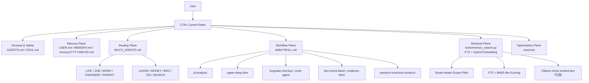
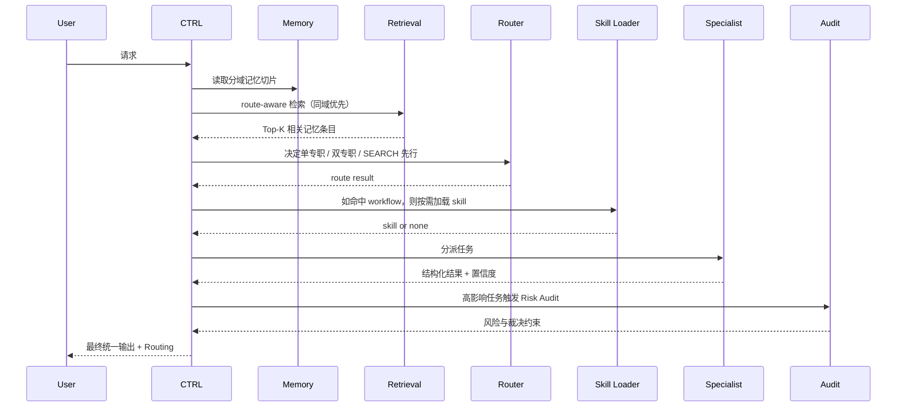

# longClaw

语言 / Language: **简体中文** | [English](README.en.md)

**longClaw 是一个 project-based AI workspace**，专为需要持续推进复杂任务的技术用户设计。

它不是聊天机器人。它知道你在做什么项目、上次做到哪里、下一步该干什么——跨 session 不失忆。

---

## 它解决什么问题

你有没有遇到过：

- 调研了半天，下次开新 session 又要从头解释背景
- 改了代码，但没人记得为什么改、验证结果是什么、下一步是什么
- AI 给了很好的答案，但下次问不到了

longClaw 的核心能力就是解决这三件事：**让 AI 记住你的项目上下文，让每次调研和代码任务的结果自动写回，让你随时能恢复项目态势**。

---

## 最强的两件事

### 1. Deep Research — 调研结果跨 session 可追溯

触发 `search-deep-research` skill，并发多源调研，结果自动写回当前 project 的 memory。下次同项目继续时，CTRL 能直接引用上次的发现，不用重新解释背景。

```
你：帮我深度调研 vLLM 的 continuous batching 实现
→ 并发 spawn search-agent×3，RRF 融合多源结果
→ 自动写回 project memory：summary + key_findings + next_actions
→ 下次：你提到上次调研，CTRL 直接接上
```

### 2. Code Agent — 代码任务有始有终、改动被记住

触发 `engineer-code-agent` skill，有 task 开始、实施、验证、写回。第二天回来，系统知道上次改了什么文件、验证结果是什么、下一步该干什么。

```
你：帮我重构这个模块的错误处理
→ task 开始，明确 goal 和验收标准
→ 实施 + 验证
→ 自动写回：files_touched + validation_result + next_actions
→ 下次：你说"继续上次的任务"，直接接上
```

---

## 它和普通 AI 助手有什么不同

| | 普通 AI 助手 | longClaw |
|---|---|---|
| **项目上下文** | 每次 session 重新解释 | 持久化 project memory，跨 session 可恢复 |
| **调研结果** | 聊完就消失 | 自动写回，下次可引用 |
| **代码任务** | 改完就结束 | 记录改动状态和下一步 |
| **态势感知** | 无 | `longclaw status` 一眼恢复项目现状 |
| **多专家仲裁** | 单 Agent | 10 个专职代理 + CTRL 仲裁，不打架 |

---

## Quick Start

**前提**：已安装 [OpenClaw](https://github.com/openclaw/openclaw)，workspace 目录已创建。

```bash
# 1. Clone 本仓库
git clone https://github.com/jinglong92/longClaw.git
cd longClaw

# 2. 把通用配置复制到你的 OpenClaw workspace
cp AGENTS.md SOUL.md MULTI_AGENTS.md /path/to/your-workspace/
cp -r skills/ /path/to/your-workspace/

# 3. 从模板创建你自己的私有配置（这 3 个文件不会被推送到 GitHub）
cp USER.md.example /path/to/your-workspace/USER.md
cp MEMORY.md.example /path/to/your-workspace/MEMORY.md
# 然后编辑 USER.md，填入你的名字、职业、偏好、当前上下文

# 4. 安装 memory 检索工具（可选，增强检索能力）
cp -r tools/ /path/to/your-workspace/
cd /path/to/your-workspace
python3 tools/memory_entry.py    # 构建索引
python3 tools/memory_search.py --query "测试" --verbose  # 验证

# 5. 查看当前项目状态
scripts/longclaw-status
```

**需要自己创建的私有文件**（不在 repo 里，不会推送）：

| 文件 | 来源 | 要改什么 |
|------|------|---------|
| `USER.md` | 从 `USER.md.example` 复制 | 你的名字、职业、偏好、当前上下文、专属术语定义 |
| `MEMORY.md` | 从 `MEMORY.md.example` 复制 | 从空白开始，随对话积累长期记忆 |
| `memory/` | 自动生成 | 每日对话日志，由 CTRL 自动写入 |

**可以直接复用（不需要改）**：
`AGENTS.md` · `SOUL.md` · `MULTI_AGENTS.md` · `skills/` · `tools/` · `runtime_sidecar/` · `scripts/longclaw-doctor` · `scripts/longclaw-status`

---

## 架构详解（进阶）

以下内容面向想了解内部设计的用户。

---

## 你可以用它做什么

**🧩 搭建可扩展的多代理系统**
定义任意数量的专职代理（JOB / WORK / LEARN / ENGINEER / ...），通过 CTRL 控制平面统一路由和仲裁。每个代理只处理自己域内的任务，CTRL 负责最终裁决和输出——不会出现多个代理同时给出矛盾答案的情况。

**🧠 多层工业级记忆存储与检索**
内置三层记忆体系：每日日志（短期）、分域长期记忆（MEMORY.md 按 [DOMAIN] 分块）、结构化 JSONL 条目索引（持久化）。检索时先按路由域收敛范围，再做 FTS + Embedding Rerank（Ollama 本地推理），精准召回相关记忆，不被跨域噪声污染。

**🔄 智能会话管理与上下文压缩**
内置四层压缩策略：L1 实时截断（工具输出 > 500 字符立即截断）、L2 轻量摘要（token 压力驱动，同步生成结构化 recap）、L3 原生压缩（OpenClaw 内置）、L4 话题归档（结论写入长期记忆）。引入结构化 recap 层（借鉴 Claude Code Summarizer Subagent），L3 压缩后不失忆、多 agent handoff 只传 recap 不传完整历史，`raw_events` 表作为独立事实源保证可审计性。

**🔍 可控的 Developer Mode + 证据驱动执行**

在对话中说 **"开启 dev mode"** 后，系统会把 Dev Mode 视为**会话级硬状态**，并优先从 `memory/session-state.json` 读取会话字段。Developer Mode 的目标不是“多打一段日志”，而是把执行闭环变成**可核验产物优先**：

- 没有真实执行证据，不得声称“已执行/已完成/已生效”
- 没有 verbatim readback，不得声称“已读回校验”
- public-web 只读证据抓取默认按 session 预授权，不与本地任务混淆
- web evidence gate 仅拦截外网证据抓取，不得误拦本地文件修改/读回/验证

```
[DEV LOG]
🔀 路由     JOB | 触发: "offer、面试" | 模式: 单专职
🧠 Memory   [SYSTEM]+[JOB] | ~380 tokens | 节省 72%
📂 Session  第 5 轮 | recent_turns=5/20 | 未触发压缩
🔍 检索     scope=JOB | level=同域归档 | 召回 3 条 | top=[0.91, 0.78, 0.62]
⚖️ 置信度   0.88 [依据: 数据+经验] | 冲突: 无
🤝 A2A      JOB → PARENT 时间冲突协调 | confidence=0.85 | needs_ctrl=false
🏷️ 实体     检测到新实体: Shopee=进行中（2026-04-10）→ 已更新 [JOB]
```

可观测的内容包括：**路由决策 · 会话状态 · 记忆注入量 · 检索范围 · 专家置信度 · A2A 多代理通信 · 冲突裁决过程 · 实体更新记录**

**🧱 Workspace Baseline 已收口**

当前 workspace 已把”授权、证据、读回、session 状态、外网检索门禁”固化成一套统一基线：

- `AGENTS.md`：Deny > Ask > Allow 三层授权 / Immutable Rules / execution latch / readback validation
- `.claude/settings.json`：PostCompact / FileChanged / PreToolUse / SessionStart hooks（harness 层强制执行）
- `memory/session-state.json`：Dev Mode、当前域、待确认动作、压缩次数

**⚡ Workflow Skill 按需加载**
高频任务固化为独立 `SKILL.md`，会话启动时只建索引，命中触发条件后才加载全文执行，执行完即退出。每个 skill 声明 `requires` 依赖字段，缺工具直接返回 `blocked`，不空转。

**🤖 Subagent 并发架构**
四类专用子代理（model: inherit，继承主 session 的 Codex），各自有独立 context 和最小工具权限：
- `search-agent`：并发搜索，只有 WebFetch/WebSearch/Read/Grep 权限
- `memory-agent`：BRO/SIS 路由时后台检索近期记忆，只读权限；回复中明确标注 `[本轮]`/`[记忆]`/`[判断]` 三种来源
- `heartbeat-agent`：cron 定时巡检，只读 + 写 heartbeat-state.json + 自动检查索引新鲜度
- `repo-explorer`：code-agent 触发时自主探索 codebase，返回结构化文件地图，只读

**📊 优化闭环（预留能力）**
真实交互后续可沉淀为优化资产，目前仓库默认聚焦多专家仲裁、分域记忆与检索闭环。

---

| | |
|---|---|
| **基于** | [OpenClaw](https://github.com/openclaw/openclaw)（Peter Steinberger，MIT 开源，353k ⭐） |
| **部分借鉴** | [Hermes Agent](https://github.com/NousResearch/hermes-agent)（Nous Research，MIT 开源，40k ⭐） |
| **底层 LLM** | Codex（OpenClaw 运行时） |
| **运行环境** | Mac mini M4（24/7 本地），WhatsApp / Telegram / Discord 交互 |
| **核心扩展** | 多专家仲裁、分域记忆、向量化检索、Subagent 并发、Harness hooks |

---

## 目录

1. [三系统定位对比](#1-三系统定位对比)
2. [核心设计](#2-核心设计)
3. [当前系统架构](#3-当前系统架构)
4. [Memory 检索系统](#4-memory-检索系统)
5. [Workflow Skills](#5-workflow-skills)
6. [演示](#6-演示)
7. [文件索引](#7-文件索引)
8. [当前边界](#8-当前边界)
9. [设计借鉴说明](#9-设计借鉴说明)
10. [Runtime Sidecar](#10-runtime-sidecar本迭代新增)

---

## 1. 三系统定位对比

longClaw 与官方 OpenClaw、Hermes Agent 同属"个人 AI 操作系统"赛道，但定位和架构有本质差异。

### 1.1 一句话定位

| 系统 | 定位 | 核心范式 |
|------|------|---------|
| **官方 OpenClaw** | "The AI that actually does things" | 单 Agent + 本地执行 + 自我进化 |
| **Hermes Agent** | Self-improving AI agent | 单 Agent + 多工具 + 技能自动学习 |
| **longClaw（本仓库）** | 个人 AI 操作系统，多专家仲裁 + 可优化 | Multi-Agent + CTRL 仲裁 + 训练底座 |

### 1.2 架构对比

```
官方 OpenClaw：
  用户 → OpenClaw Agent（本地 24/7）
           ├── 自动生成 SKILL.md（自我进化）
           ├── 50+ 集成（Gmail/GitHub/智能家居）
           └── ClawHub 技能市场

Hermes Agent：
  用户 → AIAgent.run_conversation()
           ├── 47 个工具 / 20 toolset
           ├── SQLite + FTS5 记忆检索
           └── Progressive Disclosure skill 加载

longClaw（本仓库）：
  用户 → CTRL 控制平面（唯一对外出口）
           ├── 10 个专职代理（JOB/WORK/LEARN/ENGINEER/...）
           ├── 置信度协议 + P0-P4 冲突裁决 + Risk Audit
           ├── 分域记忆注入（~80% token 节省）
           ├── route-aware 检索（FTS + Hybrid Embedding）
           └── 优化闭环预留能力（当前未启用）
```

### 1.3 核心差异矩阵

| 能力维度         | 官方 OpenClaw         | Hermes Agent     | longClaw                         |
| ------------ | ------------------- | ---------------- | -------------------------------- |
| **执行层**      | ✅ 本地代码执行、文件读写、浏览器控制 | ✅ 47 工具          | ✅ 继承 OpenClaw 完整执行层              |
| **专家仲裁**     | ❌ 单 Agent           | ❌ 单 Agent        | ✅ 10 专职代理 + CTRL 仲裁              |
| **风险审计**     | ❌                   | ❌                | ✅ P0-P4 优先级 + Risk Audit         |
| **分域记忆**     | ❌ 全量注入              | ⚠️ FTS-only 全局检索 | ✅ 按路由域精准注入                       |
| **向量检索**     | ❌                   | ⚠️ FTS-only      | ✅ route-aware + Hybrid Embedding |
| **用户画像层**    | ❌                   | ❌                | ✅ USER.md 独立画像                   |
| **技能自动生成**   | ✅ Agent 自写 SKILL.md | ✅ 自动精炼           | ⚠️ 提议系统（用户确认后写入）                 |
| **本地优化闭环（预留）** | ❌              | ❌                | ⚠️ 预留，当前未启用               |
| **50+ 集成生态** | ✅ ClawHub           | ✅ Skills Hub     | ✅ 继承 OpenClaw                    |
| **开源**       | ✅ MIT               | ✅ MIT            | ✅ MIT                            |

> longClaw 的执行层（代码执行/文件读写/浏览器控制/50+ 集成）由 OpenClaw 软件本体提供，
> 运行在 Mac mini M4 上。workspace 配置层（本仓库）在此基础上增加了仲裁、记忆、检索三层能力。

---

## 2. 核心设计

### 2.1 CTRL 控制平面

传统多代理系统的问题：多个 Agent 都能回答，但没人负责最后裁决；并行多但冲突难以解释；路由决策不可见。

longClaw 的设计：

- `CTRL` 是唯一对外交付入口，专职代理只做域内推理
- 默认单专职，跨域问题按需启用双专职并行（≤2）
- 每次回复携带 `Routing:` 行，路由决策完全可见
- 高影响决策触发 Risk Audit（P0 强制阻断 → P4 信息合并）

$$\text{Final Answer} = \text{CTRL}(\text{route},\ \text{specialist outputs},\ \text{risk audit},\ \text{memory slice})$$

**与官方 OpenClaw / Hermes 的差异**：两者均为单 Agent 范式，没有专家仲裁层。longClaw 的多专家仲裁是三系统中独有的。

### 2.2 分域记忆注入

`MEMORY.md` 按 `[SYSTEM] / [JOB] / [LEARN] / [ENGINEER] / ... / [META]` 分块，CTRL 按路由只注入必要片段：

$$\text{Injected Memory} = \text{[SYSTEM]} \cup \text{[Relevant Domain]}$$

相比全量注入，每次节省约 **80% token**，同时避免历史噪声污染当前请求。

**与官方 OpenClaw / Hermes 的差异**：官方 OpenClaw 全量注入 MEMORY.md；Hermes 的 FTS 检索是全局范围。longClaw 在注入前先按路由域过滤，是三系统中唯一做到分域注入的。

### 2.3 Workflow Skill（借鉴 Hermes，有所调整）

把高频复杂任务沉淀为 workflow skill，遵循 **Progressive Disclosure**¹ 原则：

- 会话启动时只建 skill index（name + description）
- 命中触发条件时才加载完整 `SKILL.md`
- 执行完成后退出 context，不长期占用 token 预算

当前 skill 以“按需加载的工作流插件”形式组织，主要覆盖工程执行、检索取证、学习生成、系统运维、治理迁移五类场景（详见 [§ Workflow Skills](#5-workflow-skills)）。

> ¹ Progressive Disclosure 设计借鉴自 **[Hermes Agent](https://github.com/NousResearch/hermes-agent)**。
> Hermes 有完整的 skill_manage 工具实现自动 create/patch；longClaw 将其移植为 workspace 协议层约定。

**与官方 OpenClaw 的差异**：官方 OpenClaw 的 Agent 可以自动写 SKILL.md（真正的自我进化）；longClaw 目前是提议系统，用户确认后才写入。

### 2.4 route-aware Memory 检索

OpenClaw 原生 `memory_search` 是 FTS-only，词面不重叠就返回空结果。longClaw 在此基础上增加了两层：

**第一层：scope filter（先决定搜哪里）**

```
Level 1: 当前 session / recent turns
Level 2: 同域 + 7天内   → 结果 ≥ 2 则停止
Level 3: 同域 + 全量    → 结果 ≥ 2 则停止
Level 4: 跨域全量       → 兜底，结果标注[跨域]
```

**第二层：hybrid rerank（再决定怎么搜）**

$$S(q,d) = S_{\text{fts}} + 0.4 \cdot N_{\text{entity}} + 0.05 \cdot \text{imp}(d) + 0.05 \cdot \mathbf{1}_{\text{daily}}(d)$$

可选 Hybrid 模式：FTS candidate → Ollama nomic-embed-text（768 维）→ RRF fusion

**与 Hermes 的差异**：Hermes 的 FTS 是全库统一检索；longClaw 先按路由域收敛范围，再做 FTS + embedding rerank，解决了"更聪明地召回不该召回的东西"的问题。

### 2.5 本地优化闭环（预留）

仓库保留优化闭环扩展位，但短期不启用，不影响当前主路径（Codex via OpenClaw）。

---

## 3. 当前系统架构

### 3.1 主架构图


### 3.2 四层压缩协作 + recap 层


四层压缩的数据流与 recap 层关系：

```
工具调用
   ├─→ raw_events 表（事实源，append-only，不受任何压缩影响）
   └─→ L1 Trim（> 500 字符立即截断）
            │
            ↓
       L2 Summarize（token 压力驱动）
            ├─→ 压缩中间历史
            └─→ 生成 recap.json（authoritative=false，lossy 压缩上下文）
                      │
                      ├─→ L3 Compact seed（压缩后不失忆）
                      ├─→ agent handoff payload（只传 recap，不传完整历史）
                      └─→ L4 Archive 候选（confirmed_facts → MEMORY.md）
```

**recap 硬约束**：`authoritative=false` 永远不可改；工具调用验证必须查 `raw_events`，不得以 recap 代替。

### 3.3 当前六层结构



### 3.4 请求流动时序



---

## 4. Memory 检索系统

> 2026-04-10 新增，放在 `tools/` 目录，无外部依赖（FTS 部分）。

### 检索架构

```
用户 query
    │
    ▼
Query Rewrite（3 个变体）
  ① 原始 query
  ② + domain hints（路由到 JOB 自动加 "job career offer interview"）
  ③ + 实体提取版（公司名 / 技术词 / 项目名）
    │
    ▼
Route-Aware Scope Filter
  Level 2: 同域 + 7天内  →  结果 ≥ 2 则停止
  Level 3: 同域 + 全量   →  结果 ≥ 2 则停止
  Level 4: 跨域全量      →  兜底，标注[跨域]
    │
    ▼
FTS Scoring（BM25-like，纯 Python，无外部依赖）
  实体精确命中 +0.4 · N_entity
  daily 条目（事实性更强）+0.05
  全局按分数重排（不受 level 顺序限制）
    │
    ├── FTS-only → Top-K
    │
    └── Hybrid（--hybrid，需 Ollama）
          nomic-embed-text（768 维，M4 本地推理，无需 GPU）
          → RRF fusion（FTS rank + embedding rank）
          → Top-K
```

### 快速上手

```bash
# 构建索引（首次或 MEMORY.md 更新后）
python3 tools/memory_entry.py
python3 tools/memory_entry.py --stats

# FTS 检索（无需 Ollama，立即可用）
python3 tools/memory_search.py --query "Shopee 面试" --domain JOB
python3 tools/memory_search.py --query "openclaw 调优" --domain ENGINEER --verbose

# Hybrid 检索（需要 Ollama）
brew install ollama && ollama pull nomic-embed-text
python3 tools/memory_search.py --query "换电站运力" --domain ENGINEER --hybrid
```

---

## 5. Workflow Skills

workflow skills 只在命中时加载，当前可概括为下表：

| 类别 | 代表 skill |
|------|-------------|
| 工程执行 | `code-agent`、`research-execution-protocol`、`research-build` |
| 检索与证据 | `deep-research`、`fact-check-latest`、`public-evidence-fetch` |
| 学习与生成 | `paper-deep-dive`、`paperbanana` |
| 系统运维 | `longclaw-checkup`、`session-compression-flow`、`proactive-heartbeat` |
| 治理与迁移 | `skill-safety-audit`、`multi-agent-bootstrap`、`memory-companion`、`jd-analysis` |

---

## 6. 演示

### 演示一：多专家仲裁

```
开启 dev mode。
从 ENGINEER 和 JOB 两个视角同时分析：
这个技术项目应该如何定位和表达？
要求各自给出置信度，CTRL 最后仲裁。
```

展示：路由可见 + 双专职克制触发 + CTRL 真实仲裁 + 置信度差异

### 演示二：Workflow Skill

```
按 jd-analysis 工作流处理这个岗位。
输出：能力模型、匹配度、主要短板、本周行动。
```

展示：角色负责领域判断，skill 负责具体流程，输出结构稳定可复现

### 演示三：最新事实核查

```
按 fact-check-latest 工作流，核查最近 30 天 Agent + OR 岗位趋势。
要求区分 [确定] / [推断] / [缺失]。
```

展示：SEARCH 角色 + 不对不确定信息装懂 + 信息完整性显式表达

### 演示四：Memory 检索对比

```bash
# FTS-only vs Hybrid，展示 route-aware scope 的效果
python3 tools/memory_search.py --query "Shopee 面试" --domain JOB --verbose
python3 tools/memory_search.py --query "上次面试进展" --domain JOB --hybrid --verbose
```

展示：同域优先 + 实体命中加权排序 + hybrid 语义补盲

---

## 7. 文件索引

### 核心协议

| 文件 | 作用 |
|------|------|
| [AGENTS.md](AGENTS.md) | 全局行为约束 + Deny/Ask/Allow 三层授权 + Immutable Rules（最高优先级）|
| [SOUL.md](SOUL.md) | 助手人格契约 |
| [MULTI_AGENTS.md](MULTI_AGENTS.md) | 专职代理定义 + 路由规则 + A2A 协议 |
| [CTRL_PROTOCOLS.md](CTRL_PROTOCOLS.md) | CTRL 运行协议：Skill 加载 / 压缩 / 检索 / Skill 提议 |
| [DEV_LOG.md](DEV_LOG.md) | DEV LOG 9 字段格式规范 + 强制输出规则 |
| [HEARTBEAT.md](HEARTBEAT.md) | 心跳静默策略 + Proactive Heartbeat Agent 说明 |
| `USER.md` | 用户画像与偏好（私有，从 USER.md.example 创建，不在 repo 里）|
| `MEMORY.md` | 长期记忆（分域块，私有，从 MEMORY.md.example 创建，不在 repo 里）|
| [USER.md.example](USER.md.example) | USER.md 公开模板 |
| [MEMORY.md.example](MEMORY.md.example) | MEMORY.md 公开模板 |

### Harness 配置（.claude/）

| 文件 | 作用 |
|------|------|
| [.claude/settings.json](.claude/settings.json) | UserPromptSubmit（/new 重启）/ PostCompact / FileChanged / PreToolUse / SessionStart hooks |
| [.claude/agents/search-agent.md](.claude/agents/search-agent.md) | 并发搜索子代理（inherit model，WebFetch+Read+Grep）|
| [.claude/agents/memory-agent.md](.claude/agents/memory-agent.md) | 记忆检索子代理（inherit model，只读）|
| [.claude/agents/heartbeat-agent.md](.claude/agents/heartbeat-agent.md) | 心跳巡检子代理（inherit model，只读+写 heartbeat-state.json+自动索引重建）|
| [.claude/agents/repo-explorer.md](.claude/agents/repo-explorer.md) | Codebase 探索子代理（inherit model，只读，返回结构化文件地图）|

### Workflow Skills

| 文件 | 触发场景 |
|------|---------|
| [skills/job-jd-analysis/SKILL.md](skills/job-jd-analysis/SKILL.md) | JD 分析 |
| [skills/learn-paper-deep-dive/SKILL.md](skills/learn-paper-deep-dive/SKILL.md) | 论文深度解读 |
| [skills/engineer-longclaw-checkup/SKILL.md](skills/engineer-longclaw-checkup/SKILL.md) | longClaw 运行时体检 |
| [skills/search-fact-check-latest/SKILL.md](skills/search-fact-check-latest/SKILL.md) | 最新事实核查 |
| [skills/engineer-research-execution-protocol/SKILL.md](skills/engineer-research-execution-protocol/SKILL.md) | 研究型工程执行协议 |
| [skills/engineer-research-build/SKILL.md](skills/engineer-research-build/SKILL.md) | 研究工程落地构建 workflow |
| [skills/meta-skill-safety-audit/SKILL.md](skills/meta-skill-safety-audit/SKILL.md) | 外部技能接入安全审计 |
| [skills/meta-session-compression-flow/SKILL.md](skills/meta-session-compression-flow/SKILL.md) | 会话压缩与跨会话衔接流程 |
| [skills/multi-agent-bootstrap/SKILL.md](skills/multi-agent-bootstrap/SKILL.md) | 多代理架构搭建/迁移 |
| [skills/search-public-evidence-fetch/SKILL.md](skills/search-public-evidence-fetch/SKILL.md) | 公开网页/论文证据抓取 |
| [skills/search-deep-research/SKILL.md](skills/search-deep-research/SKILL.md) | 并发多源深度调研（spawn search-agent×2-3）|
| [skills/companion-memory-companion/SKILL.md](skills/companion-memory-companion/SKILL.md) | 记忆增强陪伴（BRO/SIS 自动触发）|
| [skills/meta-proactive-heartbeat/SKILL.md](skills/meta-proactive-heartbeat/SKILL.md) | 主动心跳巡检（cron + SessionStart 呈现）|
| [skills/learn-paperbanana/SKILL.md](skills/learn-paperbanana/SKILL.md) | 学术论文配图自动生成（需本地安装）|

### Memory 检索工具

| 文件 | 作用 |
|------|------|
| [tools/memory_entry.py](tools/memory_entry.py) | MEMORY.md + daily memory → JSONL 条目 |
| [tools/memory_search.py](tools/memory_search.py) | route-aware FTS + hybrid embedding 检索 |

### 学习文档

| 文件 | 内容 |
|------|------|
| [docs/longclaw-design.md](docs/longclaw-design.md) | 系统设计与 Claude Code 对比（架构/记忆/压缩/协同/Harness，含设计决策矩阵）|
| [docs/longclaw-practice.md](docs/longclaw-practice.md) | 实践经验与踩坑（5类常见问题解法、演进历程、已知问题）|
| [docs/memory-compression-guide.md](docs/memory-compression-guide.md) | 记忆与压缩机制详解 + Mermaid 原理图（PPT 专用）|
| [docs/claude-code-internals.md](docs/claude-code-internals.md) | Claude Code 内部架构逆向分析（sourcemap，10个核心设计模式）|
| [docs/coding-agent-learning-plan.md](docs/coding-agent-learning-plan.md) | Coding Agent 学习路径（SWE-agent/Aider/SWE-bench，5个里程碑）|

### 历史设计资料

- [multi-agent/ARCHITECTURE.md](multi-agent/ARCHITECTURE.md)
- [multi-agent/PROFILE_CONTRACT.md](multi-agent/PROFILE_CONTRACT.md)
- [multi-agent/UNIFIED_SYNC_2026-03-25.md](multi-agent/UNIFIED_SYNC_2026-03-25.md)

---

## 8. 当前边界

| 边界 | 说明 |
|------|------|
| workspace 改造层 | longClaw 是 OpenClaw workspace 改造，原生能力（hooks/权限/compaction/skill加载）直接可用；longClaw 新增仲裁、分域记忆、检索、subagent、harness hooks |
| Subagent 模型 | subagent 只支持 Claude 模型（inherit/sonnet/opus/haiku），不支持 Codex；当前四个 agent 均设为 inherit 继承主 session |
| Session 连续性 | 微信 bot 每条消息触发新 session（ephemeral），DEV LOG 的 round 是本次运行内轮次；跨 session 统计由 heartbeat-agent 负责 |
| memory-agent 来源标注 | BRO/SIS 回复中必须区分 [本轮]/[记忆]/[判断] 三种来源；memory-agent 超时时禁止把当前会话信息包装成记忆检索结果 |
| FileChanged hook 时效 | 只感知进程运行中的文件变更；启动前的变更需重启 OpenClaw 或 /new 后生效 |
| 技能自动生成 | 目前是提议系统（用户确认后才写入），非官方 OpenClaw 式自动写入 |
| memory 检索质量 | 取决于 MEMORY.md 的事实条目密度；heartbeat-agent 每天自动检查索引新鲜度并按需重建 |
| hybrid 增益 | 语料以配置/规则文本为主时 FTS 与 embedding 差距不大；事实型日志积累后优势显现 |
| 本地优化闭环 | 相关实现已暂时移除，短期不启用（主用 Codex via OpenClaw） |
| 并发上限 | 专职并行 ≤2；subagent 并发 ≤3（deep-research 上限）|
| Proactive Heartbeat | 需在 Mac mini 上手动运行一次 setup_heartbeat_cron.sh 安装 cron job |

---

## 9. 设计借鉴说明

### Claude Code

> **Claude Code**（Anthropic）：https://claude.ai/code

longClaw 从 Claude Code 内部架构中借鉴了两个具体设计：

| 借鉴点 | Claude Code 原始设计 | longClaw 的实现与调整 |
|--------|---------------------|---------------------|
| **Tool Result Budgeting** | 工具输出按 token 预算截断，超出部分不塞入上下文，保留可追溯路径 | L1 Trim：> 500 字符截断 + 尾注，同时 `raw_events` 表独立保存完整原始输出 |
| **Summarizer Subagent** | context 接近上限时，专用 summarizer 压缩中间历史，压缩产物与原始事件日志分开存储，摘要永远不覆盖事件日志 | L2 Summarize 升级：触发时同步生成结构化 `recap.json`（含 `authoritative=false` 硬约束），写入 `session_recaps` SQLite 表；`raw_events` 表独立存储，recap 不得用于审计 |

**借鉴动机**：longClaw 是 workspace 型 agent runtime，每个 session 持续读写多份状态文件，上下文积累速度远快于普通对话。没有结构化压缩产物的问题：L3 compaction 后 CTRL 失忆、multi-agent handoff 需传完整历史、调试时摘要与事件混淆无法区分。

**与 Claude Code 的差异**：Claude Code 的 Summarizer 是独立 subagent；longClaw MVP 阶段由 CTRL / Layer 2 Summarize 生成，不引入独立 recap-agent（待 schema 和 handoff 协议稳定后再重构）。

---

### 官方 OpenClaw

> **OpenClaw**（Peter Steinberger，MIT 开源，353k ⭐）：https://github.com/openclaw/openclaw

longClaw 是在官方 OpenClaw 软件基础上改造的 workspace。执行层（代码执行、文件读写、浏览器控制、50+ 集成、Heartbeat 机制）完全继承官方 OpenClaw，运行在 Mac mini M4 上。

本仓库是 workspace 配置层的改造，包括：

- 扩展了 MULTI_AGENTS.md（10 个专职代理、A2A 协议、置信度裁决）
- 重构了 MEMORY.md（分域块注入）
- 新增 tools/ 目录（独立 memory 检索工具）

### Hermes Agent

> **Hermes Agent**（Nous Research，MIT 开源，40k ⭐）
> GitHub：https://github.com/NousResearch/hermes-agent
> 文档：https://hermes-agent.nousresearch.com/docs/

| 借鉴点 | Hermes 原始设计 | longClaw 的实现与调整 |
|--------|---------------|---------------------|
| **Skill 格式（SKILL.md）** | 结构化 frontmatter，粒度为具体 workflow（arxiv-search、github-pr-workflow 等） | 沿用格式和粒度原则，为 4 个高频任务建 SKILL.md；角色定义保留在 MULTI_AGENTS.md |
| **Progressive Disclosure** | 启动时只加载 skill name+description，命中时才读完整内容，有 skill_manage 工具支撑 | OpenClaw 运行时原生支持；longClaw 在此基础上扩展了 requires 依赖检查和强制触发规则 |
| **Context Compression** | 50% token threshold 触发，四阶段算法（清理冗长输出→划定边界→生成摘要→清理孤立工具对） | 分两层：Layer A 为压缩偏好声明（与 OpenClaw 原生 compaction 协同），Layer B 为话题归档 |
| **FTS + embedding 检索** | SQLite FTS5 + session 血缘追踪，mode=fts-only | 增加 route-aware scope filter + Ollama 本地 embedding rerank + RRF fusion |
| **Proactive Troubleshooting** | 外部查询失败时主动尝试备用路径，不直接问用户 | 沿用理念，修正 fallback 路径（Google Cache 已下线 → Wayback Machine） |

**longClaw 独有，Hermes 没有的**：

| 能力 | 说明 |
|------|------|
| Multi-Agent 仲裁 + Risk Audit | 10 个专职代理 + CTRL 仲裁 + P0-P4 优先级裁决 |
| USER.md 用户画像层 | 独立的用户上下文文件，个性化建议的基础 |
| 本地优化闭环（预留） | 后续按需恢复，不影响当前主路径 |
| route-aware scope filter | 检索前先按路由域收敛范围，而非全库检索 |

---

> 这套系统最有价值的地方，不是"会分角色聊天"，而是把控制、记忆、流程和优化闭环拆清楚——让每一层都可以独立演进、独立观测、独立优化。

---

## 10. Runtime Sidecar（本迭代新增）

本迭代在 workspace 中增加一层 **Python Runtime Sidecar**：在不大改 OpenClaw 本体的前提下，用 hooks 聚合事件、持久化会话台账（session ledger），并提供 `doctor` / `status` 等诊断与查询入口。设计取向是 **workspace 优先、侧车次之、最后才 fork 运行时**——能靠配置解决的不写代码，能靠侧车解决的不 fork。

### 10.1 新增路径与工具

| 路径 | 作用 |
|------|------|
| `runtime_sidecar/` | Hook 分发器、事件总线、状态 SQLite、日志、`plugins/`（SessionStart、PostCompact、FileChanged、PreToolUse）、`doctor/` 自检模块 |
| `scripts/longclaw-doctor` | 健康检查：必备文件、hook 配置、状态库初始化、可选组件形态；可用 `--json` 输出机器可读结果，任一项失败则非零退出 |
| `scripts/longclaw-status` | 台账摘要：会话数、路由与工具事件、最近 note 时间等；可用 `--json`；库不存在时会在首次使用时创建 |
| `tools/session_search.py` | 对台账做子串检索（默认可扫全表） |
| `docs/architecture-boundary.md`、`docs/migration-roadmap.md`、`docs/compatibility-matrix.md` | 架构边界、迁移路线、兼容矩阵 |

Sidecar **不替代** OpenClaw 自带的 session 存储与运行时行为；改动应保持可逆。

### 10.2 接入：Bridge + Dispatcher（推荐）

OpenClaw 对部分 hook 有固定协议语义（例如 `SessionStart` / `PostCompact` 对 `CLAUDE_ENV_FILE` 的注入、`PreToolUse` 的 `hookSpecificOutput.updatedInput`）。**不要**把四个事件全部直接改成只跑 `python3 -m runtime_sidecar.hook_dispatcher`，否则容易丢失这些语义。

推荐做法：在 `scripts/hooks/` 下用 **bridge 脚本**先完成既有协议与保护逻辑，再以旁路方式调用侧车写台账。仓库内已提供：

- `scripts/hooks/hook_dispatcher_session_start.sh`（在宿主**会**发 `SessionStart` 时生效）
- `scripts/hooks/hook_dispatcher_user_prompt_submit.sh`（**UserPromptSubmit**：`/new` 清 marker 并重启 gateway；按会话 key 用 `memory/.user_prompt_submit.injected.<key>` 做**协议首轮注入**；每轮用户消息旁路 **`python3 -m runtime_sidecar.hook_dispatcher UserPromptSubmit`**，由插件 `user_prompt_submit.py` 写 `sessions` + `notes(kind=user_prompt_submit)`；stdin JSON 与 `CLAUDE_USER_PROMPT` 均可供提取 prompt 预览）
- `scripts/hooks/hook_dispatcher_post_compact.sh`
- `scripts/hooks/hook_dispatcher_file_changed.sh`
- `scripts/hooks/hook_dispatcher_pre_tool_use.sh`

**宿主差异（已用探针验证）：** 在部分 OpenClaw / Claude Code 会话类型下，**`SessionStart` 可能根本不被调用**；此时 **`UserPromptSubmit` 承担主初始化**，**`PreToolUse`** 继续负责工具前旁路与无 `session_id` 时的台账兜底。

`.claude/settings.json` 中对应事件应指向上述 `bash scripts/hooks/...`。`SessionStart` 建议保持旧版**单层 `hooks` 数组、不包 `matcher`**（部分宿主对 `SessionStart`+`matcher: "auto"` 不触发）；`PostCompact` 等可沿用你环境原先已验证的 `matcher` 写法。侧车分发器从 stdin 读 JSON：`python3 -m runtime_sidecar.hook_dispatcher <Event>`，由 bridge 构造并管道传入。

排查宿主是否真正执行 hook：各 bridge 会向 `memory/sidecar-hooks.log` 写入 `[hook] … bridge invoked`。

### 10.3 常用命令

```bash
# 自检
scripts/longclaw-doctor
# scripts/longclaw-doctor --json

# 台账状态
scripts/longclaw-status
# scripts/longclaw-status --json

# 子串检索示例
python3 tools/session_search.py --query error --kind notes
```

### 10.4 范围与后续

- 实现刻意保持精简：不试图覆盖 OpenClaw 全部会话语义；当前仅实现部分 hook 作为起点，新事件可通过新增 plugin 扩展。
- 检索侧目前为简单 `LIKE` 查询；后续阶段可升级到 FTS5。

更细的说明见 `docs/` 下上述三份文档。

---

## Contributing

欢迎贡献 Workflow Skill、改进检索工具或完善训练底座。

最低门槛的贡献方式：在 `skills/<domain>-<skill-name>/` 下新建一个 `SKILL.md`，
描述一个具体的可复用工作流（参考现有的 `skills/job-jd-analysis/` 格式）。

详见 [CONTRIBUTING.md](CONTRIBUTING.md)。

## Skills 扩展原则

新增 skill 必须满足：
- 不替代 CTRL（skill 是 workflow，不是角色）
- 不改变全局人格
- 不常驻污染上下文（执行完即退出）
- 优先局部增强、可验证、可回滚

新增方式：在 `skills/<domain>-<skill-name>/` 下新建 `SKILL.md`，参考现有格式（frontmatter + 触发条件 + 流程步骤 + 输出格式）。


---

## 架构分层说明

longClaw 是运行在 Mac mini M4 上的 **OpenClaw workspace 改造层**，不是独立运行时。

### OpenClaw 原生提供（直接可用，无需在 workspace 里重新实现）

| 能力 | 说明 |
|------|------|
| Hooks 系统 | PreToolUse / PostToolUse / SessionStart / Stop 等事件，harness 层自动执行 |
| 权限模型 | Deny > Ask > Allow 三层，settings.json 配置，harness 强制执行 |
| 工具调用生命周期 | 工具发现、调用、结果注入，由 OpenClaw 运行时管理 |
| Context compaction | session 接近上下文窗口时自动触发，保护工具调用边界 |
| SKILL.md 加载 | Progressive Disclosure，会话启动时扫描 skills/，命中时加载全文 |
| Bootstrap files 加载 | `AGENTS.md` / `SOUL.md` / `TOOLS.md` / `IDENTITY.md` / `USER.md` / `MEMORY.md` 会话启动时自动进入 system prompt；`AGENTS.md` 的关键 section 在 compaction 后原生重注入 |
| Session 生命周期 | 会话创建、恢复、结束，由 OpenClaw 管理 |

### longClaw workspace 层新增（本仓库的改造内容）

| 能力 | 说明 |
|------|------|
| CTRL 多专家仲裁 | 10 个专职代理 + P0-P4 冲突裁决，定义在 MULTI_AGENTS.md |
| 分域记忆注入 | MEMORY.md 按 [DOMAIN] 分块，CTRL 按路由只注入必要片段 |
| route-aware 检索 | tools/memory_search.py，4 级作用域 + FTS + Hybrid Embedding |
| Skill 依赖声明 | requires 字段，命中前检查工具可用性 |
| Layer B 话题归档 | 话题结束时提炼结论写入 MEMORY.md，跨 session 可检索 |
| 结构化 recap 层 | L2 Summarize 同步生成 recap.json（借鉴 Claude Code Summarizer），authoritative=false 硬约束，agent handoff 只传 recap；raw_events 表独立存储工具调用事实源 |
| DEV LOG 格式 | 9 字段可观测日志，含 🛠️ 工具 PostToolUse 注入 |
| 本地优化闭环（预留） | 暂不启用，当前仓库不包含具体实现 |
