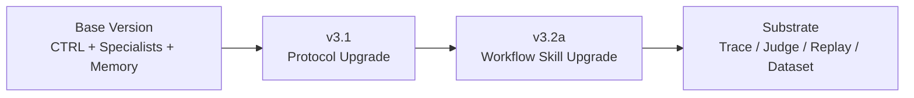
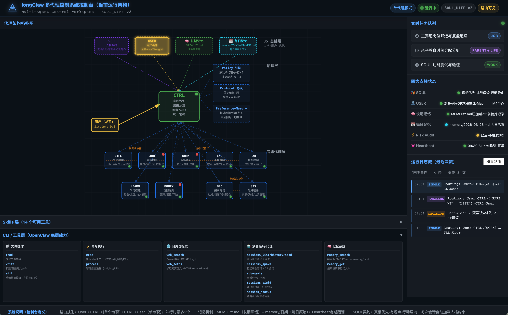
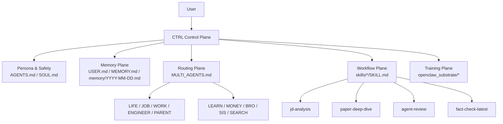
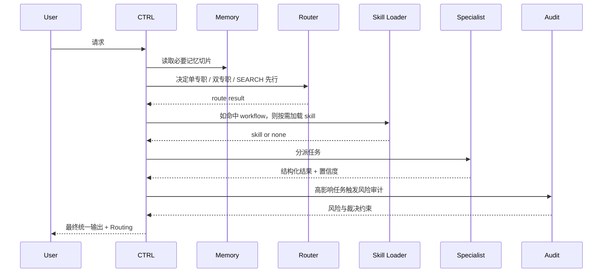

# longClaw Workspace

语言 / Language: **简体中文** | [English](README.en.md)

longClaw 是一个面向真实个人协作场景的 AI 控制系统。它的价值不在于“堆更多 Agent”，而在于把 Agent 从一次性对话，升级成一个**可路由、可记忆、可审计、可迭代优化**的工作系统。

当前版本不是对旧设计的推翻，而是一次**融合升级**：

\[
\text{Current longClaw} = \text{Base Multi-Agent} + \text{v3.1 Protocol Upgrade} + \text{v3.2a Workflow Upgrade} + \text{Local-first Substrate}
\]

---

## 1. 一句话定位

如果用一句话向面试官解释：

> longClaw 的核心创新，是把“会聊天的 LLM”升级成“有控制平面、有记忆平面、有工作流平面、还能沉淀训练资产的个人 AI Runtime”。

我真正解决的问题不是“怎么多加几个角色”，而是：

1. **谁处理这个任务**：路由要可控。
2. **为什么这么处理**：裁决要可解释。
3. **跨会话怎么延续**：记忆不能靠上下文窗口碰运气。
4. **系统怎么持续变好**：真实交互要沉淀成 trace / replay / dataset。

---

## 2. 演化路线：不是替代，是升级

### 2.1 版本演化图



### 2.2 每一轮升级做了什么

| 阶段 | 保留了什么 | 新增了什么 | 解决了什么问题 |
|---|---|---|---|
| Base | `CTRL + 专职代理 + 基础记忆` | 多代理协作骨架 | 先把角色分工建立起来 |
| `v3.1` | 保留原有角色体系 | `SEARCH`、分域记忆注入、置信度裁决、A2A/Session 协议、Developer Mode | 解决“路由不稳、记忆污染、检索弱、裁决不可见” |
| `v3.2a` | 保留 `v3.1` 协议层 | workflow skills、Progressive Disclosure、Context Compression、Proactive Skill Creation | 解决“工作流重复、上下文膨胀、角色 prompt 越写越脏” |
| Substrate | 保留上层控制协议 | trace / judge / dataset / replay / backend export | 解决“只能聊天、无法复盘、无法优化” |

结论：

- `v3.1` 不是替代 Base，而是把控制协议做硬。
- `v3.2a` 不是替代 `v3.1`，而是把高频任务抽象成 workflow。
- substrate 也不是替代上层，而是给上层提供优化闭环。

---

## 3. 这套设计真正有意思的地方

### 3.1 从“多角色聊天”升级为“CTRL 控制平面”

传统多代理系统常见问题：

- 多个 Agent 都能回答，但没人负责最后裁决
- 并行很多，看起来热闹，实际成本高且容易冲突
- 回答出来了，但很难解释为什么这么路由、为什么这么答

longClaw 的做法是：

- `CTRL` 是唯一对外交付入口
- 专职代理只做域内推理，不直接面向用户输出最终口径
- 默认单专职，必要时最多双专职并行
- 最后统一回到 CTRL 做仲裁和风险审计

形式化地说：

\[
\text{Final Answer} = \text{CTRL}(\text{route}, \text{specialist outputs}, \text{risk audit}, \text{memory slice})
\]

这带来的直接收益是：

- 稳定性更高
- 输出口径更统一
- 冲突更容易被发现和解释

### 3.2 从“把所有东西都塞进 prompt”升级为“分域记忆注入”

旧问题：长期记忆越来越长，最后所有请求都被历史噪声污染。

当前设计：

- `MEMORY.md` 不再是一整块文本
- 而是按 `[SYSTEM] / [JOB] / [LEARN] / [ENGINEER] / ... / [META]` 分块
- CTRL 按路由只注入必要片段

所以：

\[
\text{Injected Memory} = \text{System} \cup \text{Relevant Domain}
\]

而不是：

\[
\text{Injected Memory} = \text{All Memory}
\]

这看起来是小改动，但对稳定性是大改动。

### 3.3 从“角色能力膨胀”升级为“workflow skill”

`v3.2a` 新增的重点不是更多角色，而是把高频复杂任务沉淀成 workflow skill。

当前 4 个 skill：

| Skill | 面向任务 | 作用 |
|---|---|---|
| `jd-analysis` | 岗位/JD | 提取能力模型、匹配度、短板与投递动作 |
| `paper-deep-dive` | 论文/技术方法 | 深解方法、对比路线、压缩成面试可复述版本 |
| `agent-review` | 协议/系统设计 | 审查规则冲突、脏设计、token 浪费 |
| `fact-check-latest` | 最新事实核查 | 做多源交叉验证、区分确定与推断 |

它们遵循一个关键设计：

**Progressive Disclosure**

- 会话启动时只建 skill index
- 只有命中具体工作流时，才加载完整 `SKILL.md`
- 用完就退出，不长期占上下文预算

这比把所有流程都写进角色 prompt 更工程化，也更节省 token。

### 3.4 从“聊天日志”升级为“训练可回放资产”

最容易被低估的一点，是 `openclaw_substrate/`。

我没有把它设计成一个“展示层目录”，而是设计成后续优化闭环的基础设施：

- `gateway`: 统一入口
- `trace_plane`: 记录 canonical trace
- `judge_plane`: 规则评价 / 奖励信号
- `dataset_builder`: 构建可训练数据
- `shadow_eval`: baseline vs candidate 回放对比
- `backends/*`: 本地 MLX-LM 与 LLaMA-Factory 导出路径

也就是说，longClaw 的目标不是只会“回答得像个聪明助手”，而是最终可以：

\[
\text{Interaction} \rightarrow \text{Trace} \rightarrow \text{Judge} \rightarrow \text{Dataset} \rightarrow \text{Replay / Optimize}
\]

---

## 4. 当前系统长什么样

### 4.1 主架构图



这张图保留了历史设计图，因为它仍然准确表达了系统的控制台视角。

### 4.2 当前五层结构



### 4.3 请求是怎么流动的



---

## 5. 为什么这种设计对真实场景更有价值

### 5.1 稳定性

- 默认单专职，避免无意义并行
- CTRL 统一输出，避免多口径冲突
- 分域记忆注入，降低历史噪声污染

### 5.2 可解释性

- 每次响应都带 Routing
- 冲突裁决有明确协议
- 最新事实核查强调“确定 / 推断 / 缺失”

### 5.3 成本控制

- Skill 按需加载，而不是全量加载
- 长对话支持 compression / archival 规则
- 不靠“更长上下文”粗暴解决复杂度

### 5.4 可优化性

- 交互可沉淀为 trace
- 路由错误、重试率、回退率都可以被观测
- 后续可以做 replay、shadow eval、adapter 迭代

---

## 6. 当前最值得讲给面试官的点

如果只讲 4 个点，我建议讲这 4 个：

1. **CTRL 控制平面**
   - 我不是做了多个角色，而是把“路由、仲裁、风险控制”独立成控制平面。

2. **分域记忆注入**
   - 我没有让系统盲目记更多，而是让记忆可切片、可控、可解释。

3. **workflow skill 机制**
   - 我把高频任务从“角色 prompt 膨胀”里拆出来，变成按需加载的流程资产。

4. **trace-first substrate**
   - 我不是停留在 prompt engineering，而是给系统留了 replay / judge / dataset 的优化路径。

这 4 点组合起来，才构成 longClaw 的创新闭环。

---

## 7. 你可以怎么现场演示

### 7.1 演示一：路由与裁决

```text
开启 dev mode。
从 ENGINEER 和 JOB 两个视角同时看：这个技术项目应该怎么讲进简历？
要求：给出各自置信度，最后由 CTRL 仲裁。
```

这能演示：

- 路由可见
- 双专职并行是克制触发，不是默认乱并发
- CTRL 不是摆设，而是真正负责统一结论

### 7.2 演示二：workflow skill

```text
按 jd-analysis 工作流处理这个岗位。
输出：能力模型、匹配度、主要短板、投递建议。
```

这能演示：

- 角色负责领域
- skill 负责流程
- 输出结构明显比普通聊天稳定

### 7.3 演示三：最新事实核查

```text
按 fact-check-latest 工作流，核查最近 30 天 Agent + OR 岗位趋势。
要求区分 [确定]/[推断]/[缺失]。
```

这能演示：

- `SEARCH` 角色存在意义
- 对“最新信息”不装懂
- 信息完整性与不确定性被显式表达

---

## 8. 相关代码与文档入口

### 8.1 核心协议文件

- [AGENTS.md](AGENTS.md)
- [MULTI_AGENTS.md](MULTI_AGENTS.md)
- [SOUL.md](SOUL.md)
- [USER.md](USER.md)
- [MEMORY.md](MEMORY.md)

### 8.2 当前 workflow skill

- [skills/job/jd-analysis/SKILL.md](skills/job/jd-analysis/SKILL.md)
- [skills/learn/paper-deep-dive/SKILL.md](skills/learn/paper-deep-dive/SKILL.md)
- [skills/engineer/agent-review/SKILL.md](skills/engineer/agent-review/SKILL.md)
- [skills/search/fact-check-latest/SKILL.md](skills/search/fact-check-latest/SKILL.md)

### 8.3 本地训练底座

- [openclaw_substrate/gateway.py](openclaw_substrate/gateway.py)
- [openclaw_substrate/trace_plane.py](openclaw_substrate/trace_plane.py)
- [openclaw_substrate/judge_plane.py](openclaw_substrate/judge_plane.py)
- [openclaw_substrate/dataset_builder.py](openclaw_substrate/dataset_builder.py)
- [openclaw_substrate/shadow_eval.py](openclaw_substrate/shadow_eval.py)
- [openclaw_substrate/cli.py](openclaw_substrate/cli.py)

### 8.4 历史页面与设计资料

这些内容继续保留，因为它们是演化过程的一部分，而不是废弃物：

- [multi-agent/README.md](multi-agent/README.md)
- [multi-agent/ARCHITECTURE.md](multi-agent/ARCHITECTURE.md)
- [multi-agent/PROFILE_CONTRACT.md](multi-agent/PROFILE_CONTRACT.md)
- [multi-agent/LEARNING_GUIDE_FOR_JINGLONG.md](multi-agent/LEARNING_GUIDE_FOR_JINGLONG.md)
- [multi-agent/UNIFIED_SYNC_2026-03-22.md](multi-agent/UNIFIED_SYNC_2026-03-22.md)
- [multi-agent/UNIFIED_SYNC_2026-03-25.md](multi-agent/UNIFIED_SYNC_2026-03-25.md)
- [docs/openclaw-iteration-plan-v1.md](docs/openclaw-iteration-plan-v1.md)
- [docs/openclaw-面试讲解提纲_2026-03-25.md](docs/openclaw-面试讲解提纲_2026-03-25.md)
- [docs/hidden-training-agents-v0.1.md](docs/hidden-training-agents-v0.1.md)
- 历史 NoCode 控制台页面：[longClaw 多代理控制台](https://control-system-panel.mynocode.host/#/longclaw)

---

## 9. 当前边界

必须说清楚的事实：

1. `v3.2a` 目前首先是 workspace-level 协议，不是完整 runtime 自动装载器。
2. `SEARCH` 的最新事实核查能力，仍受外部检索配置影响。
3. substrate 已经定义了优化闭环，但仍处于早期联动阶段。
4. 这套系统最强的部分是“控制设计”，不是“底层模型花样”。

---

## 10. 面试里最该落的判断

如果让我用一句最硬的话收尾：

> 我做的不是一个会分角色聊天的 Demo，而是一个把控制、记忆、流程和优化闭环拆清楚的个人 AI Runtime。

这也是 longClaw 最有意思的地方。
