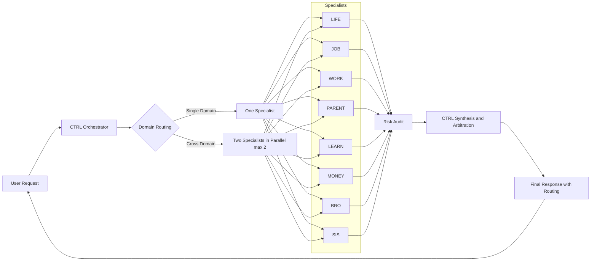
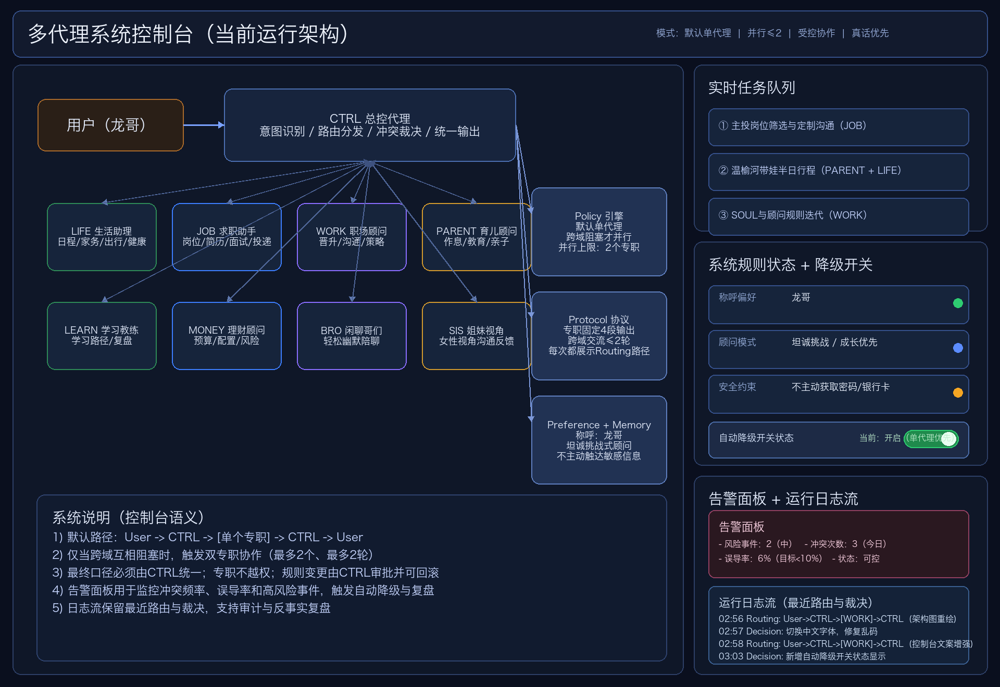
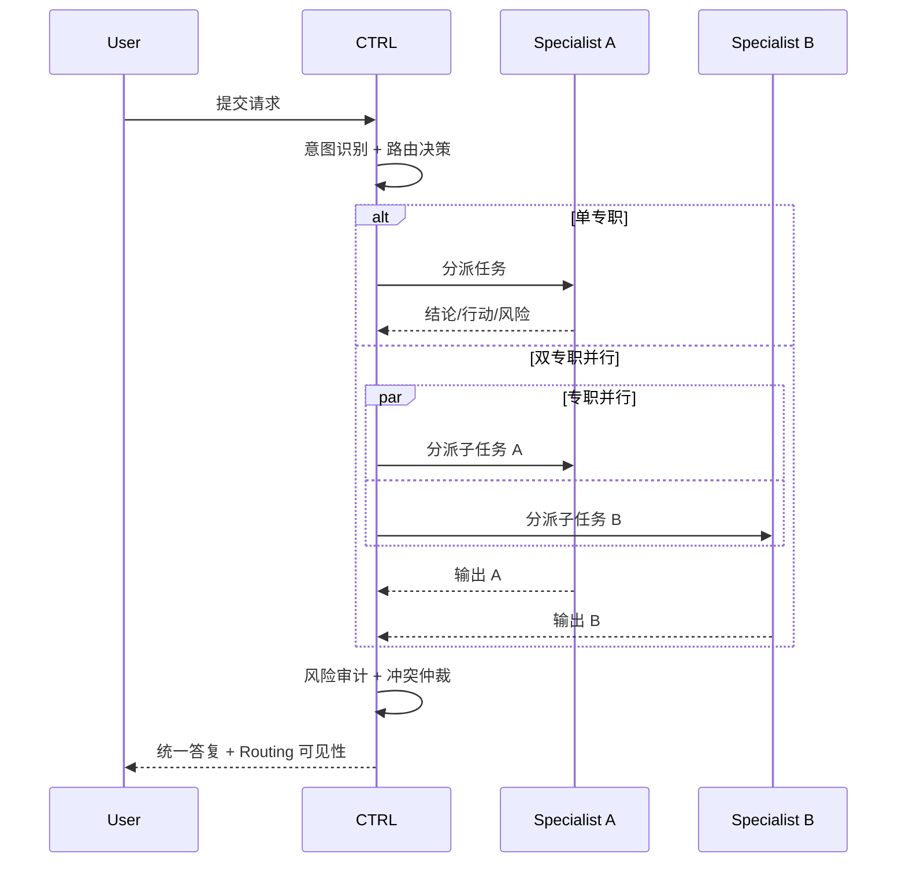

# longClaw Workspace

语言 / Language: **简体中文** | [English](README.en.md)

longClaw 是一个面向个人 AI 协作的多代理控制系统工作区，核心目标是：

- 用 `CTRL` 总控统一路由与裁决
- 让专职代理在单域或跨域任务中稳定协作
- 通过显式风险审计与可观测日志，提高决策质量与可追踪性

---

## 1. 项目概览

本仓库包含三层能力：

1. **行为与边界层**：定义助手行为、隐私边界和安全约束（`AGENTS.md`, `SOUL.md`, `USER.md`）
2. **记忆与连续性层**：沉淀长期偏好与日常上下文（`MEMORY.md`, `memory/`）
3. **多代理执行层**：定义路由协议、专职角色与控制台原型（`MULTI_AGENTS.md`, `multi-agent/`）

---

## 2. 多代理控制系统架构图

### 2.1 高层控制流



### 2.2 图文架构总览（Dashboard）



说明：上图用于快速理解控制台视角下的结构关系；下方 Mermaid 时序图用于表达请求级执行路径。

### 2.3 请求执行时序



---

## 3. 核心设计原则

- **CTRL 唯一对外交付**：专职负责推理，最终由 CTRL 汇总输出
- **默认单专职，必要时并行**：仅在跨域或明显盲区场景启用双专职并行
- **风险优先于花哨表达**：涉及资金/职业/关系等高影响问题时强制 Risk Audit
- **可追踪、可复盘**：路由路径、裁决逻辑与关键决策应可回溯

---

## 4. 路由协议（对外可见）

每次响应需包含路由信息：

- 单专职：`Routing: User -> CTRL -> [JOB] -> CTRL -> User`
- 双并行：`Routing: User -> CTRL -> ([PARENT] || [LIFE]) -> CTRL -> User`

角色标签固定为：`LIFE/JOB/WORK/PARENT/LEARN/MONEY/BRO/SIS`。

---

## 5. 仓库结构

```text
.
|-- AGENTS.md
|-- SOUL.md
|-- USER.md
|-- MEMORY.md
|-- HEARTBEAT.md
|-- MULTI_AGENTS.md
|-- multi-agent/
|   |-- README.md
|   |-- ARCHITECTURE.md
|   |-- UNIFIED_SYNC_2026-03-22.md
|   `-- agent-console-mvp/
|-- memory/
|-- TOOLS.md
|-- README.en.md
`-- README.md
```

---

## 6. 快速开始

1. 阅读控制规则与边界：`AGENTS.md`
2. 阅读人格与用户偏好：`SOUL.md`, `USER.md`
3. 阅读路由配置与角色分工：`MULTI_AGENTS.md`
4. 加载连续上下文：`MEMORY.md`, `memory/`

---

## 7. 运行 Agent Console MVP

```bash
cd multi-agent/agent-console-mvp
npm install
npm run dev
```

访问：`http://localhost:3799`

MVP 当前包含：聊天主视图、运行控制、实时日志、基础控制动作与审计接口。

---

## 8. 参考文档

- 架构说明：`multi-agent/ARCHITECTURE.md`
- 控制台说明：`multi-agent/agent-console-mvp/README.md`
- 全体同步记录：`multi-agent/UNIFIED_SYNC_2026-03-22.md`
- 英文文档：`README.en.md`

---

## 9. 说明

- 这是持续演进中的个人工作区，文档和状态文件会频繁更新
- 若要用于团队/生产，请补充鉴权、审计留存、故障回滚与 SLA 约束
