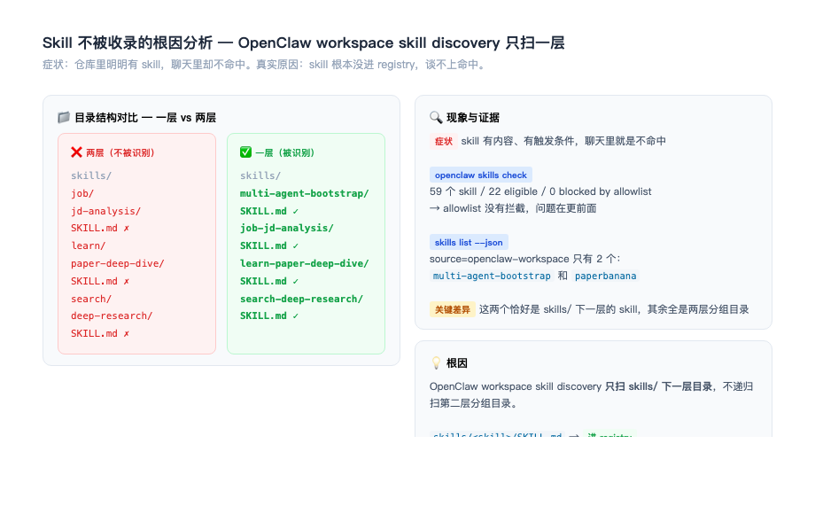
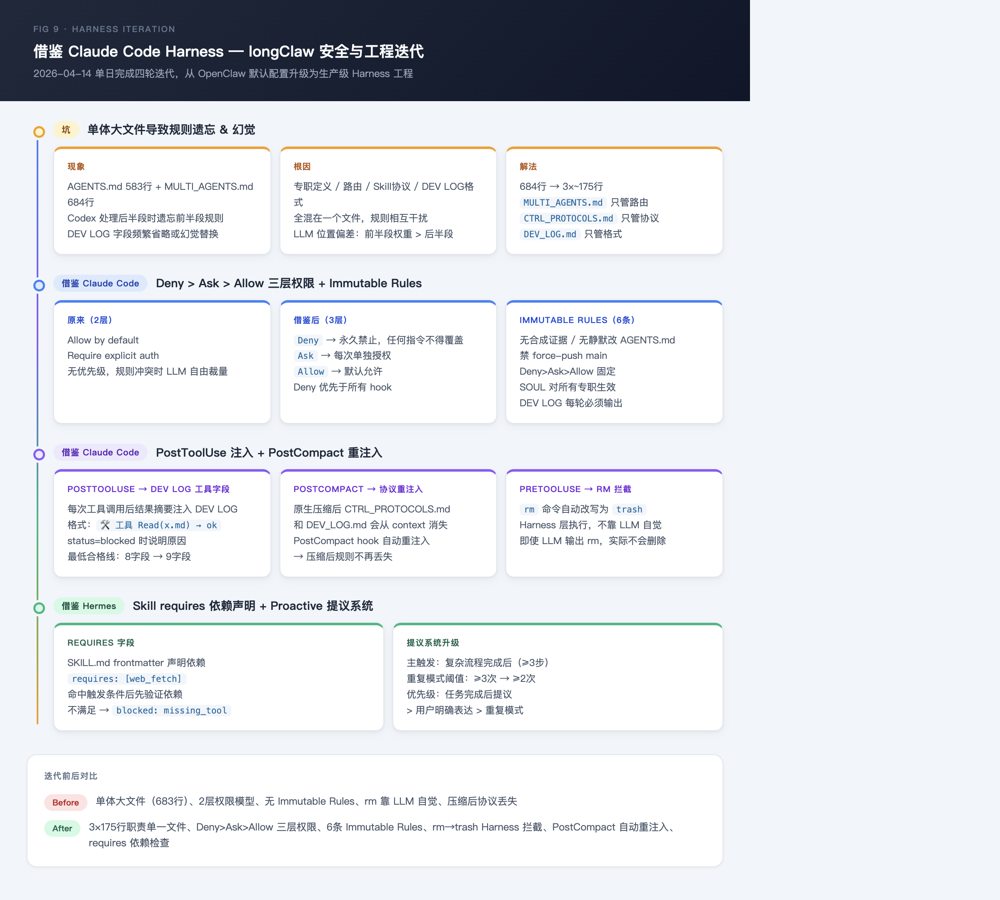
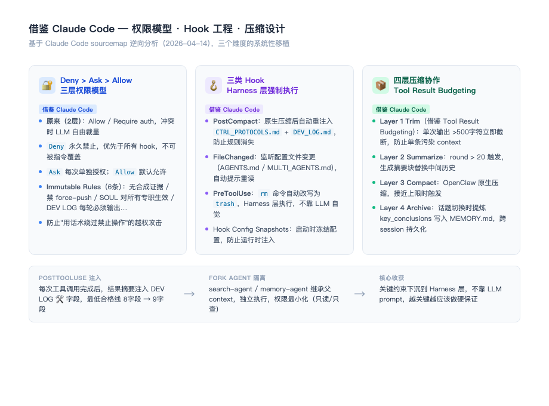
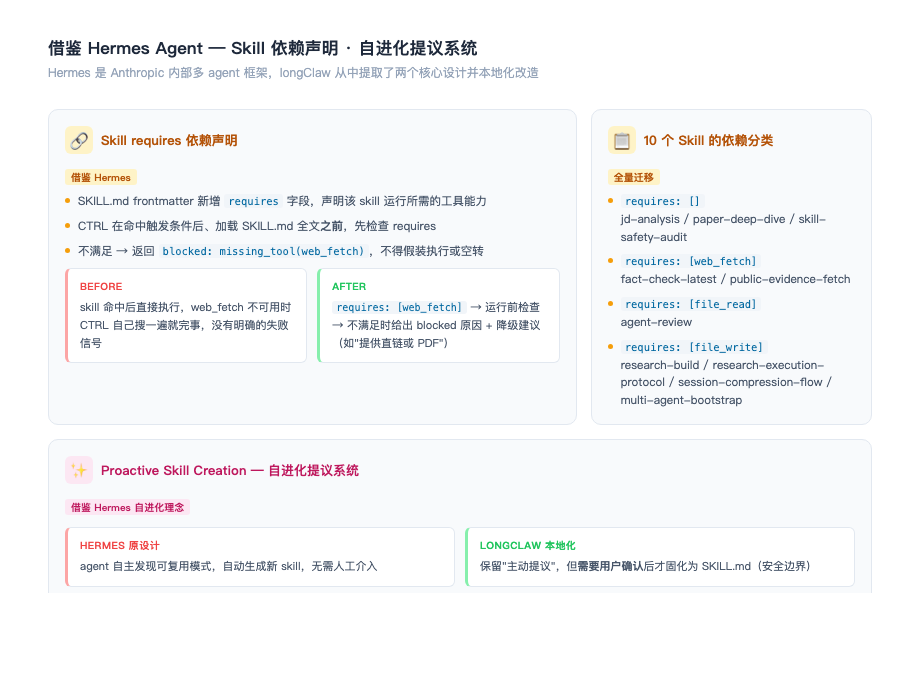
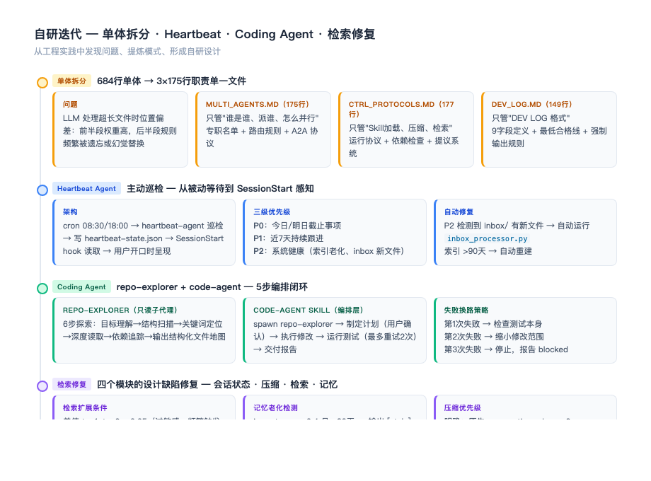
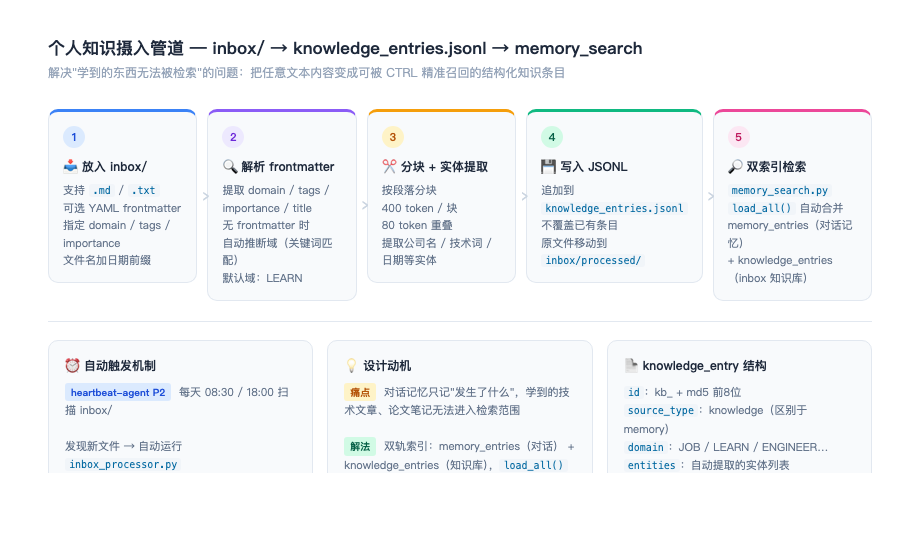
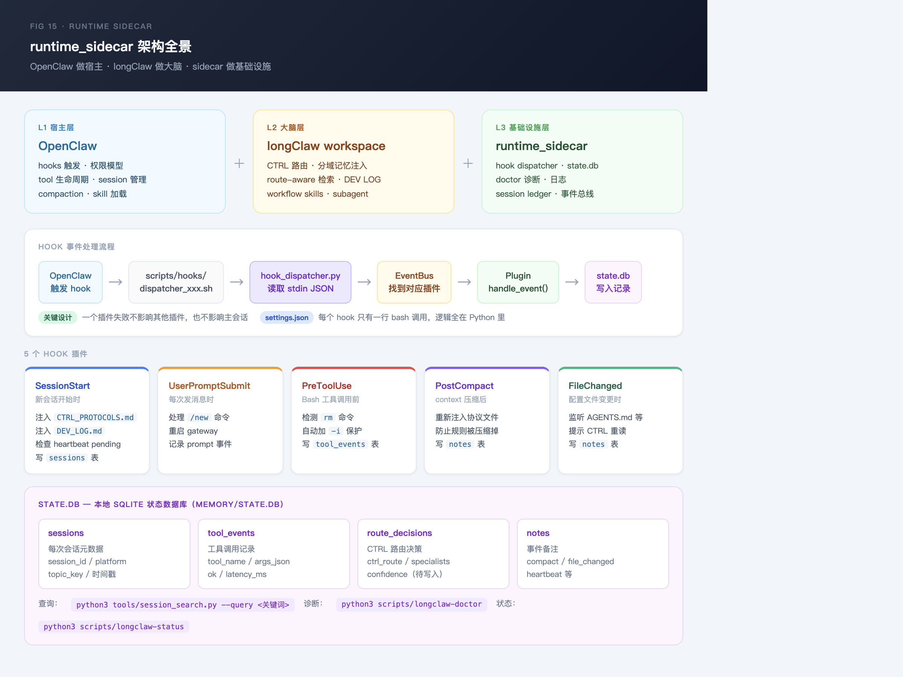

# longClaw 实践经验与踩坑记录

> 版本：2026-04-22 | 运行环境：Mac mini M4，OpenClaw + Codex，微信/WhatsApp/Telegram
> 本文档覆盖：踩坑经验、调优记录、验证方法、迭代路径
> 所有经验来自 2026.03 — 2026.04 的真实生产运行

---

## 一、最常见的五类问题及解法

### 问题 0：Skill 根本没进 registry（最前置的坑）



**现象**：仓库里明明有 skill，聊天里怎么说都不命中，DEV LOG 里 `🧩 Skill 命中: none`。

**错误排查方向**：怀疑触发关键词写得不够、frontmatter 格式有问题、模型懒得读 SKILL.md。

**真正的根因**：skill 根本没进 OpenClaw 的 registry，谈不上命中。

**诊断方法**：

```bash
# 查 registry 里来自 workspace 的 skill 数量
openclaw skills list --json | jq '.skills[] | select(.source=="openclaw-workspace") | .name'

# 和磁盘上实际数量对比
find skills/ -name "SKILL.md" | wc -l
```

如果 registry 数量远少于磁盘数量，问题就在目录层级。

**根因**：OpenClaw workspace skill discovery **只扫 `skills/` 下一层目录**，不递归扫第二层分组目录。

```
skills/<skill>/SKILL.md          → ✅ 进 registry
skills/<group>/<skill>/SKILL.md  → ❌ 隐身，不进 registry
```

**解法**：把目录拍平，用前缀保留分类语义：

```bash
# 批量迁移（longClaw 提供了脚本）
bash apply_longclaw_skill_pack.sh
```

或手动：

```
skills/job/jd-analysis/SKILL.md       → skills/job-jd-analysis/SKILL.md
skills/learn/paper-deep-dive/SKILL.md → skills/learn-paper-deep-dive/SKILL.md
skills/search/deep-research/SKILL.md  → skills/search-deep-research/SKILL.md
```

**改完后必须新开 session**，旧会话沿用老的 skill 列表快照，改了目录也不会生效。

**排查优先级**：
1. **P0** 目录层级不符合 discovery 规则 → 拍平
2. **P1** 改完后旧 session 仍用旧快照 → 重启 / 新开 session
3. **P2** 个别 SKILL.md frontmatter 格式问题 → 改完目录后再查

---

### 问题 1：Skill 命中但不执行（空转）

**现象**：DEV LOG 显示 `🧩 Skill 命中: deep-research`，但后面没有 `sessions_spawn`，CTRL 自己搜了一遍就完事了。

**根因**：Skill 被命中加载了，但 SKILL.md 里的编排步骤写的是"文档描述风格"而不是"指令风格"，Codex 把它当成说明文字而不是执行指令。

**解法**：把 SKILL.md 的 Step 改成明确的动词命令：
```
❌ 文档风格：
"Step 2：并发 spawn SearchAgent，分别查询不同维度"

✅ 指令风格：
"Step 2：立即执行以下操作——
  Agent(search-agent): 搜索 arXiv 最新论文，关键词：<维度A>
  Agent(search-agent): 搜索 GitHub 相关项目，关键词：<维度B>
  Agent(search-agent): 搜索行业动态，关键词：<维度C>"
```

**验证**：DEV LOG 里出现 `🛠️ 工具 sessions_spawn(...)` 才算真正执行了。

---

### 问题 2：DEV LOG 字段全是 `unavailable`

**现象**：`🧠 Memory ~unavailable tokens`，`📂 Session 第 4 轮 | recent_turns=unavailable`。

**根因**：微信 bot 每条消息触发一个新 session，`session-state.json` 没有被持久写入。这是 OpenClaw 官方的 fresh session 设计——每次 session 都是全新启动，跨 session 连续性靠文件而非上下文续接。

**结论**：这是**预期行为，不是 bug**。

**修正**：把 `unavailable` 改为 `ephemeral`（语义更准确），表示"临时会话字段未持久化"。
- `📂 Session 第 4 轮（ephemeral）` — 本次运行内的轮次，不跨 session 累积
- 跨 session 统计由 heartbeat-agent 负责（session_stats 字段）

**不要做的事**：不要加 Stop hook 每轮写入 session-state.json。微信 bot 场景下收益不覆盖额外延迟，官方也推荐把周期性统计放 heartbeat 做。

---

### 问题 3：Skill 触发条件太软，经常漏命中

**现象**：说"帮我调研一下 Agent 进展"，DEV LOG 显示 `🧩 Skill 命中: none`，CTRL 直接用 SEARCH 角色搜了一遍。

**根因**：触发条件全是语义描述，Codex 要靠理解才能判断是否命中，容易漏。

**解法**：加硬触发关键词，让 Codex 看到特定词就直接命中，不需要语义推断：

```yaml
## 触发条件
**硬触发关键词（出现任一即命中）**：
- "深度调研" / "deep research" / "深研"
- "多个来源" / "多来源" / "多角度"
- 用户发 `/deep` 命令
```

**规律**：触发条件里至少要有 3-5 个硬关键词，才能覆盖用户的各种表达方式。

---

### 问题 4：压缩后 CTRL 忘记了检索规则

**现象**：长对话后，CTRL 不再按四级检索顺序操作，直接全库搜索，或者 DEV LOG 格式乱掉。

**根因**：原生 compaction 触发后，CTRL_PROTOCOLS.md 和 DEV_LOG.md 不在 OpenClaw 的默认重注入列表里，被压缩掉了。

**解法**：PostCompact hook 自动补救，压缩完成后覆写 `CLAUDE_ENV_FILE`（注意是 `>`，不是 `>>`，防止多次 compaction 后文件膨胀）：

```bash
# scripts/hooks/hook_dispatcher_post_compact.sh 核心逻辑
{
  printf '[PostCompact: re-injecting critical protocols]\n'
  cat CTRL_PROTOCOLS.md DEV_LOG.md
} > "$CLAUDE_ENV_FILE"
```

同时，PostCompact plugin 会在 SQLite 写入结构化 `compact_events` 记录，字段包括 `tool_events_before`、`trim_events_before`、`trigger_source`，方便事后排查压缩时机是否合理。

**验证**：长对话后看 DEV LOG 的 `🔍 检索` 字段是否还在按 Level 1→4 的顺序操作。查历史压缩记录：

```bash
sqlite3 memory/state.db "select session_id, trigger_source, tool_events_before, trim_events_before, compacted_at from compact_events order by id desc limit 5;"
```

---

### 问题 5：GRPO 训练后模型 think 过长，上线延迟翻倍

**现象**（来自换电诊断 Agent 实践）：SFT+GRPO 模型 think 平均从 46 token 膨胀到 284 token，P90 延迟从 13.7s 升至 22.3s，无法上线。

**根因**：Reward Hacking。R_evidence 奖励引用证据，模型学会了"写长 think 堆证据"来拿高分——这是典型的奖励函数设计缺陷。

**解法**：在 Reward 中加入 token 长度惩罚作为第四层：
```python
R_length = -0.1 * max(0, len(think_tokens) - 100) / 100
R_total = R_format + R_tool_path + R_evidence + R_length
```

**教训**：训练指标好不等于能上线。Reward 设计必须考虑推理成本约束，先定义环境和 verifier，再谈算法。

---

## 二、Harness 工程实践

### 2.0 借鉴 Claude Code Harness 的迭代故事（2026-04-14）



这是 longClaw 单日迭代最密集的一天，四轮改动全部来自对 Claude Code 内部 harness 设计的逆向学习。

**起点：单体大文件的幻觉问题**

当时 `AGENTS.md` 583 行、`MULTI_AGENTS.md` 684 行，把专职定义、路由规则、Skill 协议、DEV LOG 格式全混在一起。Codex 在处理超长文件时存在位置偏差——前半段规则注意力权重高，后半段规则频繁被遗忘或幻觉替换。具体表现：DEV LOG 字段省略、Skill 触发后步骤遗漏、路由命中但专职行为不符。

**第一步：拆文件（治本）**

参考 Claude Code 的 `CLAUDE.md` 单文件职责设计，把 684 行单体拆成三个职责单一文件：
- `MULTI_AGENTS.md`（175行）→ 只管"谁是谁、派谁、怎么并行"
- `CTRL_PROTOCOLS.md`（177行）→ 只管"Skill 加载、压缩、检索"
- `DEV_LOG.md`（149行）→ 只管"DEV LOG 格式"

每个文件头部明确声明"本文件管什么、不管什么"，消除歧义。**经验法则：单配置文件超过 ~200 行就该警惕，超过 400 行基本必然出现遗忘/幻觉。**

**第二步：借鉴 Deny > Ask > Allow 三层权限**

Claude Code 的授权模型是 `Deny > Ask > Allow`，Deny 规则优先于所有 hook，任何指令不得覆盖。longClaw 原来只有 2 层（Allow / Require auth），规则冲突时 LLM 自由裁量，导致"禁止操作"被用户话术绕过。

升级后新增 6 条 Immutable Rules，写入 `AGENTS.md`，包括：无合成证据、无静默改 AGENTS.md、禁 force-push main、SOUL 对所有专职生效、DEV LOG 每轮必须输出。这些规则不可被任何 skill 或用户指令覆盖。

**第三步：借鉴 PostToolUse 注入 + PostCompact 重注入**

Claude Code 每次工具调用后会把结果摘要注入到 context。longClaw 借鉴这个设计，让 DEV LOG 的 `🛠️ 工具` 字段在每次工具调用完成后强制输出结果摘要（`status=ok/failed/blocked`），不再只靠正文叙述。

同时发现一个关键问题：原生压缩（PostCompact）之后，`CTRL_PROTOCOLS.md` 和 `DEV_LOG.md` 会从 context 消失，导致压缩后协议全部失效。解法是加 PostCompact hook，压缩完自动重注入这两个文件。

另外加了 PreToolUse hook 把 `rm` 命令自动改写为 `trash`——这是 harness 层的强制拦截，不靠 LLM 自觉，即使 LLM 输出 `rm -rf`，实际执行的是 `trash`。

**第四步：借鉴 Hermes Skill 依赖声明**

Hermes 的 skill 有 `requires` 字段声明工具依赖。longClaw 迁移这个设计，SKILL.md frontmatter 加 `requires: [web_fetch]` 等声明，CTRL 在命中触发条件后、加载 SKILL.md 全文前先验证依赖，不满足直接返回 `blocked: missing_tool`，不再假装执行或空转。

**核心收获**

Harness 的本质是**把"靠 LLM 自觉遵守"的规则下沉到执行层**。越关键的约束越不应该依赖 prompt，而应该在 hook、权限模型、文件结构上做硬保证。

---

### 2.1 借鉴 Claude Code — 权限模型 · Hook 工程 · 压缩设计（一周全景）



这一周对 Claude Code 的借鉴贯穿三个维度，从单次 sourcemap 逆向分析出发，逐步落地到 longClaw 的每个子系统。

**权限模型：从 2 层升 3 层**

Claude Code 的 `Deny > Ask > Allow` 三层模型中，Deny 规则优先于所有 hook，任何 prompt 指令不得覆盖。这解决了 longClaw 原来 2 层模型（Allow / Require auth）的核心漏洞——规则冲突时 LLM 自由裁量，可被话术绕过。

迁移后写入 6 条 Immutable Rules：无合成证据、无静默改 AGENTS.md、禁 force-push main、Deny>Ask>Allow 固定、SOUL 对所有专职生效、DEV LOG 每轮必须输出。这 6 条是"不可谈判的底线"，任何 skill 或用户指令都不能覆盖。

**Hook 工程：三类 Hook 各司其职**

- **PostCompact**：原生压缩后 `CTRL_PROTOCOLS.md` 和 `DEV_LOG.md` 会从 context 消失，协议全部失效。PostCompact hook 在压缩完成后自动重注入，这是 Claude Code "Hook Config Snapshots" 理念的直接应用。
- **FileChanged**：监听 AGENTS.md / MULTI_AGENTS.md 等配置文件，变更后自动提示 CTRL 重读。解决了"改了配置但 LLM 还在用旧规则"的幽灵问题。
- **PreToolUse**：`rm` 命令在 harness 层被改写为 `trash`，不靠 LLM 自觉。这是 harness 最核心的价值——把关键约束从 prompt 层下沉到执行层。

**压缩设计：四层分工，执行链完整**

Claude Code 对每次工具输出做 budget 限制，超出截断。longClaw 借鉴这个思路，形成四层从轻到重的压缩体系：

| 层                      | 触发                               | 执行主体                                    | 适用 session 形态 |
| ---------------------- | -------------------------------- | --------------------------------------- | ------------- |
| Layer 1 Trim           | 任意工具输出 > 500 字符，当轮立即             | PostToolUse hook（bash bridge + sidecar） | 全部            |
| Layer 2 Summarize      | 工具事件数 > 30 OR trim_event 累计 > 10 | UserPromptSubmit 注入提示 → CTRL 执行         | 仅 persistent  |
| Layer 3（原生 compaction） | OpenClaw 内置，context 接近上限         | OpenClaw 运行时                            | 全部            |
| Layer 4 Archive        | 话题边界（用户说"搞定了"等）                  | CTRL 主动写入 MEMORY.md                     | 全部            |

**执行链关键点**：
- Layer 1 由 `PostToolUse` hook 驱动，sidecar 写 `trim_event` note 到 SQLite，bash bridge 向 Claude 注入 `hookSpecificOutput.updatedOutput` 实现截断
- Layer 2 由 `UserPromptSubmit` plugin 在每轮检查 `should_trigger_layer2_summarize()`，条件满足时在返回消息里注入 `[layer2-summarize]` 提示，CTRL 执行实际摘要
- Ephemeral session（微信 bot 等每条消息新 session）不触发 Layer 2，工具事件无法跨轮积累
- Layer 3 触发后由 PostCompact hook 覆写重注入协议文件（`>`，不是 `>>`）

---

### 2.2 借鉴 Hermes Agent — Skill 依赖声明 · 自进化提议系统



Hermes 是 Anthropic 内部多 agent 框架，longClaw 从中提取了两个设计并做了本地化改造。

**Skill requires 依赖声明**

Hermes 的 agent 在执行前会检查前置条件。longClaw 迁移这个设计：每个 SKILL.md frontmatter 新增 `requires` 字段，CTRL 在命中触发条件后、加载 SKILL.md 全文之前先做依赖检查。不满足时返回 `blocked: missing_tool(web_fetch)` 并给出降级建议，不再假装执行或空转。

10 个 skill 全量迁移，分四类：无依赖（jd-analysis 等）、需要 web_fetch（fact-check-latest 等）、需要 file_read/shell_exec（longclaw-checkup 等）、需要 file_write（research-build 等）。

这个设计的价值在于**把运行时失败提前到启动前**。原来 skill 命中后直接执行，web_fetch 不可用时 CTRL 自己搜一遍就完事，没有明确的失败信号，用户也不知道 skill 实际上没有正确执行。

**Proactive Skill Creation 自进化提议系统**

Hermes 的 agent 能自主发现可复用模式并生成新 skill。longClaw 保留了"主动提议"的理念，但加了安全边界——需要用户确认后才固化为 SKILL.md。

触发优先级重排，对齐 Hermes 自进化理念：① 复杂流程完成后（≥3步 + 可复用）当轮末尾主动提议；② 用户明确表达；③ 重复模式检测（≥2次，从≥3次降低）。把"等用户重复三次才提议"变成"任务完成后主动说出来"，减少用户的认知负担。

---

### 2.3 自研迭代 — 单体拆分 · Heartbeat · Coding Agent · 检索修复



除了借鉴外部设计，这一周也有四条纯自研的迭代主线。

**单体文件拆分：工程实践出来的经验法则**

这不是借鉴，是被问题逼出来的。684 行的 MULTI_AGENTS.md 把专职定义、路由规则、Skill 协议、DEV LOG 格式全混在一起，LLM 处理时后半段规则频繁遗忘。解法是按关注点分离：每个文件只管一件事，文件头部明确声明"本文件管什么、不管什么"。**经验法则：单配置文件超过 ~200 行就该警惕，超过 400 行基本必然出现遗忘/幻觉。**

**Heartbeat Agent：主动巡检代替被动等待**

原来只能等用户问"我有什么待办事项"，Heartbeat 把这个变成主动推送。cron 08:30/18:00 触发 heartbeat-agent 巡检，结果写入 `heartbeat-state.json`，SessionStart hook 在用户开口时读取并呈现 P0/P1 事项。

P2 系统健康检查还会自动修复：发现 inbox/ 有新文件自动运行 `inbox_processor.py`，发现索引 >90 天自动重建。这是"把运维工作从人工变成自动"的思路——系统自己知道自己的健康状态，不需要人去问。

**Coding Agent：repo-explorer + code-agent 5步编排**

借鉴 SWE-agent 和 Aider 的设计理念，把"ENGINEER 无法定位代码"的问题用 subagent 隔离解决。repo-explorer 是只读子代理，6步探索后返回结构化文件地图；code-agent skill 是编排层，负责 spawn repo-explorer → 制定计划 → 执行修改 → 运行测试 → 交付报告的完整闭环。失败有三级换路策略，第三次失败才停止并报告 blocked，不会无限重试。

**检索系统修复：从差值判断改为绝对值**

原来检索扩展条件用 `top1 - top2 < 0.05` 的差值判断，过于敏感，频繁触发跨域检索，把不相关的记忆也召回进来。改为绝对值 `top1 < 0.3`：分数够高就停，不够才扩展到下一级。同时修复了记忆分层的解析兼容性（支持 `[JOB]` / `## [JOB]` 三种格式）和压缩优先级冲突（原生 compaction > Layer 2，防止两者同时触发）。

---

### 2.4 hook 的正确使用场景

| 适合用 hook | 不适合用 hook |
|------------|--------------|
| 拦截特定命令并改写（rm → trash） | 匹配用户意图、触发 skill |
| 检测特定字符串（/new 命令） | 复杂的语义判断 |
| 压缩后重注入文件 | 需要 LLM 推理的操作 |
| 配置文件变更感知 | 跨 session 的状态管理 |

### 2.5 updatedInput 的正确写法

PreToolUse hook 改写工具输入，必须返回严格的 JSON 格式：

```bash
# 正确：返回 hookSpecificOutput
echo '{"hookSpecificOutput":{"hookEventName":"PreToolUse","updatedInput":{"tool_input":{"command":"trash file.txt"}}}}'

# 错误：直接输出新命令（不会生效）
echo "trash file.txt"
```

### 2.6 /new 命令的实现

微信发 `/new` → `openclaw gateway restart`，真正清空 context window。

**推荐用法**：需要归档时先说"帮我归档一下这个话题"，CTRL 执行 Layer 4 Archive，然后再发 `/new` 开启干净新会话。

**不要做的**：不要期望 /new 自动归档。归档和重启是两个独立操作，顺序很重要（先归档再重启，反过来就什么都归档不了）。

---

## 三、记忆系统实践

### 3.0 inbox 知识摄入管道的设计故事



**痛点：学到的东西无法被检索**

longClaw 的记忆系统最初只有一个轨道：对话记忆（`memory_entries.jsonl`）。每次对话结束后，CTRL 会把"发生了什么"写入 MEMORY.md 和 daily logs，heartbeat-agent 定期重建索引。

但有一类内容始终无法进入检索范围——论文笔记、技术文章、学习总结。这些内容不是"对话中发生的事"，而是"主动摄入的知识"。用户看完一篇论文，手动整理成 Markdown，但 CTRL 在检索时找不到它，因为它从来没有进入过任何索引。

**解法：双轨索引 + inbox 摄入入口**

设计思路很简单：在对话记忆之外增加一条知识库轨道，两条轨道共用同一套检索机制。

`inbox/` 目录是摄入入口，支持 `.md` / `.txt`，可选 YAML frontmatter 指定 domain / tags / importance。`inbox_processor.py` 负责处理：解析 frontmatter → 自动推断域（关键词匹配，无 frontmatter 时默认 LEARN）→ 按段落分块（400 token / 块，80 token 重叠）→ 提取实体 → 写入 `knowledge_entries.jsonl` → 原文件移入 `inbox/processed/`。

`memory_search.py` 新增 `load_all()` 方法，检索时自动合并两个索引。对 CTRL 来说，检索入口没有变化，只是召回范围扩大了。

**自动化：heartbeat-agent P2 扫描**

inbox 处理被集成到 heartbeat-agent 的 P2 系统健康检查中。每天 08:30 / 18:00，heartbeat-agent 扫描 inbox/ 目录，发现新文件自动运行处理器，无需人工干预。这延续了"把运维工作自动化"的设计思路——用户只需要把文件拖进 inbox/，其余的系统自己完成。

**设计细节：importance 自动估算**

知识条目的 importance 影响检索时的打分权重。frontmatter 里可以显式指定（high=0.9 / low=0.3），不指定时自动估算：包含"决策"、"关键"、"P0"等关键词的内容自动提升权重，包含"草稿"、"TBD"的内容自动降低权重。这样高价值的结论性内容在检索时会排在前面。

**条目结构与对话记忆的区别**

knowledge_entry 比 memory_entry 多一个 `source_type: knowledge` 字段，检索时可以通过这个字段区分来源。其余字段（domain、entities、importance、status）完全对齐，共用同一套 FTS + 实体打分机制，不需要维护两套检索逻辑。

---

### 3.1 MEMORY.md 的格式约束

```markdown
✅ 正确：域块标记单独成行
[JOB]
Shopee面试状态：二面通过，等HR（2026-04-14）

❌ 错误：加了 markdown 标题前缀（解析器会漏掉）
## [JOB]
```

**字段格式**（便于实体提取和时效判断）：
```
字段名：值（YYYY-MM-DD）
```

### 3.2 索引重建时机

```bash
# 手动重建（MEMORY.md 或 daily logs 更新后）
python3 tools/memory_entry.py --rebuild

# 检查是否需要重建（heartbeat-agent 每次巡检自动执行）
python3 tools/memory_entry.py --check-stale
# [stale] → 自动重建
# [fresh] → 跳过

# 查看统计 + 老化检测
python3 tools/memory_entry.py --stats
```

### 3.3 检索调试

```bash
# 基础 FTS 检索
python3 tools/memory_search.py --query "Shopee 面试" --domain JOB

# 详细模式（显示每级候选数）
python3 tools/memory_search.py --query "上次技术方案" --domain ENGINEER --verbose

# Hybrid 检索（需要 Ollama）
python3 tools/memory_search.py --query "换电站运力" --domain ENGINEER --hybrid
```

**常见问题**：检索结果为空时，先检查 `tools/artifacts/memory_entries.jsonl` 是否存在，再检查 MEMORY.md 的域块标记格式。

### 3.4 记忆老化管理

`--stats` 会输出 `[stale]` 列表（importance < 0.4 且 > 90天）。定期清理过期条目，防止陈旧信息污染当前决策。

---

## 四、Subagent 实践

### 4.1 deep-research 的正确触发

说"帮我**深度调研** XXX"或"帮我从**多个来源**了解 XXX"，DEV LOG 里应该出现：

```
🧩 Skill 命中: deep-research | trigger="深度调研" | loaded=yes
🛠️ 工具 sessions_spawn(subagent-xxx) → 并发子代理已完成 | status=ok
🛠️ 工具 sessions_spawn(subagent-yyy) → 并发子代理已完成 | status=ok
🛠️ 工具 sessions_spawn(subagent-zzz) → 产业维度抓取超时 | status=failed
```

注意：某个 subagent 超时（status=failed）是正常的，CTRL 会降级处理，不会整体失败。

### 4.2 heartbeat 通畅性验证

```bash
bash tools/test_heartbeat.sh
```

6 步检查，预期结果：
- Step 3（索引新鲜度）：`[fresh]` 或 `[stale] → 自动重建`
- Step 5（cron job）：显示两条 longclaw_heartbeat 记录
- Step 6（索引文件）：有条目，按域分布

### 4.3 subagent 的工具权限边界

```yaml
# search-agent：只读 + 网络
tools: [WebFetch, WebSearch, Read, Grep]

# memory-agent：只读
tools: [Read, Grep, Glob]

# heartbeat-agent：只读 + 写 heartbeat-state.json + 执行 python3
tools: [Read, Glob, Grep, Write, Bash]

# repo-explorer：只读 + 只读 bash（find/grep/ls/cat）
tools: [Read, Glob, Grep, Bash]
```

**原则**：Bash 工具给 heartbeat-agent 和 repo-explorer 是必要的（需要执行 python3 命令），但 Bash 里只允许只读操作，不允许写文件或修改系统状态。

---

## 五、Skill 与工具实践

### 5.0 Skill env 注入：直接调脚本 vs 通过 OpenClaw 触发

**现象**：在终端直接 `uv run skills/xxx/scripts/generate.py` 报 `No API key found`，但 `~/.openclaw/openclaw.json` 里明明配了 key。

**根因**：`skills.entries.<name>.env` 里的环境变量只在 OpenClaw 通过 skill 系统调用时才注入，直接跑脚本拿不到。

**解法**：
```bash
# 直接调脚本时手动传 env
GOOGLE_API_KEY=xxx uv run skills/openclaw-paperbanana/scripts/generate.py ...

# 正常使用：通过 OpenClaw 触发 skill，env 自动注入，不需要手动传
```

---

### 5.1 paperbanana — 学术配图生成

**触发**：说"帮我生成一张 xxx 架构图"或"画一张 xxx 方法论图"。

**配置**（`~/.openclaw/openclaw.json`，已配置）：
```json5
{
  "skills": {
    "entries": {
      "paperbanana": {
        "env": { "GOOGLE_API_KEY": "AIza..." }
      }
    }
  }
}
```

**常用命令**（通过 skill 触发后 CTRL 自动执行，也可手动）：
```bash
# 生成架构图
uv run skills/openclaw-paperbanana/scripts/generate.py \
  --context "描述你的系统架构..." \
  --caption "图标题" \
  --iterations 3 --auto-refine

# 从文件输入
uv run skills/openclaw-paperbanana/scripts/generate.py \
  --input method_section.txt --caption "Overview"

# 继续上一次，加反馈
uv run skills/openclaw-paperbanana/scripts/generate.py \
  --continue --feedback "箭头加粗，颜色更鲜明"
```

**注意**：
- Gemini 免费额度限速 15 RPM，`--iterations` 建议 ≤ 3
- 生成耗时 1-5 分钟，脚本会打印进度
- 不要传敏感数据，内容会发到 Google API

---

### 5.2 `.claude/skills/` vs `skills/` — 路径陷阱

OpenClaw workspace skill discovery **只扫 `skills/` 目录**，不扫 `.claude/skills/`。

```
skills/<name>/SKILL.md         → ✅ 进 registry
.claude/skills/<name>/SKILL.md → ❌ 不进 registry
```

Codex 提交的 playwright-cli skill 最初放在 `.claude/skills/`，已迁移到 `skills/engineer-playwright-cli/`。以后新增 skill 统一放 `skills/` 下。

---

## 五（原）、Coding Agent 实践

### 5.1 repo-explorer 的使用

触发：说"帮我修这个 bug"或"实现这个功能"时，code-agent skill 会自动 spawn repo-explorer。

**预期输出**：
```
[Repo Explorer 结果]
目标：修复 memory_search.py 的实体提取漏 Shopee 的问题
项目类型：Python
相关文件：
1. tools/memory_search.py [核心]
   - 作用：route-aware FTS + hybrid embedding 检索
   - 关键代码：ENTITY_PATTERNS = [...]
   - 修改建议入口：memory_search.py:68
风险点：修改 ENTITY_PATTERNS 会影响所有域的实体提取
```

### 5.2 code-agent 的执行边界

**不会做的**：
- 计划外的文件不动（用户确认计划后才执行）
- 不静默修改测试文件来让测试通过
- 失败超过 2 次就停止，报告 blocked

**换路策略**：
```
第 1 次失败 → 检查是否测试本身的问题
第 2 次失败 → 缩小修改范围，只保留最核心改动
第 3 次失败 → blocked: 需要人工介入
```

### 5.3 下一步迭代路径

| 里程碑 | 目标 | 验证方式 |
|--------|------|---------|
| M1（已完成）| repo-explorer + code-agent 基础版 | 能自主探索 longClaw codebase 并修改 |
| M2（2周）| repo-map 工具（tree-sitter）| 生成 500 token 内的代码地图 |
| M3（4周）| git worktree 隔离 | code-agent 任务在独立分支，失败可安全丢弃 |
| M4（6周）| 预留优化闭环评估接入 | 跑 SWE-bench-lite，有 resolved rate 数据 |

---

## 六、Mac mini M4 部署

### 6.0 Mac mini M4 已知问题（绕坑必读）

**`crontab -` 管道写入会永久挂起**

这台机器上 `... | crontab -` 这种写法会卡死，已多次复现：

```bash
# ❌ 永远不要在这台机器上用这种写法
crontab -l | grep -v longclaw_heartbeat | crontab -   # 会挂
(crontab -l; echo "...") | crontab -                  # 会挂
```

`setup_heartbeat_cron.sh` 已经处理了这个问题：用临时文件 + python3 subprocess 写入，5 秒超时后自动 fallback 到 Gateway cron。**直接跑脚本，不要手动操作 crontab。**

**当前 heartbeat 走的是 Gateway cron（不是 system crontab）**

system crontab 在这台机器上装不进去（5 秒超时），脚本自动 fallback 到 `openclaw cron add`：

```
longclaw-heartbeat-am  id: f19c5a35-02ac-4259-8296-4f22c9717a94  08:30 Asia/Shanghai
longclaw-heartbeat-pm  id: 163558d3-081f-477f-8719-8aa2876e2169  18:00 Asia/Shanghai
```

验证 Gateway cron 是否在线：`openclaw cron list`

**openclaw 是 node alias，cron 环境无法识别**

cron 里不能用 `openclaw`，必须用完整路径：
```
/opt/homebrew/opt/node/bin/node /opt/homebrew/lib/node_modules/openclaw/dist/entry.js
```

**Gateway 端口是动态的**

每次重启 openclaw，Gateway 端口可能变（当前 18789）。Gateway cron 由 openclaw 内部管理，不受端口变化影响；但如果手动构造 `system event --url` 命令需要重新确认端口：`lsof -i -P | grep node | grep LISTEN`

---

### 6.1 首次激活

```bash
cd ~/longClaw

# 1. 安装 heartbeat cron job（只需一次）
# 注意：不要手动操作 crontab，直接跑脚本，它会自动处理 fallback
bash setup_heartbeat_cron.sh
# 验证（Gateway cron）：
openclaw cron list | grep longclaw

# 2. 构建记忆索引（首次或 MEMORY.md 更新后）
python3 tools/memory_entry.py
python3 tools/memory_entry.py --stats  # 查看统计

# 3. 验证 heartbeat 通畅性
bash tools/test_heartbeat.sh
```

### 6.2 日常维护

```bash
# 检查索引是否需要重建（heartbeat 会自动做，也可手动）
python3 tools/memory_entry.py --check-stale

# 查看 heartbeat 最近一次巡检结果
cat memory/heartbeat-state.json | python3 -m json.tool

# 查看 cron 日志
cat /tmp/longclaw_heartbeat.log
```

### 6.3 从其他设备同步

```bash
git pull origin main
# .claude/settings.json 和 .claude/agents/ 自动生效
# MEMORY.md / USER.md / memory/ 是私有文件，只在 Mac mini 本地
# 需要手动执行一次：bash setup_heartbeat_cron.sh（cron 不在 git 里）
```

---

## 七、演进历程与关键决策节点

### 2026-03-21：初始版本

- 建立 CTRL + 10 专职代理架构
- 问题：CTRL 经常"说要做但不做"（空转）
- 解法：加 Anti-stall 规则，`doing:` 只在同轮已发起工具调用时才允许说

### 2026-04-10：记忆系统 + Skills

- 建立三层记忆 + FTS 检索
- 问题：检索扩展条件用差值（top1-top2 < 0.05）太敏感，频繁触发跨域
- 解法：改为绝对分数（top1 < 0.3）

### 2026-04-12：执行完整性

- 加 DEV LOG 强制输出规则
- 问题：DEV LOG 在 Skill 执行完后经常消失
- 解法：明确"SKILL.md 退出上下文 ≠ DEV LOG 可以省略"

### 2026-04-14：Subagent + Harness

- 借鉴 Claude Code sourcemap 逆向分析
- 加 Deny > Ask > Allow 三层权限 + Immutable Rules
- 加 PostToolUse 注入 → DEV LOG 🛠️ 工具字段
- 加 PostCompact hook → 压缩后协议文件不再丢失
- 问题：MULTI_AGENTS.md 684 行，Codex 处理后半段时遗忘前半段规则
- 解法：拆分为三个职责单一文件（MULTI_AGENTS.md / CTRL_PROTOCOLS.md / DEV_LOG.md）

### 2026-04-16：压缩机制完善

- 新增 Layer 1 Trim（借鉴 Claude Code Tool Result Budgeting）
- 压缩层统一重命名为数字编号（Layer 1/2/3/4）
- 问题：DEV LOG 字段 `unavailable` 语义不准确
- 解法：改为 `ephemeral`，明确是"临时会话字段未持久化"的预期行为

### 2026-04-17：heartbeat 自动索引重建

- heartbeat-agent 集成 `--check-stale` 自动重建索引
- 问题：每次更新 MEMORY.md 后需要手动跑 `--rebuild`
- 解法：heartbeat 巡检时自动检查 mtime，过期才重建

### 2026-04-18：v0.5.1 + v0.6.0 — 修复三大坑 + 工具扩展

- **Heartbeat cron 全链路修复**：`openclaw --print` 非法 → `openclaw agent --agent main --message`；crontab 管道挂起 → 临时文件 + python3 subprocess；Gateway URL/token 缺失 → 补全；最终 fallback 到 Gateway cron 成功
- **DEV LOG 模板不生效**：SessionStart hook 新增注入 `CTRL_PROTOCOLS.md` + `DEV_LOG.md`，第一轮就用正确模板
- **Skill 不进 registry**：14 个 skill 从两层目录拍平为一层，OpenClaw 只扫一层
- **新增 skill**：playwright-cli（浏览器自动化）、openclaw-paperbanana（学术配图，配 GOOGLE_API_KEY 即用）
- **发现**：`.claude/skills/` 不被 OpenClaw 扫描，skill 必须放 `skills/` 下

### 2026-04-19：v0.6.1 — 对比 Hermes 后的架构重新定位 + runtime_sidecar 基础层

**背景：对比 Hermes Agent 之后的吸收借鉴**

对比 Hermes 的工程外壳（统一会话存储、插件扩展点、cron、doctor、集中日志）后，明确了 longClaw 不能照搬 Hermes 架构，因为宿主是 OpenClaw。确立了三层改造原则：

```
workspace-first → sidecar-second → thin-patch-last
```

| 层                 | 目标                                        | 是否改 OpenClaw |
| ----------------- | ----------------------------------------- | ------------ |
| L1: workspace 协议层 | AGENTS / MULTI_AGENTS / skills / hooks 驱动 | 否            |
| L2: sidecar 运行层   | state.db、jobs、doctor、hook dispatcher      | 否            |
| L3: thin patch 层  | 只有 workspace 和 sidecar 做不到时才动             | 是，严格最小化      |

**核心定位**：OpenClaw 做宿主，longClaw 做大脑，sidecar 做基础设施。

**这一版做了什么**：
- 删除 LLM fallback 层（`llm_fallback.py`/`llm_fallback_proxy.py`/`runtime/model-*.json`）——过于复杂且主会话根本不经过这个脚本
- 新增 `runtime_sidecar/` 基础层：hook_dispatcher、event_bus、plugins（SessionStart/PostCompact/FileChanged/PreToolUse）、state.db schema、doctor 诊断
- 新增 `scripts/longclaw-doctor` 和 `scripts/longclaw-status` 运维脚本
- 新增 `docs/architecture-boundary.md`（三层边界）、`docs/migration-roadmap.md`（路线图）、`docs/compatibility-matrix.md`

**后续路线图优先级**：
- **P0**：hook dispatcher 接管 settings.json shell 逻辑 + state.db session ledger + doctor/logs/status
- **P1**：通用 jobs/process registry/notify_on_complete + skill registry/schema/audit
- **P2**：session_search + external memory provider + thin runtime patches

### 2026-04-19/20：v0.6.1 → runtime_sidecar 完整落地

**P0 完成：hook dispatcher 接管 settings.json**

`.claude/settings.json` 里所有 hook 的 shell 逻辑全部迁移到 `scripts/hooks/` 下的独立脚本，再由脚本调用 Python sidecar。settings.json 现在每个 hook 只有一行：

```json
"SessionStart": [{"command": "bash scripts/hooks/hook_dispatcher_session_start.sh"}]
```

**新增 UserPromptSubmit hook**：用户每次发消息时触发，处理 `/new` 命令、记录 prompt 事件。

**state.db 全量验证通过**：sessions / tool_events / notes 三张表写入读取均正常，`session_search.py` 支持多维度查询。

**Ollama 本地模型接入**：通过 `openclaw models set ollama/gemma4:e2b` 直接切换主会话模型，不需要 CTRL 中转。

**bootstrap 上限调大**：MEMORY.md 超过 bootstrap 单文件上限（12KB）导致截断，通过 `openclaw config set agents.defaults.bootstrapMaxChars 20000` 修复。

---

## 八、runtime_sidecar 实践

### 8.1 sidecar 是什么，解决什么问题



**之前**：`.claude/settings.json` 里 hook 全是内嵌 shell 命令，越来越长，难以维护，出错不知道哪里坏了。

**现在**：所有 hook 逻辑迁移到 Python 模块，settings.json 只剩一行调用。

```
OpenClaw 触发 hook
    ↓
scripts/hooks/hook_dispatcher_xxx.sh
    ↓
python3 -m runtime_sidecar.hook_dispatcher <EventName>
    ↓
EventBus 分发给对应插件
    ↓
插件执行，结果写入 state.db
```

**关键设计**：一个插件失败不影响其他插件，也不影响主会话。

### 8.2 各插件触发时机和行为

| 插件 | 触发时机 | 做了什么 |
|------|---------|---------|
| SessionStart | 新会话开始 | 注入 CTRL_PROTOCOLS.md + DEV_LOG.md，检查 heartbeat pending，写 sessions 表 |
| UserPromptSubmit | 每次发消息 | 处理 /new 命令，记录 prompt 事件；检查 Layer 2 Summarize 触发条件（工具事件数 > 30 OR trim_event > 10），条件满足时注入 `[layer2-summarize]` 提示 |
| PreToolUse | Bash 工具调用前 | 检测 `rm` 命令自动加 `-i`，写 tool_events 表 |
| **PostToolUse** | **每次工具调用后** | **Layer 1 Trim：输出 > 500 字符时向 Claude 注入截断后的 `updatedOutput`，sidecar 写 `trim_event` note** |
| PostCompact | context 压缩后 | 覆写重注入协议文件（`>`，不是 `>>`，防止多次触发后膨胀）；sidecar 写结构化 `compact_events` 记录（含 `tool_events_before`、`trim_events_before`、`trigger_source`） |
| FileChanged | 配置文件变更 | 提示 CTRL 重读变更的协议文件 |

**Layer 2 触发的 session 形态限制**：`session_type=ephemeral` 时 UserPromptSubmit plugin 直接跳过 Layer 2 检查，不注入提示。形态由 `memory/session-state.json` 的 `session_type` 字段控制（默认 `persistent`）。

### 8.3 state.db 查询

```bash
cd ~/.openclaw/workspace

# 状态快照
python3 scripts/longclaw-status

# 查询 session 记录
python3 tools/session_search.py --query <关键词>
python3 tools/session_search.py --query rm --kind tool_events
python3 tools/session_search.py --query compact --kind notes --json

# 直接查 SQLite
sqlite3 memory/state.db "select * from sessions order by started_at desc limit 5;"
sqlite3 memory/state.db "select tool_name, args_json, ok from tool_events order by id desc limit 10;"
```

### 8.4 健康检查

```bash
# 全量诊断（任何 FAIL 返回非零退出码）
python3 scripts/longclaw-doctor

# JSON 格式（便于脚本解析）
python3 scripts/longclaw-doctor --json
```

检查项包括：协议文件存在性、settings.json 语法、state.db 可写、heartbeat-state.json 格式、索引新鲜度。

### 8.5 新增插件的步骤

1. `hook_events.py` 注册新事件类型
2. `plugins/` 下新建模块，实现 `HANDLED_EVENTS` 和 `handle_event()`
3. `event_bus.py` 的 `plugin_names` 列表加上新模块名
4. `scripts/hooks/` 下新建对应 shell 脚本
5. `.claude/settings.json` 注册新 hook

详见 `runtime_sidecar/README.zh.md`。

### 2026-04-22：压缩执行链完整修复

**背景**：review 发现四层压缩的执行链有三处断裂，Layer 2 触发条件与 ephemeral session 形态冲突。

**修复内容**：

1. **Layer 1 执行链打通**：新增 `PostToolUse` hook（`scripts/hooks/hook_dispatcher_post_tool_use.sh` + `runtime_sidecar/plugins/post_tool_use.py`）。原来缺少这个 hook，Layer 1 Trim 协议存在但永远不触发。bridge 脚本修复了 `$INPUT` 未传入 heredoc 的 bug（stdin 被 `cat` 消耗后 heredoc 读到空），改为 `printf '%s' "$INPUT" | python3 -c` 两段独立 pipe。

2. **Layer 2 触发条件重写**：原来 `round > 20` 在 ephemeral session（每条消息新 session）下永远不成立，Layer 2 从未触发过。改为 `工具事件数 > 30 OR trim_event 累计 > 10`，并在 `UserPromptSubmit` plugin 里接入检查逻辑，条件满足时注入 `[layer2-summarize]` 提示。ephemeral session 明确豁免。

3. **PostCompact 重注入改覆写**：原来用 `>>`，多次 compaction 后 `CLAUDE_ENV_FILE` 会无限膨胀（每次都追加整个 CTRL_PROTOCOLS.md + DEV_LOG.md）。改为 `>`，每次覆写。

4. **PostCompact 写结构化状态**：原来只写 `"PostCompact triggered"` 裸字符串。新增 `compact_events` 表，记录 `tool_events_before`、`trim_events_before`、`trigger_source`、`summary_hint`，压缩历史可查。

**自审发现的两处**：`output_length or len(output)` 在值为 0 时错误 fallback，改为 `is not None` 判断；`should_trigger_layer2_summarize()` 改返回 reason 字符串而非 bool，消除调用方的重复查询。

---

## 九、上下文加载与 compaction 生存规则

> 来源：对 OpenClaw 源码（`workspace.ts` / `post-compaction-context.ts` / `startup-context.ts`）的分析，2026-04-22 整理。

### 9.1 三类上下文来源

**A. OpenClaw 原生 bootstrap 层**（每次 agent run 自动进入 system prompt）

```
AGENTS.md ✅   SOUL.md ✅   TOOLS.md ✅   IDENTITY.md ✅
USER.md ✅     MEMORY.md ✅（仅主私有 session）
MULTI_AGENTS.md ❌   CTRL_PROTOCOLS.md ❌   DEV_LOG.md ❌
```

**B. Startup context 层**（`/new` / `/reset` 首轮一次性注入）

最近若干天的 `memory/YYYY-MM-DD*.md` 作为 "untrusted daily memory" 注入首轮。普通 turn 不触发。

**C. Hook 注入的附加协议层**（通过 `CLAUDE_ENV_FILE`）

`CTRL_PROTOCOLS.md`、`DEV_LOG.md`、heartbeat reminder 属于这一层。不是 durable transcript，compaction 后消失，必须靠 `PostCompact` 重注入。

### 9.2 native post-compaction refresh 的真实白名单

OpenClaw `post-compaction-context.ts` 在 compaction 后只明确重注入 **`AGENTS.md` 的指定 section**：

- 默认：`Session Startup` + `Red Lines`
- 旧模板兼容：`Every Session` + `Safety`

其他文件（包括 `SOUL.md`、`MEMORY.md`）在下次 run 时作为 bootstrap 来源重新参与 prompt 组装，但不是这个 native refresh 的显式保护对象。

**结论：真正"原生 compaction 后还在"的，只有 `AGENTS.md` 里的关键 section。**

### 9.3 规则放哪里

| 规则类型 | 放哪里 | 原因 |
|---------|-------|------|
| 安全红线、核心不可违反约束 | `AGENTS.md` | 唯一被 native post-compaction refresh 明确保护的文件 |
| 流程型协议（压缩规则、检索规则、DEV LOG 格式） | `CTRL_PROTOCOLS.md` / `DEV_LOG.md` | 靠 PostCompact hook 重注入，可接受 |
| 路由规则和专职代理定义 | `MULTI_AGENTS.md` | **当前没有任何 hook 注入它**，是已知缺口 |

### 9.4 已知缺口：MULTI_AGENTS.md 没有被注入

`MULTI_AGENTS.md` 不是原生 bootstrap 文件，也没有出现在任何 hook 脚本里。CTRL 能看到它，只能靠 OpenClaw 在某个路径里把它当 workspace 文件读进来——这个行为目前未经验证。

三个修法：
1. **核心路由规则合并进 `AGENTS.md`**（最稳，原生保护）
2. **在 `SessionStart` / `PostCompact` hook 里加入注入**（次稳）
3. 维持现状，接受"靠 OpenClaw 隐式加载"的不确定性

建议选 1 或 2，不要依赖未验证的隐式加载行为。

---

## 十、待解决的已知问题

| 问题 | 优先级 | 解法方向 |
|------|--------|---------|
| Subagent 不支持 Codex（只能 inherit） | 中 | 等 OpenClaw 支持非 Anthropic 模型 |
| Fork Agent 缓存共享未实现 | 中 | A2A 并行时让子 agent 继承父 context，节省 90% token |
| LLM 侧查询记忆检索（语义理解） | 中 | 用 Codex 替代 FTS 做语义检索 |
| repo-map（tree-sitter）未实现 | 低 | 参考 Aider 的 repomap.py |
| 预留优化闭环未激活 | 低 | 主用 Codex，短期不启用 |
| 群聊隔离（不加载 MEMORY.md） | 低 | AGENTS.md 加检测规则 |
| state.db route_decisions 未写入 | 低 | CTRL 路由时调用 sidecar 写入，需 hook 支持 |
| heartbeat-agent spawn 未验证 | 中 | Gateway cron 触发后确认 last_check 更新 |
