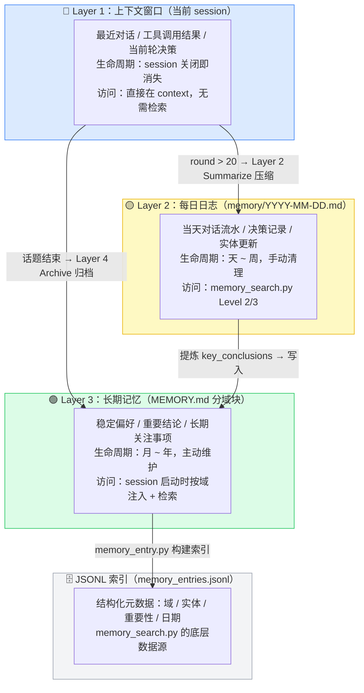
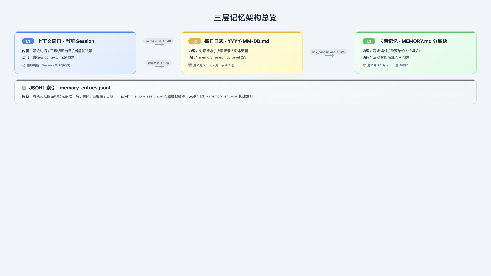
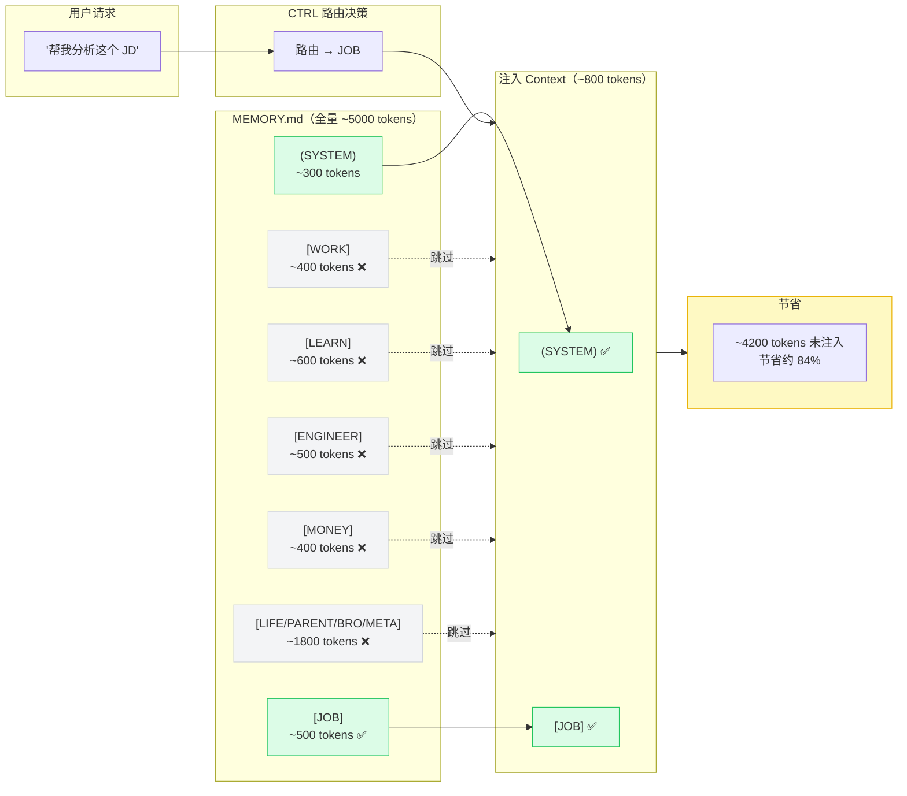
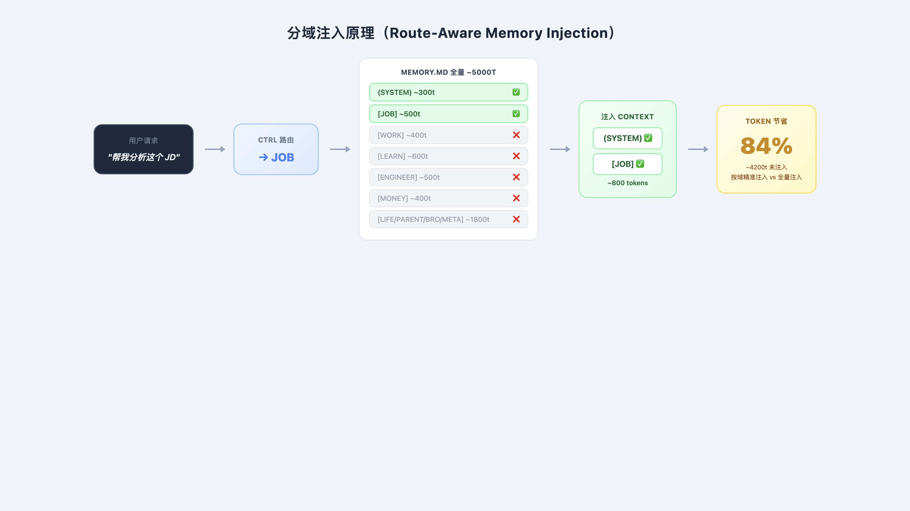
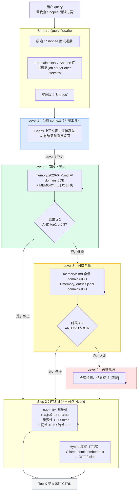
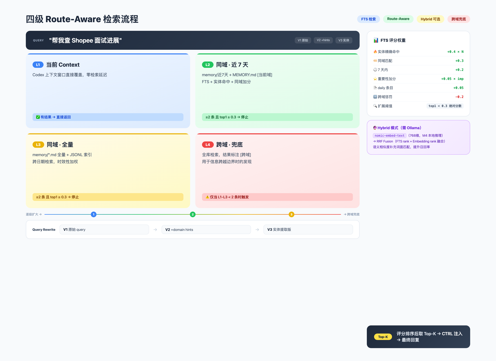
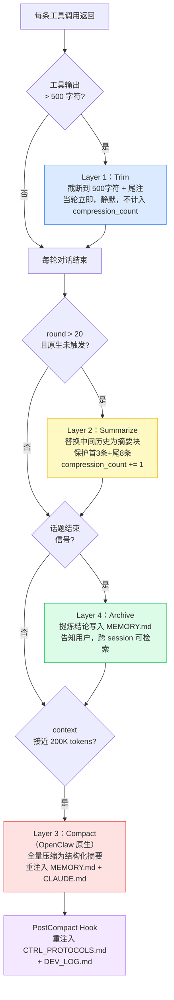
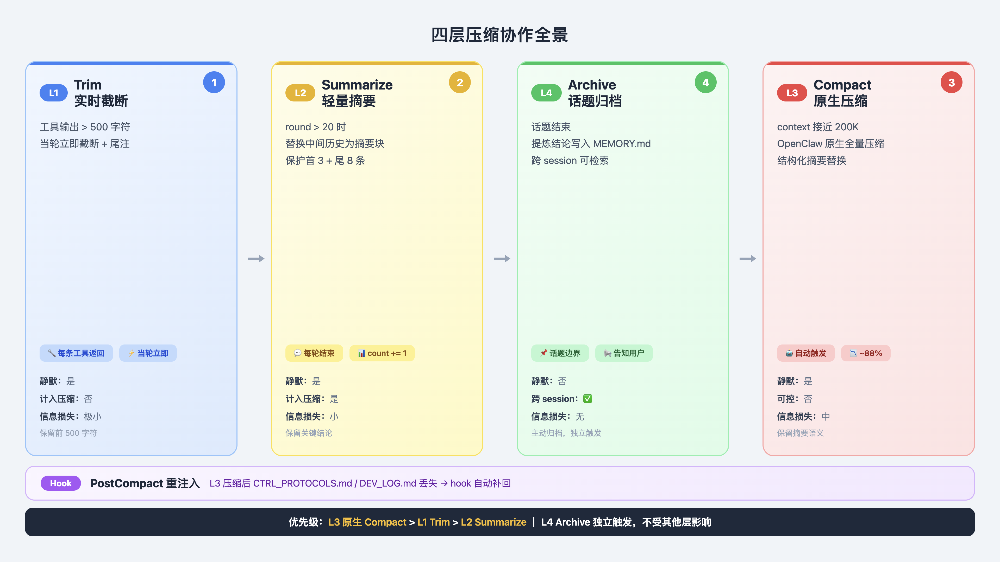
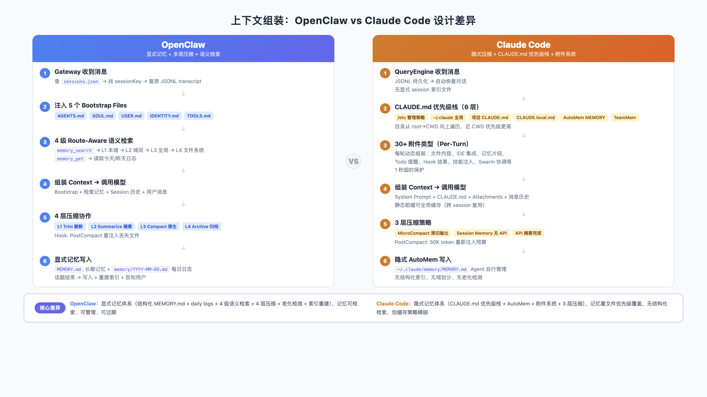
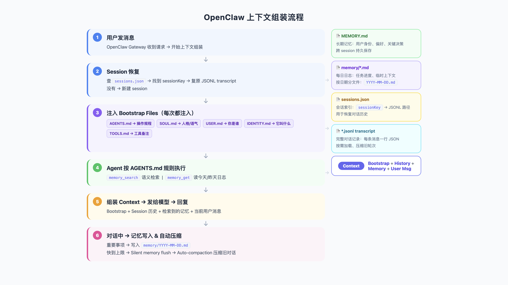

# longClaw 记忆与压缩机制详解

> 版本：2026-04-14
> 相关文件：CTRL_PROTOCOLS.md / AGENTS.md / tools/memory_entry.py / tools/memory_search.py

---

## 一、整体架构：三层记忆 + 四级检索

longClaw 的记忆系统由三个独立层组成，每层生命周期不同，解决不同问题：

### 图 1：三层记忆架构总览



> **🖼️ PPT 高清版**：

### 文字说明（原始结构）

```
┌─────────────────────────────────────────────────────────┐
│  Layer 1：上下文窗口（Codex 原生）                        │
│  生命周期：当前 session，关闭即消失                        │
│  内容：最近对话、工具调用结果、当前轮决策                   │
│  访问方式：直接在 context 里，无需检索                     │
└─────────────────────────────────────────────────────────┘
           ↓ 超过 20 轮 → Layer 2（Summarize）压缩
           ↓ 话题结束 → Layer 4 归档
┌─────────────────────────────────────────────────────────┐
│  Layer 2：每日日志（memory/YYYY-MM-DD.md）                │
│  生命周期：天到周，手动清理                                │
│  内容：当天对话流水、决策记录、实体更新                     │
│  访问方式：memory_search.py 检索（Level 2/3）             │
└─────────────────────────────────────────────────────────┘
           ↓ 提炼 key_conclusions → 写入 MEMORY.md
┌─────────────────────────────────────────────────────────┐
│  Layer 3：长期记忆（MEMORY.md，分域块）                   │
│  生命周期：月到年，主动维护                                │
│  内容：稳定偏好、重要结论、长期关注事项                     │
│  访问方式：session 启动时按域注入 / memory_search.py 检索  │
└─────────────────────────────────────────────────────────┘
                    ↓ 结构化索引
┌─────────────────────────────────────────────────────────┐
│  Layer 3b：JSONL 索引（tools/artifacts/memory_entries.jsonl）│
│  生命周期：随 MEMORY.md 和 daily logs 重建                 │
│  内容：每条记忆的结构化元数据（域/实体/重要性/日期）         │
│  访问方式：memory_search.py 的底层数据源                   │
└─────────────────────────────────────────────────────────┘
```

---

## 二、MEMORY.md：长期记忆的核心文件

### 域块设计

MEMORY.md 按专职代理的域分块，每块独立，CTRL 按路由只注入必要的块：

```markdown
(SYSTEM)           ← 所有代理都读，全局偏好和约束

[JOB]              ← 只在 JOB 路由时注入
[WORK]             ← 只在 WORK 路由时注入
[LEARN]            ← 只在 LEARN 路由时注入
[ENGINEER]         ← 只在 ENGINEER 路由时注入
[MONEY]            ← 只在 MONEY 路由时注入
[LIFE]             ← 只在 LIFE 路由时注入
[PARENT]           ← 只在 PARENT 路由时注入
[BRO/SIS]          ← BRO 和 SIS 共用此块
[META]             ← CTRL 跨域时注入
```

**注入规则**（AGENTS.md 定义）：

| 路由 | 注入内容 |
|------|---------|
| JOB | (SYSTEM) + [JOB] |
| LEARN | (SYSTEM) + [LEARN] |
| SEARCH | (SYSTEM) 只读，不注入其他域 |
| CTRL / 跨域 | (SYSTEM) + [META] + 所有相关域 |

**Token 节省**：相比全量注入，按域注入平均节省约 80% token。

### 图 2：分域注入原理（Route-Aware Memory Injection）



> **🖼️ PPT 高清版**：

### 格式约束（重要）

```markdown
✅ 正确：域块标记单独成行
[JOB]
求职相关内容...

❌ 错误：加了 markdown 标题前缀
## [JOB]     ← memory_entry.py 解析器会漏掉这条
```

**字段格式**（便于实体提取和时效判断）：
```
字段名：值（YYYY-MM-DD）
示例：
Shopee面试状态：二面通过，等HR（2026-04-10）
目标岗位方向：AI+OR融合，Senior Expert轨（2026-03-25）
```

### 老化检测

`python3 tools/memory_entry.py --stats` 会输出 `[stale]` 列表：
- 条件：importance < 0.4 且超过 90 天未更新
- 作用：提示你清理过期信息，防止陈旧数据污染当前决策

---

## 三、memory_entry.py：索引构建器

### 作用

把 MEMORY.md 和 memory/YYYY-MM-DD.md 的内容解析成结构化 JSONL 条目，供 memory_search.py 检索。

### 每条条目的结构

```json
{
  "id": "mem_a3f8c2d1",          // MD5 hash，唯一标识
  "source": "MEMORY.md",          // 来源文件
  "source_type": "long_term",     // long_term 或 daily
  "domain": "JOB",                // 所属域
  "session_type": "main",
  "created_at": "2026-04-14",     // 写入日期
  "text": "Shopee面试状态：...",   // 原文内容
  "entities": ["Shopee"],         // 提取的实体
  "importance": 0.7,              // 重要性分数（0.1-1.0）
  "status": "active"
}
```

### 重要性评分算法

```python
def estimate_importance(text):
    score = 0.5  # 基础分

    # 高重要性关键词 → +0.1 each
    high = ["决策", "结论", "P0", "重要", "关键", "offer", "面试", "上线", "已落地", "确认"]

    # 低重要性关键词 → -0.2 each
    low = ["待更新", "（待更新）", "TBD"]

    # 最终分数范围：0.1 ~ 1.0
```

含"决策"、"offer"、"面试"等词的条目重要性更高，检索时会被优先召回。

### 实体提取规则

```python
ENTITY_PATTERNS = [
    # 公司名
    r"(?:敦煌网|美团|字节|阿里|腾讯|百度|华为|京东|滴滴|快手|小红书|Shopee|longClaw)",
    # 技术词
    r"(?:GRPO|PPO|DPO|SFT|LoRA|RAG|GNN|GAT|LLM|Codex)",
    # 设备
    r"(?:Tesla|Mac\s*mini|MacBook)",
    # camelCase 词（如 longClaw）
    r"[A-Z][a-z]+[A-Z]\w*",
    # 日期
    r"\d{4}-\d{2}-\d{2}",
]
```

实体提取后存入条目的 `entities` 字段，检索时精确命中实体会加分（+0.4 × 命中数量）。

### 使用命令

```bash
# 构建/重建索引（MEMORY.md 或 daily logs 更新后执行）
python3 tools/memory_entry.py

# 强制重建（清空旧索引）
python3 tools/memory_entry.py --rebuild

# 查看统计 + 老化检测
python3 tools/memory_entry.py --stats

# 只索引某个域
python3 tools/memory_entry.py --domain JOB
```

---

## 四、memory_search.py：检索引擎

### 图 3：四级 Route-Aware 检索流程



> **🖼️ PPT 高清版**：

### 检索架构：4 级作用域 + 混合评分

```
用户 query
    │
    ▼
Step 1：Query Rewrite（生成 2-3 个变体）
  变体1：原始 query
  变体2：原始 + domain hints（JOB 路由自动加 "job career offer interview"）
  变体3：实体提取版（提取公司名/技术词/项目名）
    │
    ▼
Step 2：Route-Aware Scope Filter（4 级递进）
  Level 1：当前 context（Codex 上下文窗口，无需工具）
  Level 2：同域 7 天内 → 结果 ≥ 2 且 top1 ≥ 0.3 则停止
  Level 3：同域全量   → 结果 ≥ 2 且 top1 ≥ 0.3 则停止
  Level 4：跨域兜底   → 仅当前3级结果数 < 2 时触发，结果标注[跨域]
    │
    ▼
Step 3：FTS Scoring（BM25-like，纯 Python）
  基础分：token 词频重叠（TF-like）
  实体命中加分：+0.4 × 精确命中实体数
  重要性加分：+0.05 × importance_score
  daily 条目加分：+0.05（事实性更强）
    │
    ├── FTS-only → Top-K 结果
    │
    └── Hybrid 模式（--hybrid，需 Ollama）
          Ollama nomic-embed-text（768维，M4本地推理）
          → 计算 query 和候选文档的 embedding
          → RRF fusion（FTS rank + embedding rank）
          → Top-K 结果
```

### 扩展到下一级的条件

```python
# 满足任一条件才扩展，否则停在当前级
if len(candidates) < 2:           # 结果太少
    expand = True
elif top1_score < 0.3:            # 最高分太低（绝对低置信度）
    expand = True
elif key_entity_not_in_results:   # 关键实体没出现在结果里
    expand = True
```

**为什么用绝对分数（0.3）而不是差值**：差值判断（top1-top2 < 0.05）在低分区间极其敏感，两个分数都是 0.1 时差值也是 0，会频繁触发跨域扩展引入噪声。绝对分数更稳定。

### 打分权重

```
同域加分：   +0.3   （同域结果比跨域结果更可信）
跨域惩罚：   -0.2   （跨域结果需要更高基础分才能被选中）
7天内加分：  +0.2   （近期信息更相关）
30天内加分： +0.1   （中期信息次之）
实体命中：   +0.4 × N（精确命中是最强信号）
重要性：     +0.05 × imp（重要的条目微加分）
daily条目：  +0.05  （日志条目比长期记忆更具体）
```

### 使用命令

```bash
# 基础 FTS 检索（无需 Ollama）
python3 tools/memory_search.py --query "Shopee 面试" --domain JOB

# 详细输出（显示检索过程）
python3 tools/memory_search.py --query "openclaw 调优" --domain ENGINEER --verbose

# Hybrid 检索（需要 Ollama）
brew install ollama && ollama pull nomic-embed-text
python3 tools/memory_search.py --query "换电站运力" --domain ENGINEER --hybrid

# 跨域检索（不指定 domain）
python3 tools/memory_search.py --query "上次讨论的技术方案"
```

### 输出示例

```
=== Memory 检索 ===
Query: Shopee 面试
Domain: JOB
Mode: fts-only

[1] score=0.912 mode=fts level=同域近期 domain=JOB
 MEMORY.md (2026-04-10)
 Shopee面试状态：二面通过，等HR回复薪资方案...
 实体: Shopee, 2026-04-10

[2] score=0.783 mode=fts level=同域近期 domain=JOB
 memory/2026-04-08.md (2026-04-08)
 今天Shopee一面，算法题2道，系统设计1道...
 实体: Shopee, 2026-04-08
```

---

## 五、压缩机制：四层协作

### 图 4：四层压缩协作全景



> **🖼️ PPT 高清版**：

**优先级**：Layer 3（原生）> Layer 1（Trim）> Layer 2（Summarize）。Layer 4（Archive）独立触发。

### 5.0 全景图（文字版）

```
每条工具调用返回
    │
    └── 工具输出 > 500 字符？
          是 → Layer 1：Trim（实时截断）（当轮立即，静默）

对话进行中（每轮检查）
    │
    ├── round > 20？
    │     是 → Layer 2：Summarize（轻量摘要）（静默）
    │
    ├── 话题结束信号？
    │     是 → Layer 4：Archive — 归档写入 MEMORY.md（主动告知用户）
    │
    └── context 接近上限（200K tokens）？
              是 → OpenClaw 原生 compaction（自动）
                    └── PostCompact hook 重注入 CTRL_PROTOCOLS.md + DEV_LOG.md
```

**优先级**：原生 compaction > Layer 1（Trim）> Layer 2（Summarize）。Layer 4（Archive）独立触发，不受其他层影响。

---

### 5.1 Layer 1：Trim（工具输出实时截断）（新增，借鉴 Claude Code）

**触发**：任意一条工具输出 > 500 字符，当轮立即执行。

**执行**：
```
原始工具输出（1240字符）：
{"vehicle_id":"V123","status":"unassigned","reason":"capacity_limit",
 "station_id":"S456","battery_level":12,"last_dispatch":"2026-04-14T08:30:00",
 "operator_notes":"连续3次派单失败，运力不足区域...（后续900字符省略）}

截断后：
{"vehicle_id":"V123","status":"unassigned","reason":"capacity_limit",
 "station_id":"S456","battery_level":12,"last_dispatch":"2026-04-14T08:30:00",
 "operator_notes":"连续3次派单失败，运力不足区域...

[截断：原始输出 1240 字符，已保留前 500 字符。如需完整内容请说"展开上一条工具输出"。]
```

**不写入 session-state.json**，不计入 compression_count，纯粹的上下文清洁操作。

**设计理由**（对标 Claude Code Layer 1 Tool Result Budgeting）：
- Claude Code：API 调用前批量扫描历史消息，对所有工具结果统一设 token 上限
- longClaw Layer 1（Trim）：工具返回当轮实时截断，更简单，不需要扫描历史
- 两者效果等价，longClaw 的实时方式更符合 workspace 协议层的定位

---

### 5.2 Layer 2：Summarize（轻量摘要）（token 压力驱动，静默）

**定位**：在原生 compaction 触发之前，提前做业务层摘要，减少历史噪声积累。

**触发条件**（原生 compaction 未触发时）：
- 对话轮数 > 20

**执行内容**：
```
压缩前（中间部分）：
  [消息4]  tool_result: [截断后的500字工具输出]
  [消息5]  assistant: 根据结果分析...
  [消息6]  tool_call: 调用第二个工具
  [消息7]  tool_result: [截断后的500字工具输出]
  ...（多轮）

压缩后（替换为摘要块）：
  [压缩摘要 2026-04-16 10:30]
  目标：诊断车辆V123未派发原因
  进展：已查询派单记录、运力状态、站点容量
  决策：根因为S456站点容量限制，建议扩容或调配
  下一步：生成诊断报告
  关键实体：V123=未派发（2026-04-16），S456=容量不足
```

**保护结构**：system prompt + 前 3 条 + 后 8 条不摘要，只摘要中间部分。

**写入 session-state.json**：
```json
{
  "compression_count": 3,
  "last_compression_at": "2026-04-16T10:30:00Z"
}
```

---

### 5.3 OpenClaw 原生 Compaction（底层，自动）

**触发条件**：context window 接近上限（默认 200K tokens）

**压缩后 context 形态**：

```
压缩前：
┌─────────────────────────────────┐
│ system prompt                   │
│ MEMORY.md（前200行）             │
│ [消息1] user                    │
│ [消息2] assistant               │
│ [消息3] tool_call               │
│ [消息4] tool_result（已截断）    │
│ ...（数十轮）                    │
│ [消息N-2] user                  │
│ [消息N-1] assistant             │
│ [消息N] user（最新）             │
└─────────────────────────────────┘
         ~9600 tokens

压缩后：
┌─────────────────────────────────┐
│ system prompt          ← 保留   │
│ MEMORY.md（重新读磁盘）← 保留   │
│ [结构化摘要]           ← 新生成  │
│   · 你的意图                    │
│   · 讨论过的技术概念             │
│   · 查看过的文件及关键片段        │
│   · 遇到的错误和修复             │
│   · 待办事项                    │
│ [消息N-4] user         ← 保留   │
│ [消息N-3] assistant    ← 保留   │
│ [消息N-2] user         ← 保留   │
│ [消息N-1] assistant    ← 保留   │
│ [消息N] user（最新）   ← 保留   │
└─────────────────────────────────┘
         ~1140 tokens（压缩率 88%）
```

**保留 vs 丢失**：

| 内容 | 压缩后状态 |
|------|-----------|
| system prompt | ✅ 保留 |
| MEMORY.md（前200行） | ✅ 重新从磁盘读入 |
| 已调用的 SKILL.md | ✅ 重注入（≤5K/个，总≤25K） |
| CTRL_PROTOCOLS.md / DEV_LOG.md | ❌ 丢失 → PostCompact hook 补救 |
| 对话历史 | ❌ 替换为结构化摘要 |
| 最近几条消息 | ✅ 保留（原样） |

**PostCompact hook**：
```json
"PostCompact": [{"matcher": "auto", "hooks": [{"type": "command",
  "command": "cat CTRL_PROTOCOLS.md DEV_LOG.md >> \"$CLAUDE_ENV_FILE\""}]}]
```

---

### 5.4 Layer 4：Archive（话题归档）（话题边界驱动，主动）

**定位**：不是 context 压缩，而是**跨 session 的知识沉淀**。

**触发**（满足任一）：
- 用户说"新话题" / "搞定了" / "好了就这样"
- CTRL 判断当前话题已有明确结论
- 用户连续 2 轮未追问上一话题

**执行**：提炼 key_conclusions（≤5条）→ 提取关键实体 → 写入 MEMORY.md 对应域 → 告知用户

---

### 5.5 四层对比表

| | Layer 1（Trim） | Layer 2（Summarize） | Layer 3（Compact，原生） | Layer 4（Archive） |
|---|---|---|---|---|
| **触发条件** | 工具输出 > 500字符 | round > 20 | context 接近上限 | 话题边界信号 |
| **触发时机** | 当轮立即 | 轮数累积后 | 被动，不可控 | 话题结束时 |
| **操作对象** | 单条工具输出 | 中间历史 | 全部历史 | 无（写入外部） |
| **操作方式** | 截断 + 尾注 | 替换为摘要块 | 替换为结构化摘要 | 写入 MEMORY.md |
| **信息损失** | 极小（保留前500字符） | 小（保留关键结论） | 中（保留摘要语义） | 无损（主动归档） |
| **对用户可见** | 否 | 否 | 否 | ✅ 告知用户 |
| **跨 session** | ❌ | ❌ | ❌ | ✅ |
| **compression_count** | 不计入 | +1 | 不计入 | 不计入 |

---

### 5.6 与 Claude Code 压缩设计对比

🖼️ PPT 高清版：

Claude Code 采用**四层渐进式**压缩（每次 API 调用前按需触发）：

| Claude Code                               | longClaw 对应            | 差异                                          |
| ----------------------------------------- | ---------------------- | ------------------------------------------- |
| Layer 1：Tool Result Budgeting（批量截断历史工具结果） | **Layer 1**（实时截断当轮输出）  | CC 批量处理历史；longClaw 实时处理，更简单                 |
| Layer 2：Snip Compacting（物理删除旧消息）          | **Layer 2**（替换为摘要块）    | CC 直接删；longClaw 保留摘要，信息损失更小                 |
| Layer 3：Microcompacting（删除已完成工具结果）        | Layer 2（Summarize）覆盖部分 | longClaw 未单独实现此层                            |
| Layer 4：Auto-compacting（subagent 生成摘要）    | **原生 compaction**      | 机制类似，CC 用专用 subagent，longClaw 用 OpenClaw 内置 |
| 无                                         | **Layer 4**（话题归档）      | longClaw 独有，跨 session 知识沉淀                  |

**核心差异**：
- Claude Code 是**预防式**：每次 API 调用前检查，能不压就不压，从最轻到最重渐进
- longClaw 是**混合式**：Layer 1（Trim）实时预防 + Layer 2/4 阈值触发 + 原生 compaction 兜底

**压缩后 context 形态对比**：

```
Claude Code（Layer 2 后）：        longClaw（Layer 2 后）：
┌──────────────────────┐           ┌──────────────────────┐
│ system prompt        │           │ system prompt        │
│ [消息1-3] 保护区     │           │ [消息1-3] 保护区     │
│ （中间消息已删除）    │           │ [压缩摘要块]         │
│ [消息N-5到N]         │           │ [消息N-8到N]         │
└──────────────────────┘           └──────────────────────┘
  中间完全删除，无摘要               中间替换为摘要，保留语义

Claude Code（Layer 4 后）：        longClaw（原生 compaction 后）：
┌──────────────────────┐           ┌──────────────────────┐
│ system prompt        │           │ system prompt        │
│ MEMORY.md            │           │ MEMORY.md（重读磁盘）│
│ [结构化摘要]         │           │ [结构化摘要]         │
│ [最近几条]           │           │ [最近几条]           │
└──────────────────────┘           └──────────────────────┘
  基本一致，区别在于 CC 用专用        PostCompact hook 补救
  summarizer subagent 生成摘要       CTRL_PROTOCOLS.md 丢失问题
```

---

### Layer 4：Archive（话题归档）（longClaw 扩展，话题边界驱动）

**定位**：不是 context 压缩，而是**跨 session 的知识沉淀**。把本次对话的结论写入 MEMORY.md，下次 session 可以检索到。

**触发条件**（满足任一）：
- 用户说"新话题" / "换个话题" / "搞定了" / "好了就这样"
- CTRL 判断当前话题已有明确结论
- 用户连续 2 轮未追问上一话题（静默超时）

**执行流程**：
```
Step 1：提炼 key_conclusions（≤5条，每条一句话）
  示例：
  - Shopee 二面已通过，等 HR 薪资方案
  - 目标薪资区间：45-55K

Step 2：提取关键实体
  公司名、面试状态、学习内容、日期等

Step 3：写入 MEMORY.md 对应域
  [JOB]
  Shopee面试状态：二面通过，等HR（2026-04-14）
  目标薪资：45-55K（2026-04-14）

Step 4：告知用户
  "已将[Shopee面试进展]的结论保存到长期记忆"
```

**Layer 2（Summarize）vs Layer 4（Archive）的本质区别**：

| | Layer 2（Summarize） | Layer 4（Archive） |
|---|---------|---------|
| 目的 | 节省 token，保持当前对话流畅 | 沉淀知识，跨 session 可用 |
| 触发 | token 压力 | 话题边界 |
| 写入位置 | 替换 context 内容 | 写入 MEMORY.md |
| 对用户可见 | 静默 | 告知用户 |
| 影响范围 | 当前 session | 所有未来 session |

---

## 六、Session 状态管理

### session-state.json 的作用

这是 CTRL 的"工作台状态"，每轮更新，DEV LOG 从这里读取字段：

```json
{
  "session_id": "openclaw_job_2026-04-14",
  "round": 15,
  "dev_mode": false,
  "routing_visibility": "visible",
  "active_domain": "JOB",
  "current_topic": "Shopee面试进展",
  "last_retrieval_scope": "JOB",
  "last_retrieval_query_variants": ["Shopee 面试", "Shopee interview offer"],
  "pending_confirmation": null,
  "read_only_web_authorized": true,
  "authorized_scopes": ["public_web_read_only_evidence_fetch"],
  "compression_count": 2,
  "last_compression_at": "2026-04-14T14:20:00Z",
  "updated_at": "2026-04-14T15:30:00Z"
}
```

**写入时机**：CTRL 生成回复后、输出给用户前写入（避免循环依赖）。

**session_id 命名规则**：`openclaw_{domain}_{YYYY-MM-DD}`

### Session 三层状态结构

```
Layer 1（短期）：recent_turns
  → 最近 6-8 轮对话
  → 超过 20 轮触发 Layer 2（Summarize）压缩

Layer 2（中期）：summary + entities
  → LLM 生成的对话摘要
  → 提取的关键实体（公司/项目/决策）

Layer 3（长期）：key_conclusions
  → 话题结束时提炼的结论
  → 写入 MEMORY.md，跨 session 可检索
```

### 跨 Session 检索策略

```
专家级别检索（JOB 专家）：
  只在 session_job_* 里检索
  → 不引入其他域的噪声

CTRL 级别检索（跨域）：
  在所有 session 里检索
  → 综合多域信息做决策
```

---

## 七、完整数据流

### 图 5：上下文组装流程

🖼️ PPT 高清版：

```
用户对话
    │
    ▼
CTRL 处理请求
    │
    ├── 检索记忆（memory_search.py，Level 1→4）
    │     └── 结果注入当前 context
    │
    ├── 执行任务（工具调用、专职代理回复）
    │
    ├── 更新 session-state.json
    │     └── round += 1，更新 domain/topic/retrieval 字段
    │
    ├── 检查 Layer 2 触发（round > 20？）
    │     └── 是 → 生成摘要块，compression_count += 1
    │
    └── 检查 Layer 4 触发（话题结束信号？）
          └── 是 → 提炼结论，写入 MEMORY.md
                 → 执行 python3 tools/memory_entry.py --rebuild
                 → 告知用户

每天 memory_entry.py --stats 维护：
    → 查看各域条目数
    → 清理 [stale] 过期条目
    → 重建索引
```

---

## 八、运维命令速查

```bash
# ── 索引管理 ──────────────────────────────────────
# 首次构建索引
python3 tools/memory_entry.py

# 更新后重建
python3 tools/memory_entry.py --rebuild

# 查看统计 + 老化检测
python3 tools/memory_entry.py --stats

# ── 检索调试 ──────────────────────────────────────
# 基础检索
python3 tools/memory_search.py --query "Shopee 面试" --domain JOB

# 详细模式（显示每级候选数）
python3 tools/memory_search.py --query "上次技术方案" --domain ENGINEER --verbose

# Hybrid 模式（需要 Ollama）
python3 tools/memory_search.py --query "换电站运力" --domain ENGINEER --hybrid

# 跨域检索
python3 tools/memory_search.py --query "最近的重要决策"

# ── 压缩状态查看 ──────────────────────────────────
# 查看当前 session 压缩次数
cat memory/session-state.json | python3 -c "import sys,json; d=json.load(sys.stdin); print(f'压缩次数: {d.get(\"compression_count\",0)}, 上次压缩: {d.get(\"last_compression_at\",\"无\")}')"
```

---

## 九、常见问题

**Q：为什么检索结果为空？**
1. 先检查索引是否存在：`ls tools/artifacts/memory_entries.jsonl`
2. 如果不存在，执行：`python3 tools/memory_entry.py`
3. 如果存在但结果为空，尝试去掉 `--domain` 参数做跨域检索
4. 检查 MEMORY.md 的域块标记格式（必须单独成行，不能有 `##` 前缀）

**Q：MEMORY.md 写了内容但检索不到？**
- 检查域块标记格式：`[JOB]` 而不是 `## [JOB]`
- 执行 `python3 tools/memory_entry.py --rebuild` 重建索引

**Q：压缩后 CTRL 忘记了检索规则？**
- PostCompact hook 会自动重注入 CTRL_PROTOCOLS.md
- 如果 hook 没生效，检查 `.claude/settings.json` 是否存在

**Q：Hybrid 检索比 FTS 效果差？**
- Hybrid 在语料以配置/规则文本为主时效果有限
- 当 memory/ 积累了大量事实型日志后，Hybrid 优势才会显现
- 短期建议用 FTS-only，积累足够日志后再开 Hybrid

**Q：MEMORY.md 越来越大怎么办？**
- 定期执行 `--stats` 查看 stale 条目
- 手动删除过期的域块内容（如已结束的求职状态）
- 重要的历史决策可以保留，但加上日期方便判断时效
