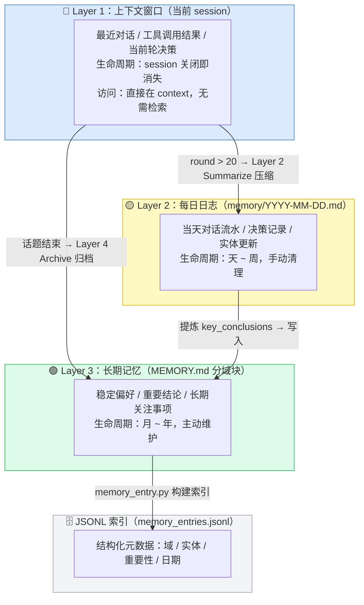
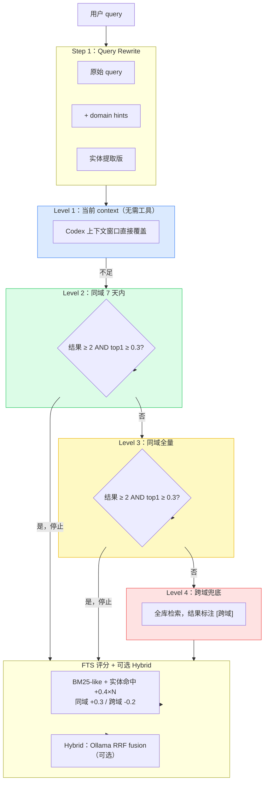
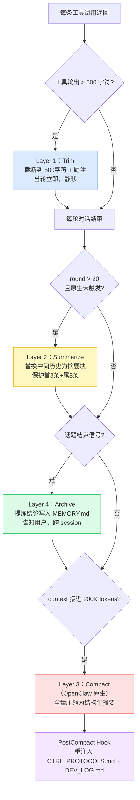

# longClaw 系统设计文档

> 版本：2026-04-17 | 运行环境：Mac mini M4，OpenClaw + Codex，24/7
> 本文档覆盖：架构总览、记忆系统、压缩机制、多模型协同、Harness 工程、Subagent 并发
> 与 Claude Code 的设计对比贯穿全文

---

## 零、架构定位

### longClaw 是什么

longClaw 是运行在 Mac mini M4 上的 **OpenClaw workspace 改造层**，不是独立运行时。

```
┌─────────────────────────────────────────────────────────────────┐
│                      longClaw 系统全景                           │
│                                                                 │
│  ┌─────────────────────────────────────────────────────────┐   │
│  │              OpenClaw 运行时（底层，直接可用）             │   │
│  │  hooks / 权限模型 / 工具调用 / compaction / skill加载     │   │
│  └─────────────────────────────────────────────────────────┘   │
│                           ↑ 基础设施层                           │
│  ┌──────────────────────────────────────────────────────────┐  │
│  │                 longClaw workspace 改造层                  │  │
│  │  CTRL 控制层   记忆系统      Harness 工程                  │  │
│  │  10专职+仲裁   三层+四级检索  hooks+权限+压缩               │  │
│  │  Subagent层    Skill 系统    训练底座                       │  │
│  │  并发+最小权限  14个工作流    Trace→Judge→Data              │  │
│  └──────────────────────────────────────────────────────────┘  │
└─────────────────────────────────────────────────────────────────┘
```

### OpenClaw 原生提供（直接可用）

| 能力 | 说明 |
|------|------|
| Hooks 系统 | PreToolUse / PostToolUse / SessionStart / Stop 等，harness 层自动执行 |
| 权限模型 | Deny > Ask > Allow，settings.json 配置，harness 强制 |
| 工具调用生命周期 | 工具发现、调用、结果注入，运行时管理 |
| Context compaction | session 接近上下文窗口时自动触发 |
| SKILL.md 加载 | Progressive Disclosure，会话启动时扫描 skills/，命中时加载全文 |
| CLAUDE.md 加载 | 项目根目录递归加载，compaction 后自动重读 |

### longClaw workspace 层新增

| 能力 | 说明 |
|------|------|
| CTRL 多专家仲裁 | 10 个专职代理 + P0-P4 冲突裁决 |
| 分域记忆注入 | MEMORY.md 按 [DOMAIN] 分块，按路由只注入必要片段 |
| Route-aware 检索 | tools/memory_search.py，4 级作用域 + FTS + Hybrid Embedding |
| Skill 依赖声明 | requires 字段，命中前检查工具可用性 |
| Layer B 话题归档 | 话题结束时提炼结论写入 MEMORY.md，跨 session 可检索 |
| DEV LOG 格式 | 9 字段可观测日志，含 🛠️ 工具 PostToolUse 注入 |
| Subagent 并发架构 | search / memory / heartbeat / repo-explorer agent |
| 训练底座 | openclaw_substrate：Trace → Judge → Dataset → MLX（设计完成，待激活） |

---

## 一、记忆系统

### 1.1 设计哲学：为什么不用向量数据库

> "简单存储 + 智能检索 > 复杂存储 + 复杂检索" — Claude Code 内部设计原则

| 方案 | 优点 | 缺点 | longClaw 选择 |
|------|------|------|--------------|
| 向量数据库（SQLite + sqlite-vec） | 语义检索强，ANN 高效 | 需要额外基础设施，黑盒，难调试 | ❌ 当前阶段 |
| 纯关键词（BM25） | 简单 | 词面不重叠就找不到 | 部分用 |
| 文件 + FTS + Hybrid Embedding | 透明可编辑，可观察 = 可信任 | 规模大时检索慢 | ✅ |

**核心理由**：用户可以直接打开 `memory/YYYY-MM-DD.md` 看到 agent 记住了什么。**可观察性 = 信任**，这是产品设计的核心决策，来自 Claude Code 的"文件记忆 vs 数据库"架构赌注。

**与公司版龙虾（CatClaw）的差异**：公司版用 text-embedding-3-large + SQLite + sqlite-vec，session 历史也被索引，每分钟同步。longClaw 用 JSONL + Ollama nomic-embed-text，手动触发重建（heartbeat-agent 每天自动检查是否需要重建）。

### 1.2 三层记忆架构



### 1.3 分域注入：token 节省 80% 的来源

MEMORY.md 按专职代理的域分块，CTRL 按路由只注入必要的块：

```
(SYSTEM)    ← 所有代理都读（全局偏好）
[JOB]       ← 只在 JOB 路由时注入
[WORK]      ← 只在 WORK 路由时注入
[LEARN]     ← 只在 LEARN 路由时注入
[ENGINEER]  ← 只在 ENGINEER 路由时注入
[BRO/SIS]   ← BRO 和 SIS 共用
[META]      ← CTRL 跨域时注入
```

**注入规则**：

| 路由 | 注入内容 | 节省比例 |
|------|---------|---------|
| JOB | (SYSTEM) + [JOB] | ~80% |
| SEARCH | (SYSTEM) 只读 | ~90% |
| CTRL/跨域 | (SYSTEM) + [META] + 相关域 | ~60% |

**数学推导**：10 个域块，每块 500 token，全量注入 5000 token，JOB 路由只注入 2 块 ≈ 1000 token，节省 80%。

**与 Claude Code 的差异**：Claude Code 全量注入 MEMORY.md（前200行/25KB）；longClaw 在注入前先按路由域过滤，是三系统中唯一做到分域注入的。

### 1.4 四级 Route-Aware 检索



**扩展条件**（为什么用绝对分数 0.3 而不是差值）：差值判断（top1-top2 < 0.05）在低分区间极其敏感——两个分数都是 0.1 时差值也是 0，会频繁触发跨域扩展引入噪声。绝对分数更稳定。

**评分权重**：

| 信号 | 权重 | 理由 |
|------|------|------|
| 实体精确命中 | +0.4 × N | 最强信号，名字/项目/公司不会歧义 |
| 同域加分 | +0.3 | 同域结果更可信 |
| 7天内 | +0.2 | 近期更相关 |
| 重要性 | +0.05 × imp | 微调，不压过实体 |
| 跨域惩罚 | -0.2 | 需要更高基础分才能被选中 |

### 1.5 JSONL vs SQLite + sqlite-vec

| 维度 | JSONL（longClaw） | SQLite + sqlite-vec（公司版） |
|------|-----------------|------------------------------|
| 存储结构 | 纯文本，每行一条 JSON | 关系型表 + 向量列 |
| 向量检索 | 全量加载内存后暴力计算 | ANN 原生支持，O(log n) |
| 增量更新 | 每次重写全量 JSONL | 只更新变化的行 |
| 可读性 | ✅ 直接 cat 可读 | 需要工具查看 |
| 依赖 | 零依赖 | 需要 sqlite-vec 扩展 |

**升级时机**：memory 条目超过 2000 条，或检索延迟明显变慢时。

---

## 二、压缩机制：四层协作

### 2.1 全景图



**优先级**：Layer 3（原生）> Layer 1（Trim）> Layer 2（Summarize）。Layer 4（Archive）独立触发。

### 2.2 四层详解

| 层 | 触发 | 操作 | 信息损失 | 对用户可见 | 跨 session |
|---|---|---|---|---|---|
| **Layer 1 Trim** | 工具输出 > 500字符 | 截断 + 尾注 | 极小 | 否 | ❌ |
| **Layer 2 Summarize** | round > 20 | 中间历史 → 摘要块 | 小 | 否 | ❌ |
| **Layer 3 Compact** | context 接近上限 | 全部历史 → 摘要 | 中 | 否 | ❌ |
| **Layer 4 Archive** | 话题边界信号 | 结论写入 MEMORY.md | 无损 | ✅ | ✅ |

### 2.3 PostCompact Hook：补救丢失的协议文件

**问题**：Layer 3 原生 compaction 后，CTRL_PROTOCOLS.md 和 DEV_LOG.md 不在 OpenClaw 的默认重注入列表里，会消失。

**解法**：

```json
"PostCompact": [{
  "matcher": "auto",
  "hooks": [{"type": "command",
    "command": "cat CTRL_PROTOCOLS.md DEV_LOG.md >> \"$CLAUDE_ENV_FILE\""}]
}]
```

### 2.4 与 Claude Code 压缩设计对比

| Claude Code | longClaw 对应 | 差异 |
|-------------|--------------|------|
| Layer 1：Tool Result Budgeting（批量截断历史工具结果） | **Layer 1 Trim**（实时截断当轮输出） | CC 批量处理历史；longClaw 实时处理 |
| Layer 2：Snip Compacting（物理删除旧消息） | **Layer 2 Summarize**（替换为摘要块） | CC 直接删；longClaw 保留摘要，信息损失更小 |
| Layer 3：Microcompacting（删除已完成工具结果） | Layer 2 部分覆盖 | longClaw 未单独实现此层 |
| Layer 4：Auto-compacting（subagent 生成摘要） | **Layer 3 Compact**（OpenClaw 原生） | CC 用专用 summarizer subagent；longClaw 用 OpenClaw 内置 |
| 无 | **Layer 4 Archive** | longClaw 独有，跨 session 知识沉淀 |

**核心差异**：
- Claude Code 是**预防式**：每次 API 调用前检查，从最轻到最重渐进
- longClaw 是**混合式**：Layer 1 实时预防 + Layer 2/4 阈值触发 + Layer 3 兜底

**PostCompact Hook 对比 Claude Code 的 summarizer subagent**：

| | Claude Code summarizer subagent | longClaw PostCompact hook |
|---|---|---|
| 解决的问题 | 对话历史的语义压缩质量 | 协议文件压缩后丢失的补救 |
| 实现复杂度 | 高（需维护专用 subagent） | 极简（一行 shell 命令） |
| 摘要质量 | 高（LLM 理解语义再生成） | 依赖 OpenClaw 原生算法 |
| 成本 | 额外一次 LLM 调用 | 零成本，纯文件操作 |

两者解决的不是同一个问题，不是替代关系。

---

## 三、多模型协同：CTRL 仲裁 + Subagent 并发

### 3.1 CTRL 控制平面

```
用户请求
    ↓
CTRL 控制平面（唯一对外出口）
    ├── 路由决策（语义关键词表 + 置信度）
    ├── 记忆检索（memory_search.py，4级）
    ├── Skill 检查（14个 skill，requires 依赖验证）
    ↓
路由分支：
    ├── 单专职（默认）：User→CTRL→[JOB]→CTRL→User
    ├── 双专职并行（跨域）：User→CTRL→([JOB]||[PARENT])→CTRL→User
    └── Subagent 编排（复杂任务）：spawn search/memory/heartbeat agent
    ↓
CTRL 仲裁输出
    ├── 置信度协议（≥0.8 直接采纳，0.6-0.8 标注不确定性，<0.6 追问）
    ├── P0-P4 优先级裁决
    └── Risk Audit（策略/价值判断类问题）
```

### 3.2 角色 vs Subagent

| 维度 | 角色（Specialist） | Subagent |
|------|-----------------|---------|
| 触发方式 | 用户开口 → CTRL 路由 | CTRL 主动 spawn |
| 执行方式 | 串行，在主 context 里 | 独立 context window，可并发 |
| 工具权限 | 继承主 session | 独立配置，最小权限 |
| 生命周期 | 跟随对话 | 任务完成即退出 |
| 典型用途 | 推理、建议、分析 | 搜索、读文件、巡检 |

**关键理解**：Subagent 是"派出去干活的工人"，角色是"坐在桌前思考的顾问"。两者互补，不是替代关系。

### 3.3 四个 Subagent 设计

| Subagent | 工具 | 触发 | 职责 |
|----------|------|------|------|
| `search-agent` | WebFetch / WebSearch / Read / Grep | deep-research skill spawn×2-3 | 并发多源搜索，返回结构化证据 |
| `memory-agent` | Read / Grep / Glob（只读） | BRO/SIS 路由时后台 spawn | 检索近期记忆，注入情绪/话题背景 |
| `heartbeat-agent` | Read / Glob / Grep / Write / Bash | cron 08:30/18:00 | 定时巡检，P0/P1 写入 heartbeat-state.json |
| `repo-explorer` | Read / Glob / Grep / Bash | code-agent skill | 自主探索 codebase，返回结构化文件地图 |

所有 subagent 均设 `model: inherit`，继承主 session 的 Codex（Mac mini 未购 Haiku）。

### 3.4 并发搜索 RRF 融合

```python
# Reciprocal Rank Fusion
for doc in all_results:
    rrf_score = sum(
        1 / (60 + rank + 1)
        for rank_list in [agent_A, agent_B, agent_C]
        if doc in rank_list
        for rank in [rank_list.index(doc)]
    )
# 跨 agent 都排名靠前的文档分数最高
```

**为什么不让每个 agent 直接输出总结**：总结的总结 → 信息损耗叠加。结构化输出（URL + verbatim snippet + score）让 CTRL 可以做真正的融合。

### 3.5 与 Claude Code Multi-Agent 的对比

| 维度 | Claude Code | longClaw |
|------|------------|---------|
| 内置 agent 类型 | Explore / Plan / Verification / General / Guide | search / memory / heartbeat / repo-explorer |
| Fork agent 缓存共享 | ✅ 子 agent 继承父 context，90% token 折扣 | ❌ 未实现（下一步优化方向） |
| Speculative Execution | ✅ 流式输出期间提前执行工具，节省 16%+ | ❌ 未实现 |
| 最小权限隔离 | ✅ 每个 agent 独立工具白名单 | ✅ requires 字段声明 |
| model 继承 | ✅ inherit 默认 | ✅ model: inherit |

---

## 四、Harness 工程：规则在基础设施层执行

### 4.1 核心思想

```
❌ 靠 LLM 自觉：在 AGENTS.md 写"请用 trash 代替 rm"
                 → LLM 可能忘记，可能忽略

✅ Harness 层执行：PreToolUse hook 拦截 rm，自动改写为 trash
                   → 无论 LLM 说什么，实际执行的都是 trash
```

这是从 Claude Code sourcemap 逆向分析中借鉴的核心设计原则。

### 4.2 三层权限模型（Deny > Ask > Allow）

```
Deny（永久禁止，优先于所有 hook）
  ├── 私有数据外发（USER.md / MEMORY.md / API keys）
  ├── git push --force 到 main/master
  ├── 无指令修改 AGENTS.md / SOUL.md
  ├── 破坏性命令（rm -rf 等）
  └── 伪造执行证据

Ask（每次单独授权）
  ├── 文件写入 / git commit / git push
  └── 出站消息

Allow（默认）
  ├── 本地只读、内存检索
  └── 预授权的公开网页只读抓取
```

**关键**：Deny 规则在 hook 之前生效——即使 hook 返回 allow，Deny 规则也会阻断。

### 4.3 6 条 Immutable Rules

不能被任何 skill、用户指令或 session 状态覆盖：

1. **无合成证据**：禁止伪造工具输出、文件内容或执行结果
2. **无静默 AGENTS.md 修改**：修改此文件必须有同轮显式用户指令
3. **禁止 force-push main/master**：即使用户要求也要警告并停止
4. **Deny > Ask > Allow 优先级固定**：不可逆转
5. **SOUL.md 对所有专职生效**：任何 skill 或角色不可覆盖人格约束
6. **DEV LOG 每轮必须输出**：不可被 skill 执行或输出长度抑制

### 4.4 当前 Hooks 配置（.claude/settings.json）

| Hook | 触发时机 | 作用 |
|------|---------|------|
| `UserPromptSubmit` | 用户发消息时 | 检测 `/new`，触发 `openclaw gateway restart` |
| `SessionStart` | session 开始时 | 检测 heartbeat-state.json，有 P0/P1 时提示 CTRL 呈现 |
| `PostCompact` | 原生压缩完成后 | 重注入 CTRL_PROTOCOLS.md + DEV_LOG.md |
| `FileChanged` | 配置文件变更时 | 通知 CTRL 重读，当前 session 即时感知 |
| `PreToolUse` | Bash 工具调用前 | `rm` 命令自动改写为 `trash`（updatedInput 机制） |

### 4.5 Anti-Stall 规则（解决空转问题）

```
❌ 空转（禁止）：
  "我现在去做 Step 1"  → 然后停住等用户
  "准备执行"           → 没有任何工具调用

✅ 正确行为：
  doing: <action>  → 仅当同轮已发起工具调用
  blocked: <reason> → 缺权限/缺输入时直接说
```

### 4.6 DEV LOG：可观测性框架

9 字段结构，每轮强制输出：

```
[DEV LOG]
🔀 路由     ENGINEER | 触发: "改配置" | 模式: normal debug
🧩 Skill    命中: longclaw-checkup | step=completed
🛠️ 工具     Edit(AGENTS.md) → +18行 | status=ok
🧠 Memory   (SYSTEM)+[ENGINEER] | ~210 tokens | 节省 72%
📂 Session  第 5 轮（ephemeral）| 未触发压缩
🔍 检索     scope=ENGINEER | level=同域近期 | 召回 2 条
⚖️ 置信度   0.99 [依据: 文件改写+读回] | 冲突: 无
🤝 A2A      无
🏷️ 实体     AGENTS_version=v2（2026-04-14）
```

**`ephemeral session`**：微信 bot 每条消息触发新 session，round 是本次运行内轮次，不跨 session 累积——这是 OpenClaw 官方的 fresh session 设计，不是 bug。

---

## 五、与 Claude Code 总体对比

### 5.1 架构对比矩阵

| 能力维度 | Claude Code | longClaw |
|---------|------------|---------|
| **执行层** | ✅ 本地代码执行、文件读写、浏览器控制 | ✅ 继承 OpenClaw 完整执行层 |
| **专家仲裁** | ❌ 单 Agent | ✅ 10 专职代理 + CTRL 仲裁 |
| **风险审计** | ❌ | ✅ P0-P4 优先级 + Risk Audit |
| **分域记忆** | ❌ 全量注入 | ✅ 按路由域精准注入，节省 80% token |
| **向量检索** | ❌ | ✅ route-aware + Hybrid Embedding |
| **用户画像层** | ❌ | ✅ USER.md 独立画像 |
| **技能自动生成** | ✅ Agent 自写 SKILL.md | ⚠️ 提议系统（用户确认后写入） |
| **本地训练底座** | ❌ | ✅ Trace→Judge→Dataset→MLX（待激活） |
| **Fork Agent 缓存** | ✅ 90% token 折扣 | ❌ 未实现（下一步） |
| **Speculative Execution** | ✅ 节省 16%+ 时间 | ❌ 未实现 |
| **Summarizer Subagent** | ✅ 高质量摘要 | ⚠️ 依赖 OpenClaw 原生 + PostCompact hook 补救 |

### 5.2 五个关键设计决策

| 决策 | 选择 | 理由 | 代价 | 缓解 |
|------|------|------|------|------|
| 文件记忆 vs 向量数据库 | 文件 + FTS + Hybrid | 透明度 = 信任；零依赖 | 规模大时检索慢 | Hybrid 模式；heartbeat 自动重建索引 |
| 按域注入 vs 全量注入 | 按路由域精准注入 | 节省 80% token | 跨域信息可能遗漏 | Level 4 跨域兜底检索 |
| Harness 层规则 vs Prompt 层建议 | Harness 层（hook + Immutable Rules） | LLM 会忘记 prompt | 灵活性降低 | Deny/Ask/Allow 三层，只有 Deny 是绝对的 |
| Subagent 并发 vs 串行角色 | 对搜索/记忆/巡检用 Subagent | 并发省时；最小权限更安全 | 模型只支持 Claude（inherit） | model: inherit 继承 Codex |
| 压缩四层协作 vs 单一策略 | Layer 1/2/3/4 分层 | 不同触发条件解决不同问题 | 配置复杂 | 优先级明确：原生 > Trim > Summarize |

### 5.3 关键数字速查

| 指标 | 数值 | 来源 |
|------|------|------|
| 分域注入 token 节省 | ~80% | MEMORY.md 10域块，每次注入1-2个 |
| 原生 compaction 压缩率 | ~88% | 9600 tokens → 1140 tokens |
| 检索扩展阈值 | top1 < 0.3 | 绝对分数，避免差值过敏感 |
| 实体命中加分 | +0.4 × N | N=命中实体数 |
| Layer 2 触发阈值 | round > 20 | session-state.json 追踪 |
| Subagent 并发上限 | 3（deep-research） | OpenClaw 并行限制 |
| Skill 总数 | 14个 | CTRL_PROTOCOLS.md skill index |
| 专职代理数 | 10个 | MULTI_AGENTS.md |

---

## 六、参考资料

- **Claude Code 架构书**：https://github.com/alejandrobalderas/claude-code-from-source
- **OpenClaw 官方文档**：https://docs.openclaw.ai
- **公司版龙虾记忆机制**：KM 2753222326
- **SWE-agent 论文**：https://arxiv.org/abs/2405.15793
- **Aider repo-map**：https://aider.chat/docs/repomap.html
