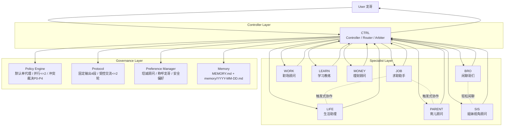

# Multi-Agent Architecture (Current)

## Routing Rule
- 默认：`User -> CTRL -> [Single Specialist] -> CTRL -> User`
- 跨域阻塞时：`User -> CTRL -> [Role A + Role B] -> CTRL -> User`（最多2个专职）

## Notes
- 所有最终输出由 CTRL 统一口径。
- 专职角色不越权；跨域协作必须受协议约束。
- 偏好与安全要求由 Preference + Memory 层长期生效。
