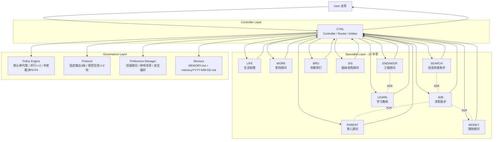

# Multi-Agent Architecture (Current)

> 权威配置见 `MULTI_AGENTS.md`。本文件为可视化架构图，与 MULTI_AGENTS.md 保持同步。

## Routing Rule
- 默认：`User -> CTRL -> [Single Specialist] -> CTRL -> User`
- 跨域时：`User -> CTRL -> ([Role A] || [Role B]) -> CTRL -> User`（最多2个专职并行）

## Notes
- 所有最终输出由 CTRL 统一口径。
- 专职角色不越权；A2A 协作最多2轮，必须受协议约束。
- 偏好与安全要求由 Preference + Memory 层长期生效。
- 合法路由标签：`LIFE/JOB/WORK/ENGINEER/PARENT/LEARN/MONEY/BRO/SIS/SEARCH`
